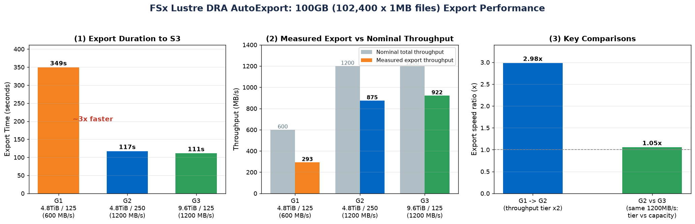

# FSx for Lustre — DRA AutoExport 导出性能测试

测试 Amazon FSx for Lustre 通过 **DRA (Data Repository Association) AutoExportPolicy** 把数据从 Lustre 文件系统自动导出回 S3 的耗时与吞吐表现。

- **区域**: us-east-2 (Ohio)
- **数据集**: 100 目录 × 1024 文件 × 1MB = **102,400 文件 = 100GB**（`/dev/urandom` + `xargs -P32` 并行 `dd`）
- **客户端**: 1 × `c5n.4xlarge`（Amazon Linux 2023，lustre-client 2.15.6），三组串行复用
- **文件系统**: FSx Lustre `PERSISTENT_2` (SSD)
- **测试日期**: 2026-08-06

## 关键顺序（务必遵守）

```
建 FS → 建 DRA(AutoExport 开启) → 挂载 → [建 DRA 之后] 再写数据 → 触发自动导出
```

> AutoExport 只导出「建立 DRA 之后」新增/变化的文件，所以必须**先建 DRA，再写数据**。

## 三组对照

| 组 | 容量 | 吞吐档 (MB/s/TiB) | 总吞吐 | 写入 Lustre | 导出到 S3 | 导出吞吐 |
|----|------|------------------|--------|------------|-----------|----------|
| **G1** | 4.8 TiB | 125 | 600 MB/s | 95s | **~349s** | **~293 MB/s** |
| **G2** | 4.8 TiB | 250 | 1200 MB/s | 96s | **~117s** | **~875 MB/s** |
| **G3** | 9.6 TiB | 125 | 1200 MB/s | 88s | **~111s** | **~922 MB/s** |



## 核心结论

1. **吞吐档翻倍（G1→G2，125→250）→ 导出加速约 3 倍**（349s→117s）。600 MB/s 档位下导出通道是明显瓶颈。
2. **相同总吞吐下，「提吞吐档」vs「加容量」几乎等价**（G2 117s vs G3 111s，误差内）。DRA 导出性能主要由**总吞吐能力（容量 × 吞吐档）**决定，可按成本/容量需求灵活选择。
3. **实测导出吞吐均低于标称总吞吐**：因为是 10 万个 **1MB 小文件**，DRA 逐文件走元数据 + PUT，受请求速率制约。大文件场景会更接近标称峰值。

## 踩坑记录（重要）

1. **DRA `file-system-path /` 报 "Missing required parameters"**：用根路径 `/` 配合 AutoExportPolicy 一直报缺参数。**改用 `/export` 立即成功**，数据须写到挂载点的 `/fsx/export/` 子目录。
2. **`--batch-import-meta-data-on-create false` 语法错误**：AWS CLI 布尔 flag 不接受 `false` 值（报 `Unknown options: false`）。要用 `--no-batch-import-meta-data-on-create` 或 `--batch-import-meta-data-on-create`。
3. **AL2023 lustre client repo 404**：官方 `fsx-lustre-client-repo-latest.noarch.rpm` (al2023) 返回 404。**AL2023 自带 `lustre-client` 包**：`sudo dnf install -y lustre-client`（2.15.6）即可，modprobe/挂载正常。
4. **S3 对象数会略超 102400（=102501）**：AutoExport 为每个目录创建占位对象（`data/` + `dir000~dir099` = 101 个）。轮询判定要按「1MB 数据文件数 = 102400」或「总数 ≥ 102501 稳定」，不能死等 exactly 102400。
5. **DRA 删除耗时长**：每个 DRA 删除约 8-10 分钟，FS 删除约 5-6 分钟，串行清理是整个测试的主要耗时项。
6. **FSx Lustre PERSISTENT_2 创建很快**：从 CREATING 到 AVAILABLE 仅 2-8 分钟。

## 挂载命令参考

```bash
# AL2023 安装 lustre client
sudo dnf install -y lustre-client

# 挂载（DNSName / MountName 来自 describe-file-systems）
sudo mkdir -p /fsx
sudo mount -t lustre -o relatime,flock <DNSName>@tcp:/<MountName> /fsx
sudo mkdir -p /fsx/export   # DRA 映射的子目录
```

## DRA 创建参考

```bash
aws fsx create-data-repository-association \
  --file-system-id <fsid> \
  --file-system-path /export \
  --data-repository-path s3://<bucket>/<prefix>/ \
  --no-batch-import-meta-data-on-create \
  --s3 'AutoImportPolicy={Events=[]},AutoExportPolicy={Events=[NEW,CHANGED,DELETED]}' \
  --region us-east-2
```

## 文件说明

- `REPORT.md` — 完整测试报告（含分析与资源记录，已脱敏）
- `fsx_dra_export_charts.png` — 结果图表（导出耗时 / 吞吐对比 / 关键对照）
- `gen_charts.py` — 图表生成脚本（matplotlib）
- `test.log` — 测试执行日志（已脱敏）

> 所有账号 ID / 实例 ID / IP / 资源 ID 已脱敏为 `REDACTED`。测试资源（EC2 + 3×FSx + 3×DRA）测完已全部删除。
