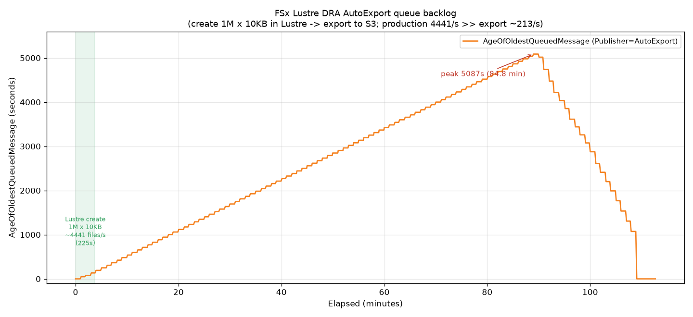

# FSx for Lustre — DRA AutoExport `AgeOfOldestQueuedMessage` 实测

AutoImport 的**对称对照实验**：同样 100 目录 × 1万 × 10KB = 100 万对象，同样指标、同样 10s 采样，但方向相反——这次在 **Lustre 文件系统里创建文件**触发 **AutoExport（Lustre → S3）**，采集 `AgeOfOldestQueuedMessage` with `Publisher=AutoExport`。

- **区域**: us-east-2 (Ohio)
- **文件系统**: FSx Lustre `PERSISTENT_2`, 250 MB/s/TiB, 1.2 TiB
- **DRA**: 双向 DRA（AutoImport + AutoExport 均为 NEW/CHANGED/DELETED）
- **负载**: 从同区 `i7i.4xlarge` 挂载 Lustre 后，16 进程在 `<DRA_MOUNT_DIR>/autoexport-test/` 本地创建 **100 万 × 10KB** 文件（100 目录 × 1万）
- **测试日期**: 2026-08-08

## 结果曲线

## 与 AutoImport 的对比（关键）

| 维度 | AutoImport (S3→Lustre) | **AutoExport (Lustre→S3)** |
|---|---|---|
| 生产速率 | S3 PUT ~542 obj/s | **Lustre 本地写 ~4441 files/s** |
| 消费速率 | AutoImport 跟得上 | **AutoExport 导出仅 ~213 obj/s** |
| 生产/消费比 | ~1:1 | **~20:1** |
| age 曲线 | **60s 稳态平台，封顶** | **线性单调飙升到峰值 5087s (84.8 min) 再回落** |
| 形态 | 小平台 | 教科书级三角积压：线性爬升 → 峰值 → 快速回落 |

## 三段行为

1. **爬升段**：文件仅 3.75 分钟（225s @ 4441/s）就全部创建完，但 age 以约 **+58s/min 线性爬升**长达 ~85 分钟——因为导出队列持续积压，最老待导出消息的等待时间线性累积。
2. **峰值**：**5087s（84.8 分钟）** —— 最老那条待导出消息等了近 1.5 小时才被导出。
3. **回落段**：约 **-200s/min** 快速下降（本地生产早停、纯消费追平积压），约 10:26 归零。

## 关键结论

1. **AutoExport 真正触发了"失控飙升"** —— 与 AutoImport 的 60s 稳态平台形成鲜明对比。根因：Lustre 本地写（4441/s）远超 AutoExport 导出到 S3 的速率（~213/s），生产是消费的 ~20 倍，队列疯狂积压。这实证了「写入速率超过消费上限 → 指标单调上升不封顶」。

2. **AutoExport 小文件导出速率 ~213 obj/s** —— 由 S3 landed count 反推（36 min 导出 45.9 万、19 min 导出 25.7 万，均吻合）。100 万个 10KB 小文件全部导出耗时约 **85 分钟**。

3. **生产启示**：Lustre 侧短时间大量产生小文件时，AutoExport 队列会严重积压，`AgeOfOldestQueuedMessage`(Publisher=AutoExport) 会堆积到很高（本例近 85 分钟）。这是真正需要 CloudWatch 告警监控的场景。若需快速把大量数据推回 S3，应考虑手动 export data repository task 而非纯依赖 AutoExport 事件队列。

> ⚠️ 导出速率 ~213/s 是**小文件（10KB）**场景，瓶颈在**每对象的元数据/PUT 事件处理**，不在字节吞吐。大文件场景导出吞吐会不同（见同仓库 `fsx-dra-export-test`，1MB 文件 100GB 导出）。

## 文件

| 文件 | 说明 |
|---|---|
| `dra_autoexport_create.py` | Lustre 本地文件创建脚本（16 进程，占位符 `<DRA_MOUNT_DIR>`） |
| `dra_autoexport_collect.py` | CloudWatch 采集器，Publisher=AutoExport，10s 采样（占位符 `<YOUR_FSX_LUSTRE_FS_ID>`） |
| `plot_dra_autoexport.py` | 曲线绘制脚本 |
| `dra_autoexport_age.csv` | 合并后的 721 个采样点原始数据 |
| `dra_autoexport_age_plot.png` | 结果曲线图 |

## 相关

- 对照方向：`../fsx-lustre-dra-autoimport-metric/`（AutoImport，60s 平台）
- 通道对比与 import 速率：`../fsx-lustre-dra-import/`
- 大文件 AutoExport 导出性能：`../fsx-dra-export-test/`

## 数据来源

- AWS 官方文档：`docs.aws.amazon.com/fsx/latest/LustreGuide/fs-metrics.html`（S3 repository metrics，维度 FileSystemId + Publisher）
- 实测：2026-08-08，us-east-2
