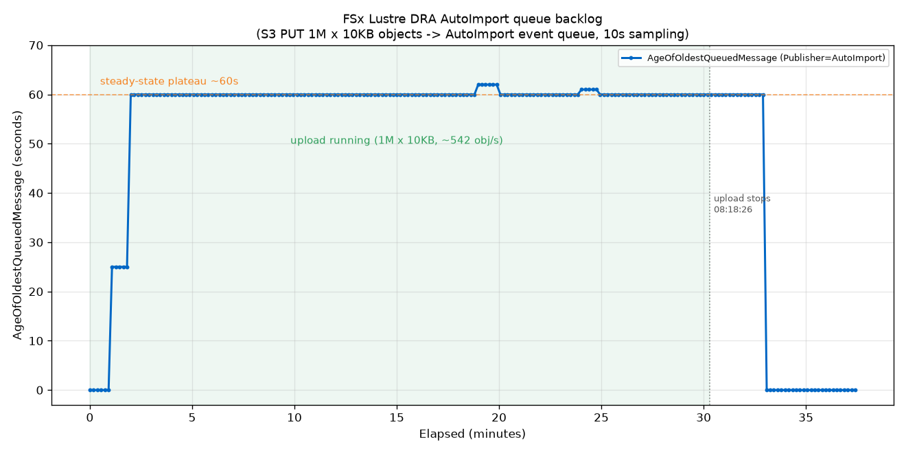

# FSx for Lustre — DRA AutoImport `AgeOfOldestQueuedMessage` 实测

验证 Amazon FSx for Lustre 的 **DRA (Data Repository Association) AutoImport** 队列指标 `AgeOfOldestQueuedMessage` 在向关联 S3 桶大批量写入对象时的行为。

- **区域**: us-east-2 (Ohio)
- **文件系统**: FSx Lustre `PERSISTENT_2`, 250 MB/s/TiB, 1.2 TiB
- **DRA**: Lustre 路径 `/dra1` ↔ S3 桶，AutoImportPolicy = `NEW, CHANGED, DELETED`
- **负载**: 从同区 `i7i.4xlarge`（16 进程 boto3）向 S3 桶 PUT **100 万 × 10KB = ~10GB** 对象（前缀 `autoimport-test/`，100 目录 × 1万文件）
- **采集**: 每 **10s** 采 `AgeOfOldestQueuedMessage`（Namespace `AWS/FSx`, dims `FileSystemId` + `Publisher=AutoImport`, stat Maximum）
- **测试日期**: 2026-08-08

## 结果曲线

## 三段行为

| 阶段 | 时间 | `AgeOfOldestQueuedMessage` |
|---|---|---|
| **上传开始** | 0–2 min | 0 → 25s → **60s**，快速爬升 |
| **上传全程** | ~30 min | **稳钉在 60s 平台**（max 62s），不再继续涨 |
| **上传停止后** | 停止后 1–2 min | **直接掉回 0**，队列迅速清空 |

- 上传速率实测 **~542 obj/s**（100 万对象耗时 1846s）。

## 关键结论

1. **AutoImport 队列指标确实会飙升** —— 一开始 PUT 到关联 S3 桶，指标立刻从 0 涨起来。**这与首次 DRA batch import（该指标全程 ≈0）形成鲜明对比**，印证了「该指标只反映建好 DRA 后 S3 变更触发的 AutoImport 增量同步积压，不反映初始批量导入」。

2. **但不是无限飙升，而是升到稳态平台（~60s）就封顶** —— 在 ~542 obj/s 的写入速率下，AutoImport 消费能力**跟得上**，队列维持恒定的小积压（约 1 个采样周期）。上传一停，1–2 分钟清空。

3. **要真正让它单调失控上升**，需把写入速率顶到 **超过 AutoImport 消费上限**（更高并发 / 多机 / S3 Batch）。本次单机 542 obj/s 尚未达到临界点。

> ⚠️ **需标注的推断**：稳态恰好 ≈60s，很可能部分是 CloudWatch 指标按 60s 周期聚合/发布的产物，宜理解为「约一个采样周期的恒定小积压」，而非精确的实际队列延迟。此点为**实测现象 + 机理推断**，无官方文档逐字佐证。

## 指标速查

- **命名空间**: `AWS/FSx`
- **维度**: `FileSystemId` + `Publisher`（取值 `AutoImport` / `AutoExport`）
- **单位**: 秒。含义 = 队列中最老一条待处理变更消息已等待的时长。
- **仅在 AutoImport/AutoExport 队列活跃时才有数据点**（空闲时 None 或 0）。

## 文件

| 文件 | 说明 |
|---|---|
| `dra_autoimport_upload.py` | S3 批量上传脚本（16 进程 boto3，占位符 `<YOUR_DRA_S3_BUCKET>`） |
| `dra_autoimport_collect.py` | CloudWatch 指标采集器，10s 采样（占位符 `<YOUR_FSX_LUSTRE_FS_ID>`） |
| `plot_dra_autoimport.py` | 曲线绘制脚本 |
| `dra_autoimport_age.csv` | 208 个采样点原始数据 |
| `dra_autoimport_age_plot.png` | 结果曲线图 |

## 数据来源

- AWS 官方文档：`docs.aws.amazon.com/fsx/latest/LustreGuide/fs-metrics.html`（S3 repository metrics，维度 FileSystemId + Publisher）
- AWS 官方文档：`docs.aws.amazon.com/fsx/latest/LustreGuide/autoimport-data-repo-dra.html`
- 实测：2026-08-08，us-east-2
