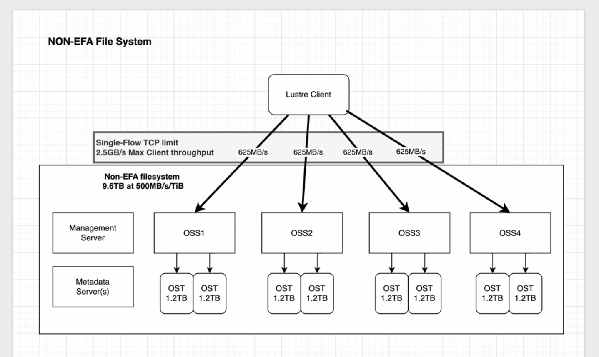
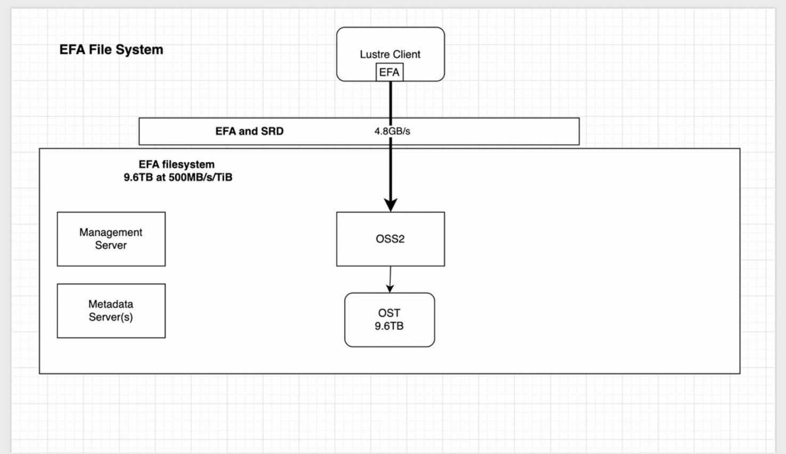

# FSx for Lustre + EFA 排障工具与 SOP

EFA-enabled FSx for Lustre 客户端排障的一键诊断脚本 + 分层排障 SOP。

沉淀自真实排障经验（大半天死磕、反复误判 4 次后靠"同 AZ 对照实验"一击命中）。

## EFA 对客户端连接吞吐的影响

同一个 9.6TB @ 500MB/s/TiB 的 FSx Lustre 文件系统，**是否启用 EFA 决定了客户端到后端的传输路径，进而决定单客户端吞吐上限**：

**NON-EFA**：客户端走 **Single-Flow TCP**，每条流受单流上限约束（图中 625MB/s），需靠多个 OSS（4×OSS，每 OSS 挂 2×1.2TB OST）并发才能叠加带宽，单客户端封顶约 **2.5GB/s**。



**EFA**：客户端经 **EFA + SRD**，单条高吞吐连接直达后端（OSS/OST 划分粒度更大），单客户端可达 **4.8GB/s**（受机型网卡带宽限制，单 EFA 100Gbps 机型实测读 ~7.4GB/s）。



> 关键点：NON-EFA 的瓶颈是单流 TCP，必须靠多 OSS 并发才拉得起吞吐；EFA/SRD 单连接即可打满，绕过单流 TCP 限制。二者是同容量文件系统，差异纯在传输路径与 OST 划分粒度。

## 文件

| 文件 | 说明 |
|---|---|
| `efa_lustre_diag.sh` | 一键诊断脚本，分四层自动检查并输出结构化报告 |

## 快速使用

```bash
chmod +x efa_lustre_diag.sh

# 全量诊断（建议 sudo，才能读 dmesg / 内核参数）
sudo ./efa_lustre_diag.sh

# 带 AWS 侧检查（自动比对客户端 AZ vs FSx AZ —— 头号根因）
sudo ./efa_lustre_diag.sh --fsid fs-xxxxxxxx --region us-east-2

# 指定 Lustre 挂载点
sudo ./efa_lustre_diag.sh --mount /fsx
```

退出码：有 FAIL → 1；仅 WARN 或全通过 → 0（便于接入自动化/CI）。

## 脚本检查内容（分层）

| 层 | 检查内容 | 关键判据 |
|---|---|---|
| 第 0 层 | IMDS 取本机 AZ / 机型 / subnet | 为 AZ 比对做准备 |
| 第 1 层 | EFA 物理设备 + 内核模块 (efa/ib_core/rdma_cm) | `lspci`、`ibv_devinfo` |
| 第 2 层 | libfabric 用户态栈 `fi_info -p efa` | 能否枚举 EFA provider |
| 第 3 层 | LNet efa 网络 + `osc.*.ost_server_uuid` | **OST 状态权威判据** FULL/IDLE=通 |
| 第 3.5 层 | dmesg 扫 CREATE_AH / evict / osc_extent_wait / 模块缺失 | 决定性证据 |
| 第 4 层 | aws cli 比对客户端 AZ vs FSx AZ | ★ 不一致=跨 AZ 根因 |

## 排障心法（铁律，血泪沉淀）

1. **一次只改一个变量**（机型 / AZ / 软件栈）。反复误判就是因为一次动多个变量。定位靠"好机器打 AMI + 同 AZ 起对照实验"。
2. **OST 通不通看 `lctl get_param osc.*.ost_server_uuid`**（`FULL`/`IDLE`=通，`DISCONN`=断）。**别看** `lnetctl peer show` 的 `state:NA`——EFA 场景恒为 NA，不代表故障。
3. **`CREATE_AH ... err -22` → 99% 跨 AZ**。EFA 客户端必须与 FSx 在**同一 AZ + 同 /16 CIDR**（AWS 官方硬约束）。跨 AZ 时 `kefalnd_init_conn_ah()` 建地址句柄失败 → OST 全部 DISCONN。
4. **`modprobe lnet/lustre: Module not found` → 内核漂移**（AMI 克隆后新实例自动升级内核，lustre-client-modules 是给旧内核编的）。修复：`install-fsx-lustre-client.sh --install-lustre` 给当前内核重装模块。
5. **`EFA device FW[0x0]` / `ibv fw_ver 0.0.0.0` / `device_cap_flags 0x0` 是 EFA 设备的正常显示**，不是故障信号（跑通的机器也是这些值）。别当 bug 去死磕。

## 分层排障决策树

```
OST DISCONN / fio 卡在 "Laying out IO file"
  │
  ├─ lctl get_param osc.*.ost_server_uuid → 有 DISCONN?
  │     │
  │     ├─ dmesg 有 CREATE_AH err -22 ?
  │     │     ├─ 是 → 【EFA 数据面建 AH 失败】
  │     │     │        1. 查客户端 AZ vs FSx AZ → 跨 AZ? → 重建同 AZ 客户端 ★最常见
  │     │     │        2. 查 SG 是否有"引用自身 SG、allow all"的入/出站规则
  │     │     └─ 否 → 看 evict/reconnect/recovery → 服务端 OST failover 中，等恢复
  │     │
  │     └─ fi_pingpong 能通吗?
  │           ├─ 不通 → EFA 栈/网络问题(第1-2层)，Lustre 无辜
  │           └─ 通  → EFA 好，问题在 LNet 配置或服务端
  │
  └─ modprobe lnet 报 Module not found?
        → 内核漂移，install-fsx-lustre-client.sh --install-lustre 重装模块
```

## 常用排障命令速查

```bash
# ---- OST / Lustre 状态（权威）----
lctl get_param osc.*.ost_server_uuid | grep -v FULL   # 揪出没连上的 OST
lfs check servers
lfs df -h /fsx                                         # 只有 MDT 没 OST = OST 全断

# ---- LNet ----
lnetctl net show -v                                    # 本机 LNet 网络，看 efa NI
lctl list_nids                                         # 本机 NID（应见 ...@efa）
lnetctl ping <ost_nid>@efa                             # LNet 层 ping

# ---- EFA 设备 / 栈 ----
fi_info -p efa                                         # libfabric 能否枚举 EFA
/opt/amazon/efa/bin/fi_pingpong -p efa                 # server 端
/opt/amazon/efa/bin/fi_pingpong -p efa <server_ip>     # client 端（隔离测 EFA 数据面）
ibv_devinfo -v | grep -iE "fw_ver|device_cap_flags"    # 注意：全 0 是正常，别当 bug

# ---- dmesg 决定性证据 ----
dmesg -T | grep -iE "create ah|comp_status|kefalnd|LNetError|evict|reconnect|recovery"

# ---- AWS 侧 AZ 对齐 ----
aws fsx describe-file-systems --file-system-ids <fsid> --region <r> \
  --query 'FileSystems[].SubnetIds'
aws ec2 describe-subnets --subnet-ids <subnet> --query 'Subnets[].AvailabilityZone'
```

## EFA + FSx Lustre 已知硬约束

- **同 AZ + 同 /16 CIDR**：EFA-enabled FSx Lustre 客户端与文件系统必须同 AZ（官方 Prerequisites 明确要求）。跨 AZ → EFA 数据面必然失败。
- **单网卡上限通常 1 个 EFA**；多 EFA 需多网卡机型（如 hpc6id.32xlarge 有 2 个 EFA，吞吐更高）。
- **EFA 不能在 running 实例上热插拔**，须启动时配好。
- **SG 必须有一条引用自身 SG、allow-all 的入/出站规则**（EFA/RDMA 要求，纯以太网没有）。
- **EFA Lustre 吞吐档位创建后不可改**（只能扩容量间接提吞吐）；EFA 建后不能开关。
- 吞吐受机型网卡带宽限制：单 EFA 100Gbps 机型实测读 ~7.4GB/s；双 EFA 200Gbps 机型 ~9.3GB/s。

## GPUDirect Storage (GDS) 补充

- GDS 只支持 GPU 机型（P5/P5e/P5en/P6-B200），需 GPU + EFA + 同 AZ FSx。
- DLAMI 预装 CUDA/driver/EFA/Lustre/GDS 工具，但 **nvidia-fs 内核模块需手动 build**（`git clone gds-nvidia-fs && make && insmod nvidia-fs.ko`）。configure-efa 用 `--optimized-for-gds`。
- 验证：`gdscheck -p`（GPU supports GDS + Platform verification succeeded）；`gdsio -x 0`(GPUDirect) vs `-x 1`(CPUONLY)。读测试要求文件先存在（先 `-I 1` 写再 `-I 0` 读）。
- **GDS 吞吐不一定高于 CPU 路径**（CPUONLY 会命中 page cache，GDS 故意绕过主机内存）。GDS 价值在绕过 CPU bounce buffer、省 CPU/内存带宽，高吞吐或 CPU 忙时才体现优势。公平对比要 drop_caches + 看 CPU 占用。

---

*基于 AWS 官方文档 + 实测经验整理。EFA 错误码逐位精确语义未逐条核对源码，深挖具体错误码建议查 AWS EFA 文档 / rdma-core 源码。*
