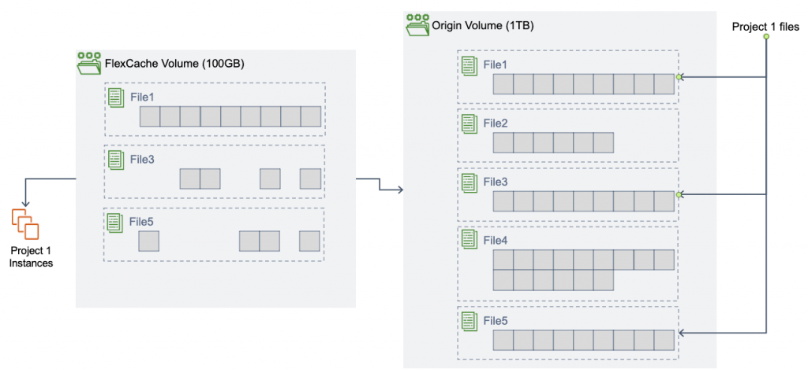

# FSx for NetApp ONTAP — FlexCache 缓存命中/未命中延迟实测

在 AWS Ohio (us-east-2) 建两个 FSx ONTAP 文件系统（origin + cache），配置 FlexCache 关系，
实测 **cache hit（命中）vs cache miss（未命中）** 的读延迟差异。

> 环境标识（文件系统 ID / SVM / subnet / SG / 实例 ID / IP）已脱敏为 `REDACTED`。

## FlexCache 是什么

官方文档：
- ONTAP FlexCache volumes (NetApp): https://docs.netapp.com/us-en/ontap/flexcache/
- Creating a FlexCache (AWS FSx): https://docs.aws.amazon.com/fsx/latest/ONTAPGuide/create-flexcache.html
- Caching data using Amazon FSx for NetApp ONTAP (AWS Blog):
  https://aws.amazon.com/blogs/storage/caching-data-using-amazon-fsx-for-netapp-ontap/

NetApp FlexCache 是 origin volume 的**远程稀疏缓存**——只缓存被实际读取的 hot data 的 block
（不是整文件、整卷）。用于读密集、重复访问的场景，降低 WAN 延迟与带宽成本。

- **Cache miss（未命中）**：cache volume 收到冷数据读请求 → **回源 origin** 拉取 → 存本地 → 返回客户端。
  慢，因为含跨文件系统（intercluster）网络往返。
- **Cache hit（命中）**：后续读同一数据 → 直接从 cache volume **本地**返回。快，无需回源。

### 官方架构示意图（下载自 AWS storage blog，见 `diagrams/`）

| 图 | 说明 |
|---|---|
| `fig1-flexcache-caches-blocks.png` | FlexCache 只缓存被读取的 block（cache 稀疏，origin 存全量）|
| `fig3-higher-read-perf-multiple-fsx.png` | 多个 FSx ONTAP 提升读性能 |
| `fig4-two-az-local-access.png` | 双 AZ 各自本地缓存，就近访问 |
| `fig5-cross-region-caching.png` | 跨 region 缓存远端数据 |
| `fig6-grouping-clients-cache-hit-ratio.png` | 相似客户端分组以提升命中率 |
| `fig7-bidirectional-caching.png` | 双向缓存（输入文件缓存在云，输出文件缓存在本地）|



## 环境

| 项 | 值 |
|---|---|
| Origin FSx ONTAP | 1024 GiB SSD, SINGLE_AZ_1, 128 MBps |
| Cache FSx ONTAP | 1024 GiB SSD, SINGLE_AZ_1, 128 MBps |
| 网络 | 同 VPC / 同 subnet（us-east-2c）|
| SG | 已放行 ICMP + TCP 11104/11105（intercluster peering）|
| 客户端 | 同 AZ EC2（跳板机），NFS v3 挂载 |

## 配置步骤（FSx ONTAP 之间 FlexCache）

### 0. 前置：SG 放行 intercluster 端口

```bash
# FlexCache 需要 ICMP + TCP 11104/11105（inter-cluster LIF）
aws ec2 authorize-security-group-ingress --group-id REDACTED \
  --ip-permissions 'IpProtocol=tcp,FromPort=11104,ToPort=11105,IpRanges=[{CidrIp=<VPC_CIDR>}]'
```

### 1. 记录两边 inter-cluster LIF IP
FSx 控制台 → 文件系统 → Administration → Inter-cluster endpoint IP。
或 `aws fsx describe-file-systems ... OntapConfiguration.Endpoints.Intercluster.IpAddresses`。

### 2. Cluster peering（cache 侧发起，origin 侧接受，同一 passphrase）

```
# cache 侧（ssh fsxadmin@<cache mgmt IP>）
FSx-Cache::> cluster peer create -address-family ipv4 -peer-addrs <origin_inter_1>,<origin_inter_2>
  Enter the passphrase: ****   Confirm: ****

# origin 侧（ssh fsxadmin@<origin mgmt IP>）用同一 passphrase
Origin::> cluster peer create -address-family ipv4 -peer-addrs <cache_inter_1>,<cache_inter_2>
  Enter the passphrase: ****   Confirm: ****
Origin::> cluster peer show          # Availability = Available, Authentication = ok
```

### 3. SVM peering（cache 侧 create，origin 侧 accept，application=flexcache）

```
FSx-Cache::> vserver peer create -vserver cachesvm -peer-vserver originsvm \
             -peer-cluster <Origin_Cluster_ID> -application flexcache
Origin::>    vserver peer accept -vserver originsvm -peer-vserver cachesvm
Origin::>    vserver peer show      # State = peered
```

### 4. 创建 FlexCache volume（在 cache 侧）

```
# ⚠️ FSx 特有：必须 advanced 权限 + 显式 -aggr-list aggr1，否则报 FabricPool 错
FSx-Cache::> set -privilege advanced -confirmations off
FSx-Cache::*> volume flexcache create -vserver cachesvm -volume flexcachevol -size 100GB \
              -origin-vserver originsvm -origin-volume originvol \
              -junction-path /flexcachevol -aggr-list aggr1
FSx-Cache::*> volume flexcache show
```

### 5. 挂载 cache volume 测延迟

```bash
sudo mount -t nfs -o nfsvers=3 <cacheSVM_NFS_IP>:/flexcachevol /mnt/flexcachevol

# MISS：drop cache 后首次读（回源）
sync; echo 3 | sudo tee /proc/sys/vm/drop_caches
sudo dd if=/mnt/flexcachevol/testfile1.bin of=/dev/null bs=1M

# HIT：再次读同一文件（本地命中）
sync; echo 3 | sudo tee /proc/sys/vm/drop_caches
sudo dd if=/mnt/flexcachevol/testfile1.bin of=/dev/null bs=1M
```

## 测试结果

每次读前都 `drop_caches` 清客户端页缓存，隔离出 FlexCache 本身的命中/未命中差异。

| 文件 | CACHE MISS（首次，回源 origin）| CACHE HIT（再读，本地 cache）| 提速 |
|---|---|---|---|
| testfile1 (500MB) | 1.926 s（272 MB/s）| 0.444 s（1.2 GB/s）| 4.3× |
| testfile2 (500MB) | 2.010 s（261 MB/s）| 0.446 s（1.2 GB/s）| 4.5× |
| testfile3 (500MB) | 1.964 s（267 MB/s）| 0.447 s（1.2 GB/s）| 4.4× |
| small (21MB) | 0.094 s（223 MB/s）| 0.018 s（1.2 GB/s）| 5.2× |

- 多轮 HIT 稳定在 ~0.44 s（1.2 GB/s），MISS 稳定在 ~2 s（~265 MB/s）。

## 结论

1. **FSx ONTAP 之间可以建 FlexCache**：cluster peering → SVM peering → volume flexcache create，
   走 inter-cluster LIF（TCP 11104/11105）。

2. **缓存命中显著降低延迟、提升吞吐**：500 MB 文件 MISS ~2 s（265 MB/s）→ HIT ~0.44 s（1.2 GB/s），
   **快约 4.4 倍**；小文件（21 MB）快 5.2 倍。
   - MISS 慢：cache 本地无数据，需回源 origin 跨文件系统拉取（含 intercluster 网络往返）。
   - HIT 快：数据已在 cache 本地，直接返回。

3. **⚠️ FSx 特有坑**：在 FSx ONTAP 上 `volume flexcache create` 必须：
   - 进 **advanced 权限**（`set -privilege advanced`）；
   - 显式加 **`-aggr-list aggr1`**。
   否则报 `Error: No suitable storage can be found ... Aggregates not matching FabricPool requirements: aggr1`
   （因 FSx 的 aggregate 是 FabricPool，默认建卷路径不匹配）。且不接受 `-aggregate` / `-tiering-policy` 参数。

4. **适用场景**（对应官方示意图）：读密集 + 重复访问 + 跨 AZ/region 降低 WAN 延迟与流量；
   命中率越高收益越大（fig6 展示按客户端分组提升命中率）。

## 注意事项

- ONTAP CLI 用 `fsxadmin` 登录连的是**文件系统 Management endpoint IP**。
- cluster peer 两侧必须用**同一 passphrase**；SVM peer 要带 `-application flexcache`。
- 测"延迟"要 `drop_caches` 清客户端页缓存，否则第二次读命中的是客户端本地内存缓存，而非 FlexCache。
- 从 ONTAP 侧可用 `volume flexcache show` 及 statistics 查看缓存关系与命中情况。
