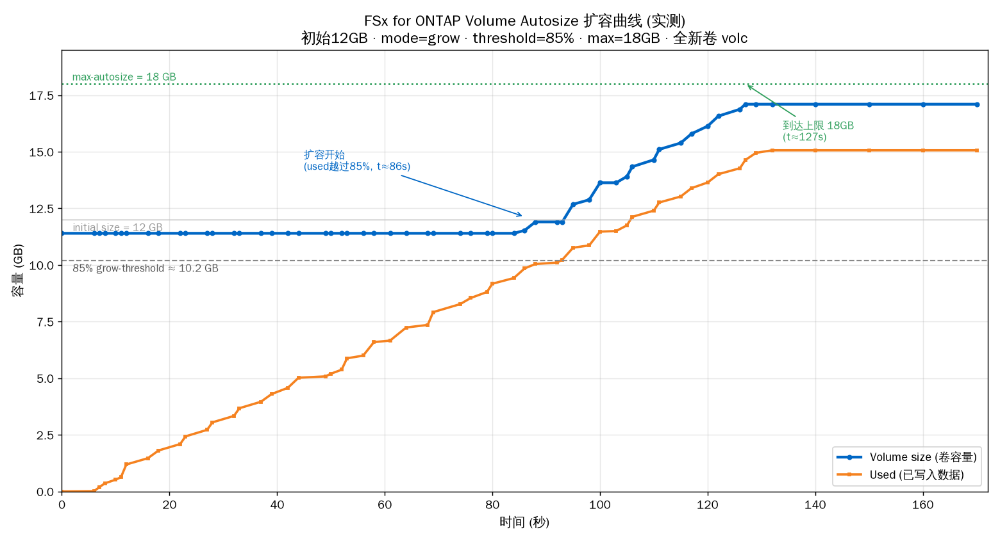

# FSx for NetApp ONTAP — Volume Autosize 实测

在 AWS FSx for NetApp ONTAP 上实测 **volume autosize（卷自动扩容）** 的行为，记录卷容量随写入数据增长而自动扩容的完整曲线，并验证 `grow` 模式、触发阈值、扩容上限等参数的实际生效情况。

> 结论标注：本目录中的曲线与数据点均为**实测**（通过 ONTAP CLI 周期采样 `volume show` 得到），非厂商文档推断。

---

## 1. 什么是 Volume Autosize

ONTAP 卷的 autosize 特性允许卷在使用率达到阈值时**自动增长**（或在数据减少时收缩），无需人工干预扩容。关键参数：

| 参数 | 说明 |
|---|---|
| `-autosize-mode` | `off` / `grow`（仅增长）/ `grow_shrink`（增长+收缩） |
| `-grow-threshold-percent` | 已用空间达到卷容量的该百分比时触发增长（默认 85%） |
| `-maximum-size` | autosize 能增长到的上限 |
| `-minimum-size` | `grow_shrink` 模式下收缩的下限 |

设置命令（ONTAP CLI）：

```
volume autosize -vserver <svm> -volume <vol> \
  -mode grow -grow-threshold-percent 85 -maximum-size 18g
```

---

## 2. 测试方法

- **文件系统**：一套 FSx for NetApp ONTAP 文件系统（us-east-2），单 SVM。
- **测试卷**：全新卷，初始容量 **12 GB**，autosize `mode=grow`、`grow-threshold=85%`、`maximum-size=18GB`。
- **负载**：从挂载了该卷（NFS v3）的 EC2 上持续写入数据，模拟卷被逐步写满。
- **采样**：在写入过程中每隔约 1 秒执行一次 `volume show -fields size,used`（`df` 视角），记录
  `(elapsed_seconds, volume_size_bytes, used_bytes)` 三元组，直到卷增长到上限 18GB 后不再变化。
- 采样得到的原始数据点内嵌在 `plot_autosize.py` 中（`raw` 列表），绘图生成 `autosize_curve.png`。

---

## 3. 实测结果



关键观测（实测）：

1. **初始容量 12 GB** 保持不变，直到已用空间接近阈值。
2. **触发点 ≈ 85% 阈值**：当 used 越过 `12GB × 85% ≈ 10.2GB`（约 t≈86s）时，卷容量开始自动增长。
3. **增长过程**：卷容量随写入持续增加，呈阶梯式上跳（每次扩容一小步），used 曲线紧贴 size 曲线之下。
4. **到达上限 18 GB**（约 t≈127s）后，卷容量**停在 18GB 不再增长**（受 `maximum-size` 限制）；此后即使继续写入，size 也不再变化，used 逼近 18GB 后写入将失败（卷满）。
5. autosize 是**按需、被动触发**的：只有当 used 越过 grow-threshold 才扩，扩容步长由 ONTAP 内部决定。

---

## 4. 文件说明

| 文件 | 说明 |
|---|---|
| `autosize_curve.png` | 实测扩容曲线图（volume size vs used，标注阈值/上限/初始容量/触发点） |
| `plot_autosize.py` | 绘图脚本，内含实测采样数据点（`raw`）。`python3 plot_autosize.py` 重新生成图 |
| `FSx_ONTAP_Autosize_CloudWrite.pptx` / `.pdf` | 配套 PPT 报告（含 autosize + Cloud Write mode + 存储效率章节，7 页） |
| `fsx_autosize_cloudwrite_ppt.py` | PPT 生成脚本（python-pptx） |

---

## 5. 相关：Cloud Write mode 与存储效率（PPT 中一并覆盖）

配套 PPT 还包含 FSx ONTAP **Cloud Write mode** 与存储效率（压缩/去重/压紧）的说明，核心结论（已查官方文档）：

- Cloud Write mode 本身不是压缩/去重功能，只决定 NFS 写入直落容量池（S3）以绕过 SSD 主层，用于大规模迁移。
- 直写容量池的数据**享受 inline 去重/压缩/压紧**，但**拿不到 background（后台）去重/压缩**——后台 efficiency job 只在 SSD 主层周期运行。
- 分层到云时已有的压缩/去重/压紧会被保留；metadata 始终存 SSD 主层。
- 来源：AWS Storage Blog《Streamline petabyte-scale data migrations with Cloud Write mode on Amazon FSx for NetApp ONTAP》、AWS FSx ONTAP *Managing storage efficiencies*、NetApp FabricPool requirements。

---

## 6. 复现要点 / 踩坑

- 采样用 `volume show -fields size,used`（`df` 物理视角），别用文件系统层 `df -h`（NFS 客户端看到的是逻辑视角，扩容反映有延迟）。
- ONTAP CLI 多命令用 `;` 分隔时，避免在单命令里塞 shell 重定向（`2>/dev/null`）或裸 `=`，否则会报 "stray or duplicate = operator"。
- 通过 SSM 向 EC2 下发含中文/换行的脚本时，用 base64 编码传，避免 JSON `\n` 被当字面量。
- 卷到达 `maximum-size` 后写满会写入失败，测试完注意清理测试数据 / 视情况恢复卷配置。
