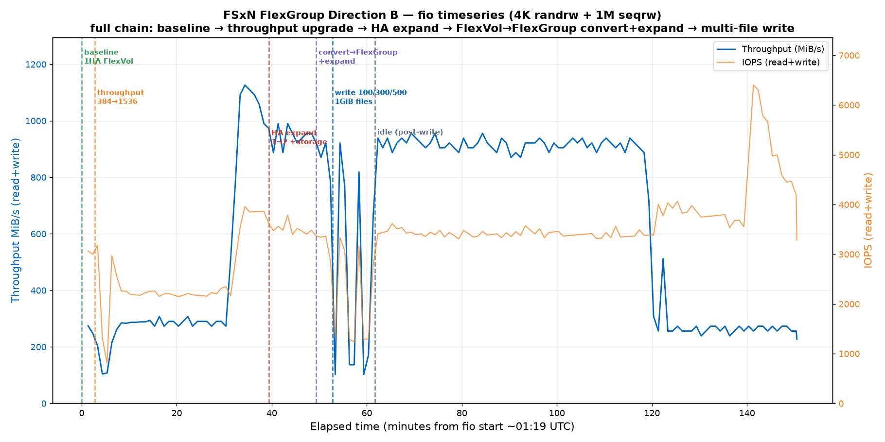

# FSx for NetApp ONTAP — FlexGroup Data Distribution Journey: DataSync Migration → Distribution Observation → In-Place Conversion

> A clean, end-to-end measured record: migrating data from a **single-HA-pair FlexVol** to a **2-HA-pair FlexGroup**, observing how FlexGroup distributes data across aggregates by file hash; then validating the full **in-place FlexVol → FlexGroup conversion** path — timings, performance impact, and balance convergence.
>
> **Region**: us-east-2 (Ohio) · **ONTAP**: 9.18.1P5 · **FSxN generation**: Gen2 (`SINGLE_AZ_2`) · All figures are measured (not doc-inferred); error messages quoted verbatim.

---

## Table of Contents

1. [Background & Questions](#1-background--questions)
2. [Part 1: DataSync Migration (FlexVol → FlexGroup)](#2-part-1-datasync-migration-flexvol--flexgroup)
   - [2.1 Environment](#21-environment)
   - [2.2 Full transfer (800 GiB)](#22-full-transfer-800-gib)
   - [2.3 Incremental transfer (150 GiB)](#23-incremental-transfer-150-gib)
   - [2.4 DataSync cost](#24-datasync-cost)
   - [2.5 Distribution observation: did FlexGroup balance?](#25-distribution-observation-did-flexgroup-balance)
3. [Part 2: In-Place FlexVol → FlexGroup Conversion](#3-part-2-in-place-flexvol--flexgroup-conversion)
   - [3.1 Full in-place upgrade path & timings](#31-full-in-place-upgrade-path--timings)
   - [3.2 fio full-run performance timeline](#32-fio-full-run-performance-timeline)
   - [3.3 Multi-file balance convergence + structural floor](#33-multi-file-balance-convergence--structural-floor)
4. [Key Conclusions](#4-key-conclusions)
5. [Appendix: Command Reference (redacted)](#5-appendix-command-reference-redacted)
6. [Appendix: FlexVol→FlexGroup Conversion Prerequisites (NetApp official)](#6-appendix-flexvolflexgroup-conversion-prerequisites-netapp-official)

---

## 1. Background & Questions

A **FlexGroup** is made of multiple **constituents (member FlexVols)** spread across one or more **aggregates**. When ONTAP writes a file, it **hashes at file granularity** and places the *entire file* into one constituent (unless using ONTAP 9.16.1+ advanced capacity balancing). So a FlexGroup's "balance" is an **approximate balance by file hash**, not block-level striping.

This experiment answers two questions with measured data:

1. **Migration scenario**: migrating 800 GiB from a single-HA-pair FlexVol to a 2-HA-pair FlexGroup (constituents across aggr1/aggr2) via **DataSync** — does the data auto-balance across the two aggregates? How long and how much does it cost?
2. **In-place conversion scenario**: can an existing FlexVol be **converted in place** to a FlexGroup (no data copy)? How long is the full upgrade chain (raise throughput → expand HA → convert → expand constituents)? How much does online performance drop during conversion? After writing many files, does cross-aggregate distribution converge toward 50:50?

---

## 2. Part 1: DataSync Migration (FlexVol → FlexGroup)

### 2.1 Environment

| Item | SOURCE | TARGET |
|---|---|---|
| FSxN | Gen2 Single-AZ, **1 HA pair**, 2048 GB, 384 MB/s | Gen2 Single-AZ, **2 HA pair**, 2048 GB, 1536 MB/s/HA |
| Volume | **FlexVol** `srcvol` (junction `/srcvol`) | **FlexGroup** `dstvol` (8 constituents, 4 each on aggr1/aggr2) |
| Data | 8 × 100 GiB = 800 GiB large files (`dd` real random data, non-sparse) | copied from source by DataSync |

> ⚠️ **A Gen2 2-HA-pair `ThroughputCapacityPerHAPair` can only be `[1536, 3072, 6144]`** — not 384 (that's a 1-HA-pair tier).

FlexGroup target volume creation (across both aggregates, 4 constituents per aggr, 8 total):

```bash
volume create -vserver dstsvm -volume dstvol \
  -aggr-list aggr1,aggr2 -aggr-list-multiplier 4 \
  -size 1600GB -junction-path /dstvol -security-style unix
```

### 2.2 Full transfer (800 GiB)

DataSync task uses the default **BASIC mode**.

| Metric | Measured |
|---|---|
| BytesTransferred | 858,993,459,200 B = **800 GiB** |
| Files | 9 (8 files + directory) |
| **Transfer duration** | 2,428,244 ms ≈ **40.5 min** |
| Avg transfer throughput | ≈ **353.7 MB/s** |
| **Verify duration** | 4,056,062 ms ≈ **67.6 min** ⚠️ |
| Total duration | ≈ **108.5 min** |

> ⚠️ **VerifyMode=ONLY_FILES_TRANSFERRED is extremely slow for large files**: verifying 800 GiB took 67.6 min — **1.67× longer than the transfer itself (40.5 min)**. Use `VerifyMode=NONE` or `POINT_IN_TIME_CONSISTENT` to save time.

### 2.3 Incremental transfer (150 GiB)

After adding files to the source, **re-run the same DataSync task** (incremental):

| Metric | Measured |
|---|---|
| BytesTransferred | 161,061,273,600 B = **150 GiB** |
| FilesTransferred | 3 (file_9 + file_10 + a 50 GiB test file) |
| Transfer duration | 492,233 ms ≈ **8.2 min** |
| Avg transfer throughput | ≈ **327 MB/s** |

> ✅ The incremental run transferred **only new/changed files** (150 GiB) — it did **not** re-transfer the 800 GiB of old data, confirming DataSync's `TransferMode=CHANGED` (default) incremental behavior.

### 2.4 DataSync cost

- **Rate**: BASIC mode **$0.0125/GB** (source: <https://aws.amazon.com/datasync/pricing/>; AWS notes the per-GB rate is the same across regions)
- Using decimal GB (AWS typically bills on 10⁹):

| Phase | Volume | Cost |
|---|---|---|
| Full | 859.0 GB | **$10.74** |
| Incremental | 161.06 GB | **$2.01** |
| **DataSync total** | | **≈ $12.75** |

- Endpoint side: source/target are in the same region, same VPC, same account → **no cross-region/cross-AZ Data Transfer OUT charges**; DataSync data doesn't incur PrivateLink billing; FSxN SSD storage billed separately.

### 2.5 Distribution observation: did FlexGroup balance?

**Key conclusion: migrating 8 large files results in clear skew, not the ideal 400:400.**

| Point in time | aggr1 | aggr2 | Ratio |
|---|---|---|---|
| After full 800 GiB | 209 GB (23%) | 616 GB (68%) | **≈ 200 : 600** |
| After incremental +150 GiB | 311.6 GB (34%) | 666.6 GB (73%) | **≈ 32 : 68** |

Constituent level (after full): `0005/0007` (102G each) on aggr1; `0002/0004` (202G each, 2 files each) + `0006/0008` (102G each) on aggr2 → **6 files on aggr2, 2 on aggr1**.

**Why the skew?** With only **8 files**, the file-hash landing sample is too small; randomness dominates → heavy bias toward one aggregate. FlexGroup's "auto-balance" only trends even with **many files** (see [3.3](#33-multi-file-balance-convergence--structural-floor): 100 files already converges to 56:44).

> 💡 To balance **few large files**, you need ONTAP 9.16.1+ advanced capacity balancing, or a manual `volume rebalance` / `volume move`.

---

## 3. Part 2: In-Place FlexVol → FlexGroup Conversion

**Question**: can a **clean FlexVol** (never touched by DataSync) be converted in place to a FlexGroup? How long is the full chain? How big is the online performance impact? After writing many files, does it converge toward 50:50?

> 📌 **Critical gotcha (important)**: a FlexVol that has been a DataSync FSx-ONTAP **source cannot be converted in place** to a FlexGroup. DataSync uses SnapMirror-to-Cloud under the hood, leaving a **hidden copy-to-cloud relationship + reference snapshot** on the source volume. `volume conversion start` then fails with `copy to cloud relationship ... is not a FlexVol`, and that relationship is **completely invisible in the customer CLI (even at diagnostic level) and cannot be released**. This part therefore uses a **completely DataSync-free clean volume**. (Proven both ways: clean volume converts successfully; the DataSync'd volume errors out and its snapshot cannot be deleted.)

### 3.1 Full in-place upgrade path & timings

Starting point: a **clean FlexVol `mfvol` at 1 HA pair / 2048 GB / 384 MB/s**. fio runs online throughout.

| Step | Operation | Duration (measured) | Note |
|---|---|---|---|
| 1 | Raise throughput 384 → 1536 (online, within 1HA) | **~36.5 min** | ⚠️ must raise throughput first |
| 2 | Expand HA 1 → 2 + storage 2048 → 4096 | **~10 min** | now has aggr1 + aggr2 |
| 3 | **FlexVol → FlexGroup conversion** (diag level) | **< 1 min** | `Job succeeded`, instant on clean volume |
| 4 | `volume expand` add constituents (+4 per aggr) | **< 1 min** | results in 9 constituents |

> ⚠️ **Cannot go directly from 1HA(384) → 2HA**: FSx requires keeping the original throughput when expanding HA, but 2HA only supports ≥1536 → contradiction. **You must first raise throughput to 1536 within 1HA, then expand HA** (and storage must double from 2048→4096 during the HA expand).

Constituent layout after conversion + expand (**key**):

- Conversion produces a **single constituent** `mfvol__0001` on **aggr1**.
- Then a symmetric expand (+4 per aggr) → **aggr1 has 5** (`__0001,__0002,__0004,__0006,__0008`), **aggr2 has 4** (`__0003,__0005,__0007,__0009`).
- → an **asymmetric 5 : 4 constituent count**, which sets the balance floor (see 3.3).

### 3.2 fio full-run performance timeline

fio parameters: `job1: 4K randrw rwmixread=70, iodepth=32, numjobs=4` + `job2: 1M seqrw rwmixread=50, iodepth=16, numjobs=2`; sampled every 60s, per-interval deltas used to reconstruct true instantaneous throughput.



**Reading the chart** (x-axis = minutes since fio start):

| Phase | Throughput (read+write) | Relative to baseline |
|---|---|---|
| Baseline 1HA/384 FlexVol | ~260–300 MiB/s | 100% |
| Raising throughput 384→1536 | trough ~100 MiB/s | ~38% |
| HA expand / conversion / expand | trough ~90–140 MiB/s (volume ops briefly interrupt I/O — the deep V around 50–60 min) | ~35–50% |
| **Post-upgrade steady state 2HA/1536** | **~900+ MiB/s** | **~3.5×** |
| Tail (multi-file write + idle) | fluctuates then falls back | — |

**Observations**:
- Online performance **drops noticeably** during upgrade/expand/conversion (these are stateful volume/storage operations that yield or briefly interrupt I/O).
- **Post-upgrade steady-state throughput is ~900+ MiB/s, ~3.5× the 1HA/384 baseline** — raising the throughput tier + 2 HA genuinely lifts the ceiling (this workload can consume it).
- Conversion (step 3) + expand (step 4) themselves are **each < 1 min** — a very short disturbance to the workload.

### 3.3 Multi-file balance convergence + structural floor

On the converted 9-constituent FlexGroup, write **100 / 300 / 500 × 1 GiB files** and measure aggr1:aggr2 distribution at each tier:


| Files | aggr1 % | aggr2 % | Total GB |
|---|---|---|---|
| 100 | 56.4 | 43.6 | 108.2 |
| 300 | 55.3 | 44.7 | 310.2 |
| 500 | 55.0 | 45.0 | 510.9 |
| **Structural floor (5:4 constituents)** | **55.6** | **44.4** | — |

**Two key conclusions**:

1. **Hash distribution converges very fast**: just **100 files** reaches 56:44 (vs. Part 1's 8 files ~25:75, and another run's 5 files 40:60). More files → more even hash landing.
2. **The residual 55:45 is not hash randomness — it is structural**: the original converted constituent `__0001` stays on aggr1, then a symmetric +4/+4 expand → aggr1 has **5**, aggr2 only **4** constituents. The balance floor = **5/9 : 4/9 = 55.6 : 44.4**, which no amount of extra files can break through.
   - **At the per-constituent level, all 9 are ~52–58 GB each — nearly perfectly balanced**.
   - To get true 50:50 → make the **constituent counts equal** across both aggregates (add 1 more to aggr2 for 5:5), not by adding more files.

---

## 4. Key Conclusions

| # | Conclusion |
|---|---|
| 1 | **FlexGroup distributes by file hash**: few large files (8) → heavy skew (~200:600); many files (100+) → rapid convergence toward balance. |
| 2 | **DataSync full 800 GiB ≈ 40.5 min transfer + 67.6 min verify** (verify slower than transfer); incremental transfers only changed files (150 GiB ≈ 8.2 min). |
| 3 | **DataSync cost** (BASIC $0.0125/GB): full $10.74 + incremental $2.01 ≈ **$12.75**. |
| 4 | **A clean FlexVol can be converted in place** to a FlexGroup; the conversion itself is < 1 min (`Job succeeded`). |
| 5 | **A FlexVol used as a DataSync source cannot be converted in place** (blocked by a hidden copy-to-cloud SM relationship, invisible and un-releasable on the customer side). |
| 6 | **Full in-place upgrade chain**: raise throughput (~36.5 min) → expand HA (~10 min) → convert (<1min) → expand (<1min). ⚠️ Cannot go directly 1HA(384)→2HA. |
| 7 | **Online performance**: drops to ~35–50% of baseline during upgrade/expand (trough ~90–140 MiB/s); **~900+ MiB/s steady state afterward, ~3.5× baseline**. |
| 8 | **The residual 55:45 is structural** (5:4 constituents), not hash randomness; true 50:50 requires equal constituent counts per aggregate. |

---

## 5. Appendix: Command Reference (redacted)

> Placeholders: `<SRC_FS_ID>` / `<DST_FS_ID>` / `<SVM_ID>` / `<SUBNET_ID>` / `<SG_ID>` / `<MGMT_IP>` / `<NFS_IP>` / `<FSXADMIN_PASSWORD>`. Bastion via SSM; ONTAP CLI via `sshpass`.

### 5.1 Create FSxN (Gen2 Single-AZ)

```bash
# 1 HA pair (source / clean-volume starting point)
aws fsx create-file-system --file-system-type ONTAP --storage-capacity 2048 \
  --subnet-ids <SUBNET_ID> --region us-east-2 \
  --ontap-configuration 'DeploymentType=SINGLE_AZ_2,HAPairs=1,ThroughputCapacityPerHAPair=384,FsxAdminPassword=<FSXADMIN_PASSWORD>,PreferredSubnetId=<SUBNET_ID>'

# 2 HA pair (DataSync target) — 2HA throughput can only be 1536/3072/6144
aws fsx create-file-system --file-system-type ONTAP --storage-capacity 2048 \
  --subnet-ids <SUBNET_ID> --region us-east-2 \
  --ontap-configuration 'DeploymentType=SINGLE_AZ_2,HAPairs=2,ThroughputCapacityPerHAPair=1536,FsxAdminPassword=<FSXADMIN_PASSWORD>,PreferredSubnetId=<SUBNET_ID>'
```

### 5.2 Create SVM + volumes

```bash
# ⚠️ On FSx, SVMs must be created via the aws CLI — ONTAP CLI's `vserver create` is not authorized
aws fsx create-storage-virtual-machine --file-system-id <FS_ID> --name mfsvm --region us-east-2

# FlexVol (ONTAP CLI)
volume create -vserver mfsvm -volume mfvol -size 1800GB -junction-path /mfvol -security-style unix

# FlexGroup (ONTAP CLI, across both aggrs, 4 constituents per aggr)
volume create -vserver dstsvm -volume dstvol -aggr-list aggr1,aggr2 \
  -aggr-list-multiplier 4 -size 1600GB -junction-path /dstvol -security-style unix
```

### 5.3 Generate data (real, non-sparse)

```bash
mount -t nfs -o nfsvers=3 <NFS_IP>:/mfvol /mnt/src
for i in $(seq 1 8); do
  dd if=/dev/urandom of=/mnt/src/file_$i.bin bs=1M count=102400 status=progress &
done; wait
```

### 5.4 DataSync (FSx ONTAP → FSx ONTAP)

```bash
aws datasync create-location-fsx-ontap --region us-east-2 \
  --storage-virtual-machine-arn <SRC_SVM_ARN> \
  --protocol 'NFS={MountOptions={Version=NFS3}}' \
  --security-group-arns <SG_ARN> --subdirectory /srcvol
# ... create the dest location the same way ...

aws datasync create-task --source-location-arn <SRC_LOC_ARN> \
  --destination-location-arn <DST_LOC_ARN> --region us-east-2   # BASIC mode by default

aws datasync start-task-execution --task-arn <TASK_ARN> --region us-east-2   # full
# After adding files, re-run the same task = incremental (only changed files)
aws datasync describe-task-execution --task-execution-arn <EXEC_ARN> --region us-east-2 \
  --query '{Bytes:BytesTransferred,Xfer:TransferDuration,Verify:VerifyDuration}'
```

### 5.5 In-place upgrade chain

```bash
# 1) Raise throughput first (within 1HA, ~36.5min)
aws fsx update-file-system --file-system-id <FS_ID> --region us-east-2 \
  --ontap-configuration 'ThroughputCapacityPerHAPair=1536'

# 2) Expand HA 1→2 + double storage (~10min)
aws fsx update-file-system --file-system-id <FS_ID> --region us-east-2 \
  --storage-capacity 4096 \
  --ontap-configuration 'HAPairs=2,ThroughputCapacityPerHAPair=1536'
```

### 5.6 FlexVol → FlexGroup conversion + expand constituents (ONTAP CLI)

```bash
sshpass -p '<FSXADMIN_PASSWORD>' ssh fsxadmin@<MGMT_IP>
set -privilege diagnostic -confirmations off      # ⚠️ conversion is hidden at admin level, needs diag

volume conversion start -vserver mfsvm -volume mfvol -check-only true   # check first
volume conversion start -vserver mfsvm -volume mfvol                    # convert → Job succeeded

# Add constituents across aggrs (+4 per aggr)
volume expand -vserver mfsvm -volume mfvol -aggr-list aggr1,aggr2 -aggr-list-multiplier 4
```

### 5.7 Inspect distribution

```bash
storage aggregate show -fields node,size,usedsize,availsize
volume show -vserver mfsvm -volume mfvol* -fields aggregate,used
volume show-footprint -volume mfvol
```

### 5.8 Cleanup

```bash
# Order: volume → SVM → file system; DataSync task → locations
volume unmount -vserver <SVM> -volume <VOL>; volume offline ...; volume delete ...
aws fsx delete-storage-virtual-machine --storage-virtual-machine-id <SVM_ID> --region us-east-2
aws fsx delete-file-system --file-system-id <FS_ID> --region us-east-2
aws datasync delete-task --task-arn <TASK_ARN> --region us-east-2
aws datasync delete-location --location-arn <LOC_ARN> --region us-east-2
```

---

## 6. Appendix: FlexVol→FlexGroup Conversion Prerequisites (NetApp official)

Source: <https://docs.netapp.com/us-en/ontap/flexgroup/convert-flexvol-volume-task.html> · ONTAP 9.7+ supports in-place conversion (no data copy, no extra space required).

**Conditions that block conversion (check each)**:

1. Volume must be **online**.
2. Volume transitioned from 7-Mode (no on 9.7; yes on 9.8+).
3. FlexGroup-unsupported features enabled: SAN LUN, Windows NFS, SMB1, snapshot naming/autodelete, vmalign, SnapLock(<9.11.1), space SLO, logical space enforcement/reporting.
4. <9.10.1 and the SVM uses SVM-DR.
5. A FlexClone volume exists and this volume is its parent; this volume cannot be a parent or a clone.
6. This volume is a FlexCache origin volume.
7. Snapshot count: 9.7- ≤255; 9.8+ ≤1023.
8. **Storage efficiency enabled → recommended to disable first** (on FSx, measured to be **warning-only, not blocking**).
9. **This volume is the source of a SnapMirror relationship whose destination isn't converted yet** ← DataSync copy-to-cloud hits this.
10. **This volume is in an active (not quiesced) SnapMirror relationship** ← same.
11. ARP (Autonomous Ransomware Protection) enabled → disable first.
12. **Quota enabled → must disable first**, can re-enable after.
13. Volume name >197 characters.
14. Volume associated with an application (9.7 only).
15. ONTAP processes running: mirroring, jobs, wafliron, NDMP backup, inode conversion.
16. Volume is the SVM root volume.
17. Volume too full (≥80% max capacity → NetApp recommends copy instead of in-place conversion).

**Steps**: `set -privilege diagnostic` (needs diag on FSx) → `volume conversion start ... -check-only true` → `volume conversion start ...`. After conversion it is a **single-constituent FlexGroup**; you can then `volume expand` to add constituents. ⚠️ **Irreversible**: a FlexGroup cannot be converted back to a FlexVol; snapshots are marked pre-conversion.

---

*The test environment was retained for reproducibility. All figures come from CLI measurements (`storage aggregate show` usedsize, `describe-task-execution`, fio per-interval sampling), not doc inference.*
