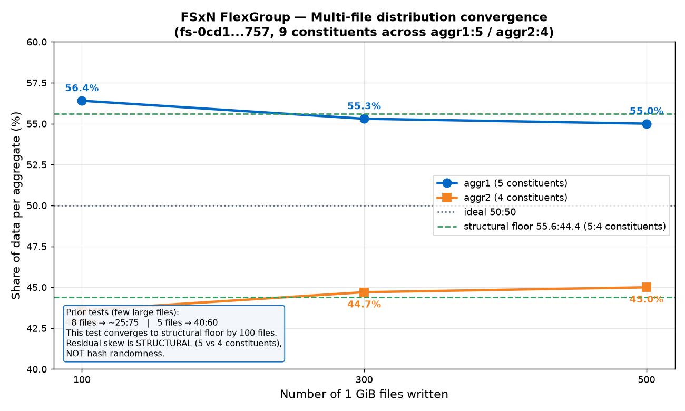

# FSx for NetApp ONTAP — FlexGroup 数据分布之旅：DataSync 迁移 → 分布观测 → 就地转换

**语言 / Language**: 中文（本页） · [English](./README.md)

> 一次干净、完整的实测记录：把数据从**单 HA pair 的 FlexVol** 迁移到 **2 HA pair 的 FlexGroup**，观察 FlexGroup 如何按文件哈希跨 aggregate 分布；随后验证 FlexVol **就地转 FlexGroup（in-place conversion）** 的完整链路、耗时、性能影响与均衡收敛。
>
> **Region**: us-east-2 (Ohio) · **ONTAP**: 9.18.1P5 · **FSxN 代次**: Gen2 (`SINGLE_AZ_2`) · 全程实测，报错原文照录，不臆造。

---

## 目录

1. [背景与问题](#1-背景与问题)
2. [第一段：DataSync 迁移（FlexVol → FlexGroup）](#2-第一段datasync-迁移flexvol--flexgroup)
   - [2.1 环境](#21-环境)
   - [2.2 全量传输（800 GiB）](#22-全量传输800-gib)
   - [2.3 增量传输（150 GiB）](#23-增量传输150-gib)
   - [2.4 DataSync 费用](#24-datasync-费用)
   - [2.5 数据分布观测：FlexGroup 均衡了吗？](#25-数据分布观测flexgroup-均衡了吗)
3. [第二段：FlexVol 就地转 FlexGroup（in-place conversion）](#3-第二段flexvol-就地转-flexgroupin-place-conversion)
   - [3.1 完整就地升级链路与耗时](#31-完整就地升级链路与耗时)
   - [3.2 fio 全程性能时序图](#32-fio-全程性能时序图)
   - [3.3 多文件均衡收敛 + 结构性地板](#33-多文件均衡收敛--结构性地板)
4. [关键结论汇总](#4-关键结论汇总)
5. [附：命令手册（脱敏）](#5-附命令手册脱敏)
6. [附：FlexVol→FlexGroup 转换前置条件（NetApp 官方）](#6-附flexvolflexgroup-转换前置条件netapp-官方)

---

## 1. 背景与问题

**FlexGroup** 由多个 **constituent（成员 FlexVol）** 组成，这些 constituent 分布在一个或多个 **aggregate** 上。ONTAP 写文件时按**文件粒度做哈希**，把整个文件落到某一个 constituent（除非 ONTAP 9.16.1+ 的 advanced capacity balancing）。因此 FlexGroup 的"均衡"是**按文件哈希的近似均衡**，不是块级条带化。

本实验要用实测回答两个问题：

1. **迁移场景**：把 800 GiB 数据从「单 HA pair 的 FlexVol」经 **DataSync** 拷到「2 HA pair 的 FlexGroup」（constituent 跨 aggr1/aggr2），数据会**自动均衡**到两个 aggregate 吗？传输花多久、多少钱？
2. **就地转换场景**：一个现有的 FlexVol 能不能**原地转成 FlexGroup**（in-place，不搬数据）？完整升级链路（升吞吐 → 扩 HA → 转换 → 扩 constituent）要多久？转换期间在线业务性能受多大影响？转完写大量文件后，跨 aggregate 能收敛到接近 50:50 吗？

---

## 2. 第一段：DataSync 迁移（FlexVol → FlexGroup）

### 2.1 环境

| 项 | SOURCE（源） | TARGET（目标） |
|---|---|---|
| FSxN | Gen2 Single-AZ, **1 HA pair**, 2048 GB, 384 MB/s | Gen2 Single-AZ, **2 HA pair**, 2048 GB, 1536 MB/s/HA |
| 卷 | **FlexVol** `srcvol`（junction `/srcvol`） | **FlexGroup** `dstvol`（8 constituent，aggr1/aggr2 各 4 个） |
| 数据 | 8 × 100 GiB = 800 GiB 大文件（`dd` 真实随机数据，非稀疏） | DataSync 从源拷入 |

> ⚠️ **Gen2 2 HA pair 的 `ThroughputCapacityPerHAPair` 只能是 `[1536, 3072, 6144]`**，不能用 384（那是 1 HA pair 的档位）。

FlexGroup 目标卷创建（跨两个 aggregate，每 aggr 4 个 constituent，共 8）：

```bash
volume create -vserver dstsvm -volume dstvol \
  -aggr-list aggr1,aggr2 -aggr-list-multiplier 4 \
  -size 1600GB -junction-path /dstvol -security-style unix
```

### 2.2 全量传输（800 GiB）

DataSync task 采用默认 **BASIC mode**。

| 指标 | 实测值 |
|---|---|
| BytesTransferred | 858,993,459,200 B = **800 GiB** |
| 文件数 | 9（8 文件 + 目录） |
| **Transfer 时长** | 2,428,244 ms ≈ **40.5 min** |
| 平均传输吞吐 | ≈ **353.7 MB/s** |
| **Verify 时长** | 4,056,062 ms ≈ **67.6 min** ⚠️ |
| Total 时长 | ≈ **108.5 min** |

> ⚠️ **VerifyMode=ONLY_FILES_TRANSFERRED 对大文件回读校验极慢**：800 GiB 校验用了 67.6 min，**比传输本身（40.5 min）还长 1.67 倍**。想省时用 `VerifyMode=NONE` 或 `POINT_IN_TIME_CONSISTENT`。

### 2.3 增量传输（150 GiB）

在源卷再加文件后，**跑同一个 DataSync task**（增量）：

| 指标 | 实测值 |
|---|---|
| BytesTransferred | 161,061,273,600 B = **150 GiB** |
| FilesTransferred | 3（file_9 + file_10 + 一个 50 GiB 测试文件） |
| Transfer 时长 | 492,233 ms ≈ **8.2 min** |
| 平均传输吞吐 | ≈ **327 MB/s** |

> ✅ 增量确实**只传新增/变更文件**（150 GiB），没有重传 800 GiB 旧数据 —— 印证 DataSync `TransferMode=CHANGED`（默认）的增量行为。

### 2.4 DataSync 费用

- **单价**：BASIC mode **$0.0125/GB**（来源：<https://aws.amazon.com/datasync/pricing/>，AWS 注明 per-GB 费率各 region 相同）
- 按十进制 GB（AWS 通常按 10⁹ 计）：

| 阶段 | 数据量 | 费用 |
|---|---|---|
| 全量 | 859.0 GB | **$10.74** |
| 增量 | 161.06 GB | **$2.01** |
| **DataSync 合计** | | **≈ $12.75** |

- 端点侧：源/目标同 region 同 VPC 同账号，**无跨区/跨 AZ Data Transfer OUT 费**；DataSync 传输数据不走 PrivateLink 计费；FSxN SSD 存储另计。

### 2.5 数据分布观测：FlexGroup 均衡了吗？

**核心结论：8 个大文件的迁移，分布明显偏斜，不是理想的 400:400。**

| 时点 | aggr1 | aggr2 | 比例 |
|---|---|---|---|
| 全量 800 GiB 后 | 209 GB (23%) | 616 GB (68%) | **≈ 200 : 600** |
| 增量 +150 GiB 后 | 311.6 GB (34%) | 666.6 GB (73%) | **≈ 32 : 68** |

constituent 级别（全量后）：`0005/0007`（各 102G）落 aggr1；`0002/0004`（各 202G，各含 2 文件）+ `0006/0008`（各 102G）落 aggr2 → **6 个文件落 aggr2，2 个落 aggr1**。

**为什么偏斜？** 因为只有 **8 个文件**，文件哈希的落点样本太小，随机性主导 → 严重偏向某个 aggregate。FlexGroup 的"自动均衡"要在**大量文件**时才趋于均匀（见 [3.3](#33-多文件均衡收敛--结构性地板)：100 个文件就收敛到 56:44）。

> 💡 想让**少量大文件**也均衡，需要 ONTAP 9.16.1+ 的 advanced capacity balancing，或手动 `volume rebalance` / `volume move`。

---

## 3. 第二段：FlexVol 就地转 FlexGroup（in-place conversion）

**问题**：一个**干净的 FlexVol**（从未接过 DataSync）能否原地转成 FlexGroup？完整链路多久？在线性能影响多大？转完写大量文件能否收敛到接近 50:50？

> 📌 **前置踩坑（重要）**：被 DataSync 当过 FSx-ONTAP **source** 的 FlexVol **无法就地转 FlexGroup** —— DataSync 底层用 SnapMirror-to-Cloud，会在源卷留下**隐藏的 copy-to-cloud 关系 + 参考快照**，`volume conversion start` 会报 `copy to cloud relationship ... is not a FlexVol` 而拦截，且该关系在客户 CLI（连 diagnostic 级）完全不可见、无法 release。所以本段用的是**全程零 DataSync 的干净卷**。（该结论已由"干净卷成功转 + DataSync'd 卷报错且快照删不掉"双向坐实。）

### 3.1 完整就地升级链路与耗时

起点：**1 HA pair / 2048 GB / 384 MB/s 的干净 FlexVol** `mfvol`。全程 fio 在线压测。

| 阶段 | 操作 | 耗时（实测） | 说明 |
|---|---|---|---|
| 1 | 升 throughput 384 → 1536（1HA 内在线） | **~36.5 min** | ⚠️ 必须先升吞吐 |
| 2 | 扩 HA 1 → 2 + storage 2048 → 4096 | **~10 min** | 完成后有 aggr1 + aggr2 |
| 3 | **FlexVol → FlexGroup 转换**（diag 级） | **< 1 min** | `Job succeeded`，干净卷秒成 |
| 4 | `volume expand` 加 constituent（每 aggr +4） | **< 1 min** | 得到 9 个 constituent |

> ⚠️ **无法直接 1HA(384) → 2HA**：FSx 要求扩 HA 时保持原 throughput，但 2HA 只支持 ≥1536 → 矛盾。**必须先在 1HA 内把 throughput 升到 1536，再扩 HA**（且扩 HA 时 storage 必须翻倍 2048→4096）。

转换 + expand 后的 constituent 布局（**关键**）：

- 转换产生**单个 constituent** `mfvol__0001`，落在 **aggr1**。
- 再对称 expand（每 aggr +4）→ **aggr1 有 5 个**（`__0001,__0002,__0004,__0006,__0008`），**aggr2 有 4 个**（`__0003,__0005,__0007,__0009`）。
- → **5 : 4 的 constituent 数不对称**，这决定了均衡地板（见 3.3）。

### 3.2 fio 全程性能时序图

fio 参数：`job1: 4K randrw rwmixread=70, iodepth=32, numjobs=4` + `job2: 1M seqrw rwmixread=50, iodepth=16, numjobs=2`，每 60s 采样，per-interval 增量还原真实瞬时吞吐。


**读图**（横轴=从 fio 启动起的分钟数）：

| 阶段 | 吞吐（read+write） | 相对基线 |
|---|---|---|
| 基线 1HA/384 FlexVol | ~260–300 MiB/s | 100% |
| 升 throughput 384→1536 中 | 谷底 ~100 MiB/s | ~38% |
| 扩 HA / 转换 / expand 中 | 谷底 ~90–140 MiB/s（卷操作使 I/O 短时中断，图中 50–60 min 的深 V） | ~35–50% |
| **升级完成稳态 2HA/1536** | **~900+ MiB/s** | **~3.5×** |
| 尾部（多文件写 + idle） | 波动后回落 | — |

**观察**：
- 升级/扩容/转换/expand 期间在线性能**明显下降**（这些是有状态的卷/存储操作，会让位或短时中断 I/O）。
- **升级完成后稳态吞吐 ~900+ MiB/s，是 1HA/384 基线的 ~3.5 倍** —— 升吞吐档 + 2 HA 把上限真正抬高了（此负载能吃到）。
- 转换（步骤 3）+ expand（步骤 4）本身**各 < 1 min**，对业务是很短的扰动。

### 3.3 多文件均衡收敛 + 结构性地板

在转好的 9-constituent FlexGroup 上写 **100 / 300 / 500 个 1 GiB 文件**，每档测 aggr1:aggr2 分布：



| 文件数 | aggr1 % | aggr2 % | 总量 GB |
|---|---|---|---|
| 100 | 56.4 | 43.6 | 108.2 |
| 300 | 55.3 | 44.7 | 310.2 |
| 500 | 55.0 | 45.0 | 510.9 |
| **结构地板（5:4 constituent）** | **55.6** | **44.4** | — |

**两个关键结论**：

1. **哈希分布收敛极快**：仅 **100 个文件**就到 56:44（对比第一段 8 文件 ~25:75、另一次 5 文件 40:60）。文件越多，哈希落点越均匀。
2. **残留的 55:45 不是哈希随机，是结构性的**：转换产生的原始 constituent `__0001` 留在 aggr1，再对称 +4/+4 expand → aggr1 有 **5** 个、aggr2 只 **4** 个 constituent。均衡地板 = **5/9 : 4/9 = 55.6 : 44.4**，堆再多文件也突破不了。
   - **per-constituent 层面 9 个各 ~52–58 GB，几乎完全均衡**。
   - 想要真 50:50 → 让两个 aggr 的 **constituent 数相等**（给 aggr2 再 expand 1 个到 5:5），而不是靠加文件。

---

## 4. 关键结论汇总

| # | 结论 |
|---|---|
| 1 | **FlexGroup 按文件哈希分布**：少量大文件（8 个）→ 严重偏斜（~200:600）；大量文件（100+）→ 快速收敛到接近均衡。 |
| 2 | **DataSync 全量 800 GiB ≈ 40.5 min 传输 + 67.6 min 校验**（校验比传输还慢）；增量只传变更文件（150 GiB ≈ 8.2 min）。 |
| 3 | **DataSync 费用**（BASIC $0.0125/GB）：全量 $10.74 + 增量 $2.01 ≈ **$12.75**。 |
| 4 | **干净 FlexVol 可就地转 FlexGroup**，转换本身 < 1 min（`Job succeeded`）。 |
| 5 | **被 DataSync 当过 source 的 FlexVol 无法就地转**（隐藏 copy-to-cloud SM 关系阻塞，客户端不可见、删不掉）。 |
| 6 | **完整就地升级链路**：先升 throughput（~36.5 min）→ 扩 HA（~10 min）→ 转换（<1min）→ expand（<1min）。⚠️ 不能直接 1HA(384)→2HA。 |
| 7 | **在线性能**：升级/扩容期间掉到基线 ~35–50%（谷底 ~90–140 MiB/s）；**完成后稳态 ~900+ MiB/s，约 3.5× 基线**。 |
| 8 | **残留 55:45 是结构性**（constituent 5:4），非哈希随机；要真 50:50 得让两 aggr constituent 数相等。 |

---

## 5. 附：命令手册（脱敏）

> 占位符：`<SRC_FS_ID>` / `<DST_FS_ID>` / `<SVM_ID>` / `<SUBNET_ID>` / `<SG_ID>` / `<MGMT_IP>` / `<NFS_IP>` / `<FSXADMIN_PASSWORD>`。跳板机走 SSM；ONTAP CLI 走 `sshpass`。

### 5.1 建 FSxN（Gen2 Single-AZ）

```bash
# 1 HA pair（源 / 干净卷起点）
aws fsx create-file-system --file-system-type ONTAP --storage-capacity 2048 \
  --subnet-ids <SUBNET_ID> --region us-east-2 \
  --ontap-configuration 'DeploymentType=SINGLE_AZ_2,HAPairs=1,ThroughputCapacityPerHAPair=384,FsxAdminPassword=<FSXADMIN_PASSWORD>,PreferredSubnetId=<SUBNET_ID>'

# 2 HA pair（DataSync 目标）—— 2HA 吞吐只能 1536/3072/6144
aws fsx create-file-system --file-system-type ONTAP --storage-capacity 2048 \
  --subnet-ids <SUBNET_ID> --region us-east-2 \
  --ontap-configuration 'DeploymentType=SINGLE_AZ_2,HAPairs=2,ThroughputCapacityPerHAPair=1536,FsxAdminPassword=<FSXADMIN_PASSWORD>,PreferredSubnetId=<SUBNET_ID>'
```

### 5.2 建 SVM + 卷

```bash
# ⚠️ FSx 上 SVM 必须用 aws CLI，ONTAP CLI 的 vserver create 无权限
aws fsx create-storage-virtual-machine --file-system-id <FS_ID> --name mfsvm --region us-east-2

# FlexVol（ONTAP CLI）
volume create -vserver mfsvm -volume mfvol -size 1800GB -junction-path /mfvol -security-style unix

# FlexGroup（ONTAP CLI，跨两个 aggr，每 aggr 4 个 constituent）
volume create -vserver dstsvm -volume dstvol -aggr-list aggr1,aggr2 \
  -aggr-list-multiplier 4 -size 1600GB -junction-path /dstvol -security-style unix
```

### 5.3 造数据（真实非稀疏）

```bash
mount -t nfs -o nfsvers=3 <NFS_IP>:/mfvol /mnt/src
for i in $(seq 1 8); do
  dd if=/dev/urandom of=/mnt/src/file_$i.bin bs=1M count=102400 status=progress &
done; wait
```

### 5.4 DataSync（FSx ONTAP → FSx ONTAP）

```bash
aws datasync create-location-fsx-ontap --region us-east-2 \
  --storage-virtual-machine-arn <SRC_SVM_ARN> \
  --protocol 'NFS={MountOptions={Version=NFS3}}' \
  --security-group-arns <SG_ARN> --subdirectory /srcvol
# ... 同样建 dest location ...

aws datasync create-task --source-location-arn <SRC_LOC_ARN> \
  --destination-location-arn <DST_LOC_ARN> --region us-east-2   # 默认 BASIC mode

aws datasync start-task-execution --task-arn <TASK_ARN> --region us-east-2   # 全量
# 加文件后再跑同一 task = 增量（只传变更文件）
aws datasync describe-task-execution --task-execution-arn <EXEC_ARN> --region us-east-2 \
  --query '{Bytes:BytesTransferred,Xfer:TransferDuration,Verify:VerifyDuration}'
```

### 5.5 就地升级链路

```bash
# 1) 先升 throughput（1HA 内，~36.5min）
aws fsx update-file-system --file-system-id <FS_ID> --region us-east-2 \
  --ontap-configuration 'ThroughputCapacityPerHAPair=1536'

# 2) 扩 HA 1→2 + storage 翻倍（~10min）
aws fsx update-file-system --file-system-id <FS_ID> --region us-east-2 \
  --storage-capacity 4096 \
  --ontap-configuration 'HAPairs=2,ThroughputCapacityPerHAPair=1536'
```

### 5.6 FlexVol → FlexGroup 转换 + 扩 constituent（ONTAP CLI）

```bash
sshpass -p '<FSXADMIN_PASSWORD>' ssh fsxadmin@<MGMT_IP>
set -privilege diagnostic -confirmations off      # ⚠️ conversion 在 admin 级不可见，需 diag

volume conversion start -vserver mfsvm -volume mfvol -check-only true   # 先 check
volume conversion start -vserver mfsvm -volume mfvol                    # 正式转 → Job succeeded

# 加 constituent 跨 aggr（每 aggr +4）
volume expand -vserver mfsvm -volume mfvol -aggr-list aggr1,aggr2 -aggr-list-multiplier 4
```

### 5.7 查分布

```bash
storage aggregate show -fields node,size,usedsize,availsize
volume show -vserver mfsvm -volume mfvol* -fields aggregate,used
volume show-footprint -volume mfvol
```

### 5.8 清理

```bash
# 顺序：volume → SVM → file system；DataSync task → locations
volume unmount -vserver <SVM> -volume <VOL>; volume offline ...; volume delete ...
aws fsx delete-storage-virtual-machine --storage-virtual-machine-id <SVM_ID> --region us-east-2
aws fsx delete-file-system --file-system-id <FS_ID> --region us-east-2
aws datasync delete-task --task-arn <TASK_ARN> --region us-east-2
aws datasync delete-location --location-arn <LOC_ARN> --region us-east-2
```

---

## 6. 附：FlexVol→FlexGroup 转换前置条件（NetApp 官方）

来源：<https://docs.netapp.com/us-en/ontap/flexgroup/convert-flexvol-volume-task.html> · ONTAP 9.7+ 支持就地转换（无需复制数据、无需额外空间）。

**会阻止转换的条件（逐项检查）**：

1. 卷必须 **online**。
2. 7-Mode 转换来的卷（9.7 不行，9.8+ 可）。
3. 启用了 FlexGroup 尚不支持的功能：SAN LUN、Windows NFS、SMB1、snapshot 命名/autodelete、vmalign、SnapLock(<9.11.1)、space SLO、logical space enforcement/reporting。
4. <9.10.1 且 SVM 在用 SVM-DR。
5. 存在 FlexClone 卷且本卷是 parent；本卷不能是 parent 或 clone。
6. 本卷是 FlexCache origin 卷。
7. 快照数：9.7- ≤255；9.8+ ≤1023。
8. **启用了 storage efficiency → 建议先禁用**（FSx 上实测**只警告不拦截**）。
9. **本卷是 SnapMirror 关系的 source，且 destination 尚未转换** ← DataSync copy-to-cloud 卡这条。
10. **本卷处于 active（未 quiesce）的 SnapMirror 关系中** ← 同上。
11. 启用了 ARP（Autonomous Ransomware Protection）→ 需先禁用。
12. **启用了 quota → 必须先禁用**，转换后可重启。
13. 卷名 >197 字符。
14. 卷关联了 application（仅 9.7）。
15. 有 ONTAP 进程在跑：mirroring、jobs、wafliron、NDMP backup、inode conversion。
16. 卷是 SVM root 卷。
17. 卷太满（≥80% max capacity 时官方建议改用复制而非就地转）。

**步骤**：`set -privilege diagnostic`（FSx 上需 diag）→ `volume conversion start ... -check-only true` → `volume conversion start ...`。转换后是**单 constituent FlexGroup**，可再 `volume expand` 加 constituent。⚠️ **不可逆**：FlexGroup 不能转回 FlexVol；快照会被置为 pre-conversion。

---

*实测环境全程保留供复现。所有数字来自 CLI 实测（`storage aggregate show` usedsize、`describe-task-execution`、fio per-interval 采样），非文档推断。*
