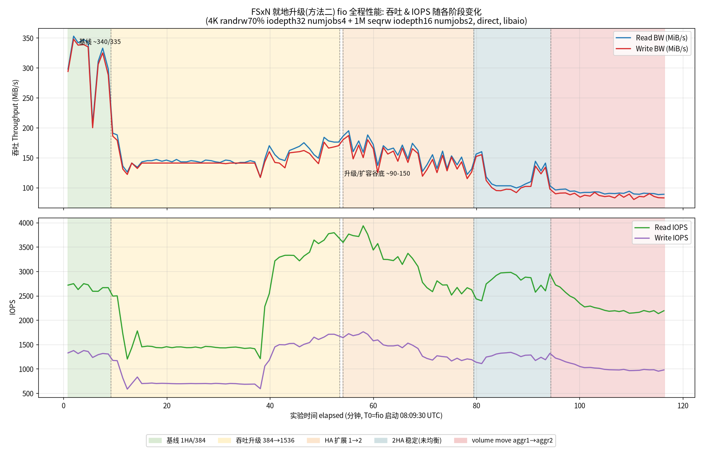

# FSx for NetApp ONTAP — 让数据分布到 2 个 HA pair(aggregate)的两种方法实测

目标:让 FSxN 的数据从「单 HA pair(单 aggregate)」变成「跨 2 HA pair(aggr1 + aggr2)」,并观察分布是否均衡、性能与耗时如何。对比两种方法:

- **方法一:新建迁移法(第 1~6 节)** — 新建一个 **2HA 的 FSxN + FlexGroup**,用 **AWS DataSync** 把数据从旧的 1HA FlexVol 迁移过来,看 FlexGroup 是否自动均衡到 2 个 aggregate。
- **方法二:就地升级法 in-place upgrade(第 7 节)** — 对**同一个 FSxN** 原地把 1HA 升级成 2HA,再尝试 FlexVol 原地转 FlexGroup + `volume move` 就地移动数据,全程用 fio 压测观察性能。数据不搬到新文件系统。

- Region: `us-east-2` (Ohio)
- FSxN 代次: **Gen2 (SINGLE_AZ_2)**
- ONTAP: 9.18.1P5
- 测试日期: 2026-08-28

> 文末有两种方法的对比小结(耗时 / 停机影响 / 性能波动 / 复杂度 / 适用场景)。

---

## 1. 实验设计

| 项 | 源 (SOURCE) | 目标 (TARGET) |
|---|---|---|
| FSxN | 2TB Gen2 Single-AZ, **1 HA pair**, 384 MB/s | 2TB Gen2 Single-AZ, **2 HA pair**, 1536 MB/s/HApair |
| 卷 | **FlexVol** `srcvol` (junction `/srcvol`) | **FlexGroup** `dstvol` (junction `/dstvol`, 8 constituents) |
| aggregate | aggr1 (1个) | aggr1 + aggr2 (2个, 各 ~907GB) |
| 数据 | 8×100GiB = 800GiB 大文件 (dd /dev/urandom) | DataSync 从源拷入 |
| 观察 | — | aggr1 vs aggr2 的 usedsize 是否 ≈ 400:400 |

FlexGroup `dstvol` 用 `-aggr-list aggr1,aggr2 -aggr-list-multiplier 4` 创建 = 每 aggregate 4 个 constituent,共 **8 个 constituent**。

---

## 2. 核心结论

**❌ 数据 NOT 自动均衡。** 8 个大文件在两个 aggregate 上分布明显偏斜。

### 第一组:全量 800GiB 后
| aggregate | node | usedsize | percent-used |
|---|---|---|---|
| **aggr1** | FsxId...-01 | **209.0 GB** | 23% |
| **aggr2** | FsxId...-03 | **616.1 GB** | 68% |

≈ **200 : 600**,远非理想的 400:400。

constituent 明细(全量后):

| constituent | aggregate | used |
|---|---|---|
| dstvol__0001 | aggr1 | 0.5 GB |
| dstvol__0002 | aggr2 | 202.1 GB (2文件) |
| dstvol__0003 | aggr1 | 0.5 GB |
| dstvol__0004 | aggr2 | 202.0 GB (2文件) |
| dstvol__0005 | aggr1 | 102.0 GB (1文件) |
| dstvol__0006 | aggr2 | 102.1 GB (1文件) |
| dstvol__0007 | aggr1 | 102.0 GB (1文件) |
| dstvol__0008 | aggr2 | 102.1 GB (1文件) |

→ 8 个文件按**文件名哈希**落到 8 个 constituent:**2 个落 aggr1,6 个落 aggr2**。constituent 会**弹性自动增长**(0002/0004 各落 2 个文件,自动长到 305GB)。

### 第二组:增量后(共 ~950GiB)
增量再传 3 个 50GiB 文件(见下),之后:

| aggregate | usedsize | percent-used |
|---|---|---|
| **aggr1** | **311.6 GB** | 34% |
| **aggr2** | **666.6 GB** | 73% |

≈ **32 : 68**,仍然不均衡。

### 为什么不均衡?
FlexGroup 的"均衡"是**按文件哈希(ingest heuristic)把每个文件整体放进某一个 constituent**。文件数量少(8~11个)时,哈希分布方差大 → 落点偏斜。**只有当文件数量很多(成百上千)时,哈希才趋于均匀。** 单个文件不会跨 constituent 拆分(除非 ONTAP 9.16.1+ 的 advanced capacity balancing)。
→ 想强制均衡需手动 `volume rebalance start` 或 `volume move`(后续实验验证)。

---

## 3. DataSync 传输时间 + 吞吐 + 费用

Task mode = **BASIC**(`create-task` 默认)。VerifyMode = ONLY_FILES_TRANSFERRED。

| 执行 | BytesTransferred | 传输时长 | 吞吐 | 校验时长 | 总时长 |
|---|---|---|---|---|---|
| **全量** (8×100GiB) | 858,993,459,200 B (800 GiB) | 40.5 min | ≈353 MB/s | 67.6 min | 108.5 min |
| **增量** (3×50GiB) | 161,061,273,600 B (150 GiB) | 8.2 min | ≈327 MB/s | 9.2 min | 17.5 min |

> ⚠️ **VerifyMode=ONLY_FILES_TRANSFERRED 对大文件回读校验极慢**:全量 verify 67.6min > 传输本身 40.5min(要把 800GB 从两端全部回读比对校验和)。想省时可用 `VerifyMode=NONE` 或 `POINT_IN_TIME_CONSISTENT`。

> **增量传了 150GiB 而非预期 100GiB**:因为源上除了 file_9/file_10(各50G),还多了一个 50G 的 fio 测试文件(压测预热时建的),也被当新文件抓走。三个新 50GiB 文件 = 150GiB。**这恰好证明增量(`TransferMode=CHANGED`)确实只传新增/变更文件,没有重传 800GB 旧数据。**

### 费用(DataSync Basic mode)
- 单价:**$0.0125 / GB**(Basic mode)。来源:[AWS DataSync Pricing](https://aws.amazon.com/datasync/pricing/)(多方核实,AWS 注明 per-GB 费率各 Region 相同;Enhanced mode 为 $0.015/GB + $0.55/execution)。
- 按**实测 BytesTransferred**(十进制 GB)计:
  - 全量:859.0 GB × $0.0125 = **$10.74**
  - 增量:161.06 GB × $0.0125 = **$2.01**
  - **DataSync 总费用 ≈ $12.75**
- 端点侧:源/目标同 Region、同 VPC、同账号 → **无跨区/跨 AZ Data Transfer OUT 费**;DataSync 传输的数据本身不走 PrivateLink 计费;FSxN SSD 存储费用另计。

---

## 4. 命令手册(脱敏)

占位符:`<ACCOUNT_ID>` / `<SRC_FS_ID>` / `<DST_FS_ID>` / `<SRC_SVM_ID>` / `<DST_SVM_ID>` / `<SUBNET_ID>` / `<SG_ID>` / `<SRC_MGMT_IP>` / `<DST_MGMT_IP>` / `<SRC_NFS_IP>` / `<SRC_LOC>` / `<DST_LOC>` / `<TASK_ID>` / `<FSXADMIN_PASSWORD>`

### 4.1 建源 FSxN(1 HA pair, Gen2 Single-AZ)
```bash
aws fsx create-file-system --file-system-type ONTAP --storage-capacity 2048 \
  --subnet-ids <SUBNET_ID> --region us-east-2 \
  --ontap-configuration \
  'DeploymentType=SINGLE_AZ_2,HAPairs=1,ThroughputCapacityPerHAPair=384,FsxAdminPassword=<FSXADMIN_PASSWORD>,PreferredSubnetId=<SUBNET_ID>'
```

### 4.2 建目标 FSxN(2 HA pair, Gen2 Single-AZ)
```bash
# ⚠️ 2 HA pair 的 ThroughputCapacityPerHAPair 只能是 [1536, 3072, 6144],不能用 384(那是 1 HA pair 的值)
aws fsx create-file-system --file-system-type ONTAP --storage-capacity 2048 \
  --subnet-ids <SUBNET_ID> --region us-east-2 \
  --ontap-configuration \
  'DeploymentType=SINGLE_AZ_2,HAPairs=2,ThroughputCapacityPerHAPair=1536,FsxAdminPassword=<FSXADMIN_PASSWORD>,PreferredSubnetId=<SUBNET_ID>'
```

### 4.3 建 SVM(源 / 目标各一个)
```bash
aws fsx create-storage-virtual-machine --file-system-id <SRC_FS_ID> --name srcsvm --region us-east-2
aws fsx create-storage-virtual-machine --file-system-id <DST_FS_ID> --name dstsvm --region us-east-2
```

### 4.4 建 FlexVol(源, ONTAP CLI)
```bash
# 经跳板机 SSM → sshpass 登录 fsxadmin@<SRC_MGMT_IP>
volume create -vserver srcsvm -volume srcvol -aggregate aggr1 \
  -size 1200GB -junction-path /srcvol -security-style unix -space-guarantee none
```

### 4.5 建 FlexGroup(目标, ONTAP CLI) —— 重点
```bash
# 先确认 aggregate 名字
storage aggregate show -fields node,size,usedsize,availsize
# 目标有 aggr1(node-01)+aggr2(node-03),用 aggr-list 跨两个 aggregate 建 8 个 constituent
volume create -vserver dstsvm -volume dstvol -aggr-list aggr1,aggr2 \
  -aggr-list-multiplier 4 -size 1600GB -junction-path /dstvol \
  -security-style unix -space-guarantee none
```

### 4.6 造 800GB 数据(在能挂源卷的 EC2 上)
```bash
mount -t nfs -o nfsvers=3 <SRC_NFS_IP>:/srcvol /mnt/src
# 8 个 100GiB 真实随机数据(并行), urandom 不可压缩,避免 ONTAP 存储效率把零压掉
for i in $(seq 1 8); do
  dd if=/dev/urandom of=/mnt/src/file_$i.bin bs=1M count=102400 iflag=fullblock &
done; wait
```

### 4.7 建 DataSync location ×2(FSx ONTAP 类型)
```bash
aws datasync create-location-fsx-ontap --region us-east-2 \
  --storage-virtual-machine-arn arn:aws:fsx:us-east-2:<ACCOUNT_ID>:storage-virtual-machine/<SRC_FS_ID>/<SRC_SVM_ID> \
  --security-group-arns arn:aws:ec2:us-east-2:<ACCOUNT_ID>:security-group/<SG_ID> \
  --protocol NFS={} --subdirectory /srcvol
aws datasync create-location-fsx-ontap --region us-east-2 \
  --storage-virtual-machine-arn arn:aws:fsx:us-east-2:<ACCOUNT_ID>:storage-virtual-machine/<DST_FS_ID>/<DST_SVM_ID> \
  --security-group-arns arn:aws:ec2:us-east-2:<ACCOUNT_ID>:security-group/<SG_ID> \
  --protocol NFS={} --subdirectory /dstvol
```

### 4.8 建 task
```bash
# ⚠️ 设了 LogLevel 就必须给 CloudWatch Log Group ARN,否则报错;这里用 OFF
aws datasync create-task --region us-east-2 \
  --source-location-arn arn:aws:datasync:us-east-2:<ACCOUNT_ID>:location/<SRC_LOC> \
  --destination-location-arn arn:aws:datasync:us-east-2:<ACCOUNT_ID>:location/<DST_LOC> \
  --name fsxn-flexgroup-rebalance-task \
  --options VerifyMode=ONLY_FILES_TRANSFERRED,LogLevel=OFF
```

### 4.9 第一次启动(全量)
```bash
aws datasync start-task-execution --region us-east-2 \
  --task-arn arn:aws:datasync:us-east-2:<ACCOUNT_ID>:task/<TASK_ID>
# 监控
aws datasync describe-task-execution --region us-east-2 \
  --task-execution-arn <EXEC_ARN> \
  --query '{Status:Status,BytesTransferred:BytesTransferred,FilesTransferred:FilesTransferred,Result:Result}'
```

### 4.10 查看数据分布(目标 ONTAP CLI)
```bash
# aggregate 级用量(核心)
storage aggregate show -fields node,size,usedsize,availsize,percent-used
# FlexGroup 各 constituent 落在哪个 aggregate、用了多少
volume show -vserver dstsvm -volume dstvol* -fields aggregate,size,used -is-constituent true
```

### 4.11 增量:源加 2×50GiB 文件
```bash
for i in 9 10; do
  dd if=/dev/urandom of=/mnt/src/file_$i.bin bs=1M count=51200 iflag=fullblock &
done; wait
```

### 4.12 第二次启动(增量)+ 查 BytesTransferred
```bash
aws datasync start-task-execution --region us-east-2 \
  --task-arn arn:aws:datasync:us-east-2:<ACCOUNT_ID>:task/<TASK_ID>
aws datasync describe-task-execution --region us-east-2 \
  --task-execution-arn <INCR_EXEC_ARN> \
  --query '{Status:Status,BytesTransferred:BytesTransferred,BytesWritten:BytesWritten,FilesTransferred:FilesTransferred}'
# 增量只传新增/变更文件(TransferMode=CHANGED),BytesTransferred≈新数据量,不重传旧数据
```

---

## 5. 踩坑记录
1. **Gen2 2 HA pair 的 ThroughputCapacityPerHAPair 只能 [1536, 3072, 6144]**;1 HA pair 可用 384。建目标时用 384 直接被拒。
2. **DataSync create-task 设 LogLevel 必须配 CloudWatch Log Group ARN**,否则 `LogLevelSetWithNoLogGroup` 报错。不需要日志就用 `LogLevel=OFF`。
3. **VerifyMode=ONLY_FILES_TRANSFERRED 对大文件校验极慢**(回读全部数据比对校验和)。
4. **FlexGroup 少量大文件分布必然偏斜** —— hash 落点方差大,不是 bug,是设计。

---

## 6. 参考
- [AWS DataSync Pricing](https://aws.amazon.com/datasync/pricing/)
- [FSx for NetApp ONTAP — FlexGroup volumes](https://docs.aws.amazon.com/fsx/latest/ONTAPGuide/managing-volumes.html)
- [ONTAP FlexGroup 概念](https://docs.netapp.com/us-en/ontap/flexgroup/)

---

# 方法二:就地升级(in-place upgrade)

对**同一个源 FSxN**(方法一里那个 1HA FlexVol)原地操作:①升吞吐 → ②扩 HA pair(1→2)→ ③尝试 FlexVol 原地转 FlexGroup → ④`volume move` 就地移动数据。全程用一台 **c6in.4xlarge** 跑 fio(NFSv3 挂源卷,`4K randrw70% iodepth32 numjobs4` + `1M seqrw iodepth16 numjobs2`,direct/libaio,每 60s 采样)。

## 7.1 各操作耗时(实测)

| 操作 | 耗时 | 说明 |
|---|---|---|
| ⚠️ 直接 1HA(384)→2HA | **不可行** | FSx 要求扩 HA 时保持原 throughput,但 2HA 只支持 ≥1536 → 矛盾 |
| 吞吐升级 384→1536(1HA 内在线) | **~44 min** | 前置步骤,必须先升到 1536 才能扩 HA |
| HA 扩展 1→2(storage 须同时 2048→4096) | **~26 min** | 完成后新增 aggr2(空) |
| FlexVol → FlexGroup 就地转换 | **被阻塞(见 7.3)** | DataSync 残留 SnapMirror-Cloud 关系挡住 |
| `volume move` srcvol aggr1→aggr2(~1TB) | **1h54m49s** | 但前 22min 被 fio 活跃 I/O 严重限速(仅到 4%);停 fio 后剩余 ~96% 用 ~1h32m |

**关键坑 1 — 384MB/s 的 1HA 无法直接扩到 2HA:**
```
# ❌ 直接扩 HA 报错:
aws fsx update-file-system --file-system-id <SRC_FS_ID> \
  --ontap-configuration 'HAPairs=2,ThroughputCapacityPerHAPair=1536'
# BadRequest: To change HAPairs from 1 to 2 ... StorageCapacity must be updated to 4096,
#             and ThroughputCapacityPerHAPair must be ... current value of 384
# 但 384 又不被 2HA 接受(2HA 只允许 1536/3072/6144)→ 死锁

# ✅ 正确姿势:先在 1HA 内把吞吐升到 1536,再扩 HA(storage 同时翻倍到 4096)
aws fsx update-file-system --file-system-id <SRC_FS_ID> --region us-east-2 \
  --ontap-configuration 'ThroughputCapacityPerHAPair=1536'          # 步骤A ~44min
aws fsx update-file-system --file-system-id <SRC_FS_ID> --region us-east-2 \
  --storage-capacity 4096 \
  --ontap-configuration 'HAPairs=2,ThroughputCapacityPerHAPair=1536' # 步骤B ~26min
```

## 7.2 fio 四阶段性能(实测)



| 阶段 | Read BW | Write BW | Read IOPS | Write IOPS | vs 基线 |
|---|---|---|---|---|---|
| 基线 1HA/384 | ~340 MiB/s | ~335 | ~2700 | ~1350 | 100% |
| 吞吐升级中 384→1536 | ~145 | ~140 | ~1400 | ~700 | ~43% |
| HA 扩展中 1→2 | ~175 | ~168 | ~3700(读 IOPS 反升) | ~1680 | BW ~52% |
| 2HA 稳定(未均衡) | ~130-160 | ~125-155 | ~2500 | ~1150 | ~45% |
| **volume move 中(谷底)** | **~90** | **~85** | ~2200 | ~1000 | **~26%** |
| **move 后稳定(数据落 aggr2)** | **~330** | **~325** | ~2400 | ~1210 | **~97% 恢复** |

**结论:**
1. **升级/扩容/move 期间性能都明显下降**,volume move 谷底掉到基线的 ~26%(move 让位客户 I/O 但仍抢占带宽)。
2. **move 完成后恢复到 ~97% 基线**。
3. **升级到 2HA 并未提升本负载的单卷吞吐** —— 因为这是**延迟受限**的单文件负载,数据只在 1 个 HA pair 的 aggregate 上,加 HA pair 不会让单卷更快;2HA 提升的是**整个文件系统的聚合上限**(多卷/多 aggregate 并行才受益)。

> 原始时序数据:`fio_timeseries_raw.txt`(122 个 60s 采样);绘图脚本逻辑见 commit。

## 7.3 ⛔ 关键发现:被 DataSync 用过的 FlexVol 无法就地转 FlexGroup

```bash
# volume conversion 在 admin 级不可见,但 diag 级可用:
set -privilege diagnostic -confirmations off
volume conversion start -vserver srcsvm -volume srcvol -check-only true
# ❌ Error: Cannot convert volume "srcvol" ... to a FlexGroup.
#    Conversion failed because the destination of a SnapMirror relationship with
#    source volume "srcvol" is not a FlexVol volume. Delete and release the
#    copy to cloud relationship from the source FlexVol volume "srcvol".
```

- **根因**:srcvol 曾作 **DataSync FSx-ONTAP source location**。DataSync 传 FSxN 数据底层用 **SnapMirror-to-Cloud(SM-C)**,在源卷留下一个隐藏的 "copy to cloud" 关系 + 参考快照(`backup-xxxxxxxx`)。
- 该 SM-C 关系**完全不在客户 CLI 可见**(`snapmirror show` / `list-destinations` / 所有 type 都空),由 FSx 服务层内部管理,**客户无法 release**;删掉 DataSync task + source location 后**仍不释放**;参考快照因被 SM-C 引用**无法删除**(force 也不行)。
- **硬结论:被 DataSync 当过 FSx-ONTAP source 的 FlexVol,无法就地转 FlexGroup。** 想就地转 FlexGroup 的卷,不能是 DataSync 的源卷(或需等 FSx 服务内部清理 / 走 Support)。

## 7.4 volume move 命令 + aggr 分布(三次对比)

```bash
# 就地把整个 FlexVol 从 aggr1 移到 aggr2(在线,无停机)
volume move start -vserver srcsvm -volume srcvol -destination-aggregate aggr2
volume move show -vserver srcsvm -volume srcvol   # 看 Move Phase / Percentage / Bytes Remaining
storage aggregate show -fields node,usedsize,percent-used
```

| 时点 | aggr1 usedsize | aggr2 usedsize | 说明 |
|---|---|---|---|
| ① 2HA 刚扩完(move 前) | **1.09 TB (62%)** | **~0 (0%)** | 全在 aggr1,**100 : 0** |
| ② volume move 后 | 790 GB → 后降到 107 GB | **1.11 TB (63%)** | 整卷落 aggr2;aggr1 残留(快照)逐步释放 |

→ `volume move` 把**整个卷**从一个 aggregate 搬到另一个,是 **100:0 → 0:100 的整体搬迁,不是"均衡"**。若想真正 aggr1≈aggr2 均衡,需要 FlexGroup(多 constituent 分散),而非单个 FlexVol move。

## 7.5 新建 FlexGroup 对「新写入」的分散(5×50GiB)

因就地转换被阻塞(7.3),改在**同一 SVM 新建一个 FlexGroup** `fgvol`(aggr1/aggr2 各 2 个 constituent),写 5 个 50GiB 新文件,验证新写入是否自动分散:

```bash
volume create -vserver srcsvm -volume fgvol -aggr-list aggr1,aggr2 \
  -aggr-list-multiplier 2 -size 600GB -junction-path /fgvol -security-style unix -space-guarantee none
mount -t nfs -o nfsvers=3 <SRC_NFS_IP>:/fgvol /mnt/fg
for i in $(seq 1 5); do dd if=/dev/urandom of=/mnt/fg/newfile_$i.bin bs=1M count=51200 iflag=fullblock & done; wait
volume show -vserver srcsvm -volume fgvol* -fields aggregate,used -is-constituent true
```

| constituent | aggregate | used | 文件数 |
|---|---|---|---|
| fgvol__0001 | aggr1 | 51.3 GB | 1 |
| fgvol__0002 | aggr2 | 51.2 GB | 1 |
| fgvol__0003 | aggr1 | 51.3 GB | 1 |
| fgvol__0004 | aggr2 | 101.9 GB | 2 |

→ 5 个新文件:**aggr1 = 2 文件(102.6GB) : aggr2 = 3 文件(153.1GB) ≈ 40 : 60**。比方法一 8 文件的 2:6(25:75)更均衡,但 5 个文件样本仍小、仍偏斜。**再次印证:FlexGroup 按文件哈希分散,文件数少必然偏斜,多才趋于均匀。**

---

# 8. 两种方法对比小结

| 维度 | 方法一:新建迁移(DataSync) | 方法二:就地升级(in-place) |
|---|---|---|
| **是否需新建 FSxN** | 是(要另一套 2HA FSxN) | 否(原地改同一个) |
| **主要耗时** | DataSync 800GB:传输 40.5min + 校验 67.6min(≈1h48m);另建 FSxN ~20min | 升吞吐 44min + 扩 HA 26min + volume move ~1h55m(热卷,让位 I/O) |
| **对业务影响/停机** | 迁移期间源可读写;切换需改挂载指向新卷(有切换窗口) | **全程在线无停机**(升级/扩容/move 都在线);但**性能显著波动** |
| **性能波动** | 源卷基本不受影响(DataSync 读快照) | **大**:升级期 ~43%、扩容期 ~52%、move 谷底 ~26% 基线;move 后恢复 ~97% |
| **数据分布结果** | FlexGroup hash 分散,少量大文件偏斜(200:600) | volume move = 整卷搬迁 100:0→0:100(非均衡);新建 FlexGroup 新写入 ~40:60 |
| **复杂度/坑** | 相对简单;但 verify 慢、有 DataSync 费用 | **坑多**:384→2HA 要两步(先升吞吐)、**DataSync 源卷无法转 FlexGroup**、热卷 move 极慢 |
| **成本** | 一段时间双份 SSD 存储 + DataSync 流量费(≈$12.75) | 仅原 FSxN 存储翻倍(2048→4096)+ 升吞吐档提价;无 DataSync 费 |
| **适用场景** | 想要干净的 FlexGroup 布局、可接受切换窗口、跨文件系统重构 | 想原地扩容不搬数据、能接受在线性能波动、卷未被 DataSync 用过 |

**一句话:** 想要"数据真正均衡分布到 2 个 aggregate",两种方法都**不会自动给你 50:50** —— FlexGroup 的均衡是**按文件哈希**的近似,文件数少必然偏斜;`volume move` 只是整卷搬家不是均衡。真要强均衡需要足够多的文件让哈希收敛,或 ONTAP 9.16.1+ 的 advanced capacity balancing / 手动 `volume rebalance`。

---

# 9. 对照实验:干净 FlexVol(全程不碰 DataSync)能否就地转 FlexGroup?

> 目的:方法二里发现"被 DataSync 当过 source 的 FlexVol 无法就地转 FlexGroup",报错指向一个隐藏的 copy-to-cloud SnapMirror 关系。但那是**基于报错的推断**。本对照实验起一台**全程不接任何 DataSync** 的全新 FSxN,用**同样的数据(8×100GiB)、同样的升级路径(1HA→2HA)**去转 FlexGroup,以坐实真因。
>
> - **成功** → 证明 DataSync source 身份就是原阻塞根因。
> - **失败** → 另有原因,按 NetApp 官方文档诊断修复。

## 9.1 对照环境(关键:此卷/SVM 全程零 DataSync)

| 资源 | 值 |
|---|---|
| FSxN | Gen2 SINGLE_AZ_2,ONTAP 9.18.1P5,us-east-2 |
| 升级路径 | 1HA/2048GB/384 → 升 throughput 到 1536 → 扩 2HA + storage 4096 |
| aggregates | aggr1、aggr2(2 HA pair) |
| SVM | ctrlsvm(NFS) |
| FlexVol | `ctrlvol`,1200GB,junction `/ctrlvol`,security-style unix,建于 aggr1 |
| 数据 | EC2 直接 NFS 挂载 `/mnt/ctrlvol`,`dd if=/dev/urandom` 写 8×100GiB(~812G,71% 用量,~26min)|

**数据写入完全靠 EC2 NFS `dd`,不建任何 DataSync location/task。** 这是对照组的关键。

## 9.2 转换过程(全部命令走 `set -privilege diagnostic`)

先检查干净卷的关系状态(对照原 srcvol):

```
volume snapshot show -vserver ctrlsvm -volume ctrlvol      → 无 backup-xxx 参考快照(只有 hourly)
snapmirror show -source-volume ctrlvol                     → There are no entries(无任何 SM 关系)
snapmirror list-destinations -source-volume ctrlvol        → There are no entries
volume efficiency show -vserver ctrlsvm -volume ctrlvol    → efficiency policy=auto(在跑)
```

check-only(1HA 时就先测了一次,2HA 后再测,结果一致):

```
volume conversion start -vserver ctrlsvm -volume ctrlvol -check-only true

Conversion of volume "ctrlvol" in Vserver "ctrlsvm" to a FlexGroup can proceed with the following warnings:
* After the volume is converted to a FlexGroup, it will not be possible to change it back to a flexible volume.
* Converting flexible volume ... will cause the state of all snapshots ... to be set to "pre-conversion". ...
* Converting the volume to a FlexGroup will not add additional resources for capacity. After converting, use the "volume expand" command to add resources.
```

**注意:全是 warning,没有一条 error。** efficiency 在跑只是"建议等它完成"的软提示,不拦截。

正式转换:

```
volume conversion start -vserver ctrlsvm -volume ctrlvol

[Job 68] Job is queued: Converting flexible volume to FlexGroup.
[Job 68] Renaming volume.
[Job 68] Job succeeded: success        ← ✅ 成功
```

转换后:

```
volume show -vserver ctrlsvm -volume ctrlvol -fields volume-style-extended,state
  ctrlsvm ctrlvol online flexgroup      ← 已是 flexgroup

# 单 constituent(官方文档:直接转 = 单 member FlexGroup)
ctrlvol__0001  aggr1  816.6GB

# 官方推荐的后续:volume expand 加 constituent 到 aggr2 → 多 aggr FlexGroup
volume expand -vserver ctrlsvm -volume ctrlvol -aggr-list aggr2 -aggr-list-multiplier 1
ctrlvol__0001  aggr1  816.6GB
ctrlvol__0002  aggr2  512.3MB     ← 新写入会分散到这里
```

客户端验证:8 个文件全在、可读(md5 正常)、新写文件成功,容量从 1.2T 涨到 2.3T。

## 9.3 对照:同时对原 DataSync'd srcvol 重测 check-only

```
volume conversion start -vserver srcsvm -volume srcvol -check-only true

Error: command failed: Cannot convert volume "srcvol" in Vserver "srcsvm" to a
       FlexGroup. Correct the following issues and retry the command:
       * Conversion failed because the destination of a SnapMirror relationship
       with source volume "srcvol" is not a FlexVol volume.  Delete and release
       the copy to cloud relationship from the source FlexVol volume "srcvol".
```

srcvol 上有 DataSync 传输时留下的参考快照;删它删不掉:

```
volume snapshot show -vserver srcsvm -volume srcvol
  srcsvm srcvol backup-0a217731f13163de0  Fri Aug 28 09:17:46 2026   ← 传输时刻创建的 SM-to-Cloud 参考快照
  (clean 的 ctrlvol 从没有这种 backup- 快照)

volume snapshot delete -vserver srcsvm -volume srcvol -snapshot backup-0a217731f13163de0 -force true
  Error: This snapshot is currently used as a reference snapshot by one or more
         SnapMirror relationships. Deleting the snapshot can cause future
         SnapMirror operations to fail.
```

**但**同时:

```
snapmirror show -source-volume srcvol            → There are no entries
snapmirror list-destinations -source-volume srcvol → There are no entries
snapmirror show-history -source-volume srcvol    → There are no entries
```

即使 `set -privilege diagnostic` 也全空 —— 这个 copy-to-cloud(SnapMirror-to-Cloud)关系对 FSx 客户侧 CLI **完全隐藏**,`fsxadmin` 权限级别既看不到也 release 不掉(由 AWS 后台管理;DataSync FSx-ONTAP 传输底层就是 SM-to-Cloud)。

## 9.4 结论(反证成立)

1. **干净 FlexVol(从没接过 DataSync)可以成功就地转 FlexGroup。** 同样的数据、同样的 1HA→2HA 升级路径,check-only 只有 warning、正式转换 `Job succeeded`。唯一软注意项是 storage efficiency 在跑(仅警告,可忽略或等它完成)。
2. **DataSync source 身份就是原实验的硬阻塞根因**,由双向证据坐实:
   - 干净卷成功转 ✅
   - DataSync'd 卷报 `copy to cloud relationship` error,且残留的 `backup-xxx` 参考快照删不掉(被隐藏 SM 关系引用),而所有 `snapmirror` 命令(含 diag 级)对它全空。
3. **机制**:DataSync 拿 FSx-ONTAP 卷当 source 传输时,底层建立一条 SnapMirror-to-Cloud 关系并打一个 `backup-<id>` 参考快照。传输/task/location 删除后,这条 copy-to-cloud 关系**不释放**、且对 fsxadmin 隐藏不可见、不可 release,参考快照被它引用也删不掉 → `volume conversion` 明确以"destination of SnapMirror relationship is not a FlexVol"报错拦截。
4. **实践建议**:**任何计划将来要就地转 FlexGroup 的 FlexVol,不要拿它当 DataSync(FSx-ONTAP source)。** 若已被当过 source 且需转,当前只能新建卷复制数据(或联系 AWS support 从后台清理 copy-to-cloud 关系)。

转换前置条件完整清单见 `flexvol_to_flexgroup_conversion_prereqs.md`(NetApp 官方文档 9 大类阻塞项)。

## 9.5 FlexVol→FlexGroup 就地转换前置条件速查(NetApp 官方,ONTAP 9.7+)

会**阻止**转换(报 error,须先修)的主要条件:
- 卷是**未转换 dest 的 SnapMirror source**、或在 **active(未 quiesce)SM 关系**里 ← copy-to-cloud 卡这条
- **storage efficiency 启用**(须先禁用;FSx 实测此项只出 warning 不拦)
- **quota 启用**(须先禁用)
- ARP 启用(须禁)
- 卷有 SAN LUN / Windows NFS / SMB1 / snapshot autodelete / vmalign / SnapLock<9.11.1 / space SLO / logical space enforcement
- 是 FlexClone parent 或 clone、是 FlexCache origin
- 快照 >1023(9.8+)/ >255(9.7)
- 卷名 >197 字符;是 SVM root 卷;有 mirroring/wafliron/NDMP 等进程在跑;卷太满(≥80% 官方建议改复制)

转后是**单 member FlexGroup**,用 `volume expand` 加 constituent;**不可逆**(FlexGroup 不能转回 FlexVol)。
