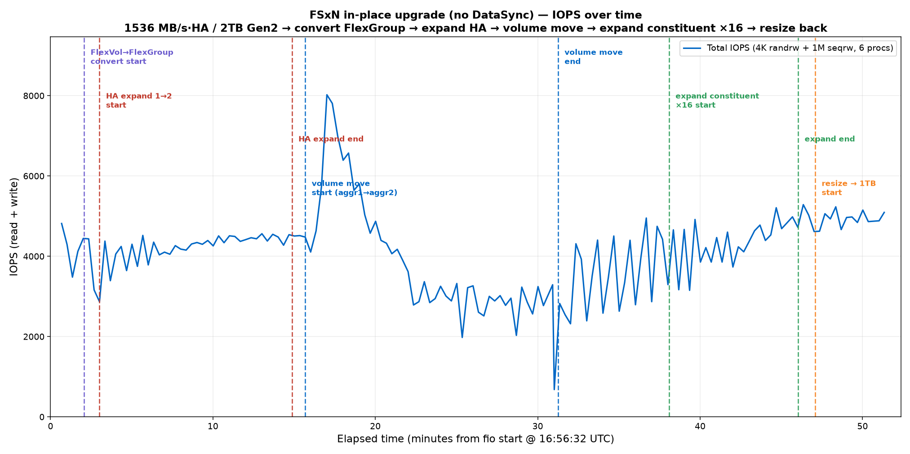

# FSxN in-place upgrade (no DataSync) — IOPS over time

Continuously running fio on an FSx for NetApp ONTAP (Gen2) file system while performing a
full in-place upgrade chain, and plotting IOPS against time with each operation marked.

## Configuration

| Item | Value |
|---|---|
| File system | FSx ONTAP Gen2, SINGLE_AZ_2, us-east-2 |
| Initial | **1536 MB/s throughput, 1 HA pair, 2 TB (2048 GB)** |
| Volume | FlexVol, 1 TB, junction `/vol1`, NFSv3 nconnect=16 |
| fio client | c6in.4xlarge (AL2023) |
| fio workload | 4K randrw (iodepth 32) + 1M seqrw (iodepth 16), **6 processes**, libaio, direct=1, 70/30 R/W, `--status-interval=20` |

No throughput upgrade was performed — throughput-per-HA-pair stayed at 1536 MB/s throughout.

## Operations & timing (UTC)

| # | Operation | Start | End | Duration |
|---|---|---|---|---|
| 1 | FlexVol → FlexGroup convert | 16:58:36 | 16:59:12 | 36 s |
| 2 | Expand HA 1 → 2 (creates aggr2) | 16:59:33 | 17:11:24 | 11m51s |
| 3 | **Volume move** (constituent aggr1 → aggr2) | 17:12:13 | 17:27:47 | **15m34s** |
| 4 | Expand constituents ×16 (+16 → 17 total) | 17:34:37 | 17:42:34 | 7m57s |
| 5 | Resize FlexGroup back to 1 TB | 17:43:37 | 17:44:22 | 45 s |

## Volume size before/after resize

| | Size | Constituents |
|---|---|---|
| After ×16 expand | ≈17 TiB (18,691,697,672,192 B) | 17 (aggr1=8, aggr2=9) |
| After resize | ≈1 TiB (1,100,204,236,800 B) | 17 (~60.2 GB each) |

## IOPS result

Per-phase total IOPS (read+write, 6 procs):

| Phase | avg IOPS | min | max | avg BW (MiB/s) |
|---|---|---|---|---|
| Convert + HA expand | 4200 | 2869 | 4564 | 1649 |
| Volume move (active) | 3860 | 682 | 8025 | 814 |
| Post-move → before expand | 3536 | 2321 | 4955 | 1082 |
| Expand constituent ×16 | 4346 | 3154 | 5211 | 1567 |
| Resize + tail | 4932 | 4618 | 5288 | 1879 |

**Takeaways**
- The **volume move** was the only operation with a large, sustained impact on client I/O: average IOPS fell to ~3860 with a floor of ~682 during cutover, and throughput roughly halved. Move of the ~470 GB-populated 1 TB constituent took **15m34s** (final cutover forced because active fio kept generating delta).
- FlexGroup **convert** (36 s) caused only a brief single-interval dip.
- **HA expand** ran non-disruptively — IOPS held ~4200 the whole time (the client sees a spike to ~8000 right after the second aggregate comes online).
- **Expand ×16** and **resize** were fast metadata-level operations with minor, short-lived I/O impact; steady-state IOPS afterward (~4900) was the highest of the run.

## Files
- `iops_timeseries.png` — IOPS vs time with operation markers
- `RUN_LOG.md` — full reproducible commands (fio + mount + all ONTAP + timings)
- `fio_test.fio` — exact fio job file
- `parse_fio_multi.py` — multi-job fio `--status-interval` parser
- `plot_iops.py` — IOPS plot script
- `parsed_fio.json` — parsed per-interval series
- `report.html` — standalone HTML report
- `raw/fio_run.log(.gz)` — raw fio output
