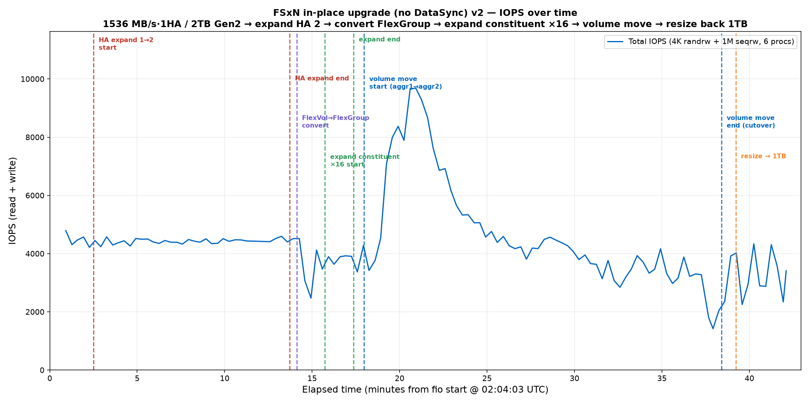

# FSxN 就地升级测试 v2（无 DataSync）— 2026-09-29

Amazon FSx for NetApp ONTAP Gen2（SINGLE_AZ_2）就地操作全程 fio 压测，观察 IOPS 变化。
本版与上一版（2026-09-28）唯一区别是**操作顺序**。

## 环境
| 项 | 值 |
|---|---|
| 文件系统 | FSx ONTAP Gen2 SINGLE_AZ_2 |
| 初始规格 | 吞吐 **1536 MB/s**、**1 HA pair**、**2048 GB** |
| 卷 | FlexVol 初始 **1 TB**，NFSv3，StorageEfficiency 关闭 |
| fio 客户端 | c6in.4xlarge（AL2023），与 FSx 同 AZ（us-east-2c），NFS `nconnect=16` |
| Region | us-east-2 |

## 操作顺序（本版）
建 1536/1HA/2TB → **扩 HA 到 2HA**（不升吞吐）→ **转 FlexGroup** → **expand ×16** → **volume move** → **resize 回 1TB**。
全程 fio 持续跑：`randrw_4k`(bs=4k, iodepth=32) + `seqrw_1m`(bs=1M, iodepth=16)，各 3 进程共 6 进程，libaio/direct=1，70/30 读写。

## 各阶段耗时（UTC）
| 操作 | 起 | 止 | 耗时 |
|---|---|---|---|
| 扩 HA 1→2（存储同步 2048→4096） | 02:06:33 | 02:17:46 | **11m13s** |
| 转 FlexGroup（1 constituent） | 02:18:10 | 02:18:35 | **25s** |
| expand ×16（→17 constituent） | 02:19:47 | 02:21:25 | **1m38s** |
| **volume move**（constituent aggr1→aggr2） | 02:22:01 | 02:42:27 | **20m26s** |
| resize 17TB→1TB | 02:43:16 | 02:43:47 | **31s** |

## constituent 分布
- 转 FlexGroup 后：1 个 constituent（`testvol__0001`）在 aggr1。
- expand ×16 后：17 个 constituent，**aggr1=9 / aggr2=8**。
- volume move（把 `testvol__0001` 从 aggr1 搬到 aggr2）后：**aggr1=8 / aggr2=9**。

> volume move 在 FlexGroup 上按 **单个 constituent** 搬迁（一个 constituent = 一次 FlexVol 级别的整卷搬迁），用于重新平衡 constituent 在 aggregate 间的分布；不是对整个 FlexGroup 做数据再均衡。活跃 fio 下 delta-sync 在 89–98% 振荡，最终用 `trigger-cutover -force` 完成。

## resize 前后
| | size | constituent 数 |
|---|---|---|
| resize 前（expand ×16 后） | 17 TB | 17 |
| resize 后 | 1,102,360,223,744 B（≈1.00 TiB） | 17（各约 60.2 GB） |

## IOPS 结果（总 IOPS = 读+写，6 进程）
| 阶段 | 平均 IOPS | 区间 |
|---|---|---|
| 操作前（稳态） | ~4470 | 4216–4790 |
| 扩 HA 期间 | ~4430 | 4239–4597 |
| 转 FlexGroup + expand 期间 | ~3720 | 2475–4519 |
| volume move 期间 | ~4680 | 1424–9692 |
| resize 后 | ~3340 | 2343–4339 |

- 扩 HA 对在线 IOPS 几乎无影响（稳态延续 ~4400）。
- 转 FlexGroup / expand constituent 期间有短暂下探（卷元数据操作），随后恢复。
- volume move 刚启动时 IOPS 冲高到 ~9700（新目标 aggr2 空闲、争用低），move 后段 delta-sync 争用使 IOPS 回落并到全程低点 ~1424。
- resize 为逻辑容量变更，瞬时完成，对 IOPS 无实质影响。

## 文件
- `iops_timeseries.png` — IOPS 曲线（竖线标注各操作开始点，无 baseline）
- `RUN_LOG.md` — 逐字 fio/挂载/ONTAP/AWS 命令 + 各阶段 UTC 时间 + move 耗时 + resize 前后 size
- `fio_test.fio` — fio job 文件
- `parse_fio_multi.py` / `plot_iops.py` — 解析与画图脚本
- `parsed_fio.json` — 解析后的 per-interval IOPS/吞吐
- `raw/fio_run.log(.gz)` — fio 原始日志

> ONTAP fsxadmin 密码在文档中用 `<FSXADMIN_PASSWORD>` 占位。
