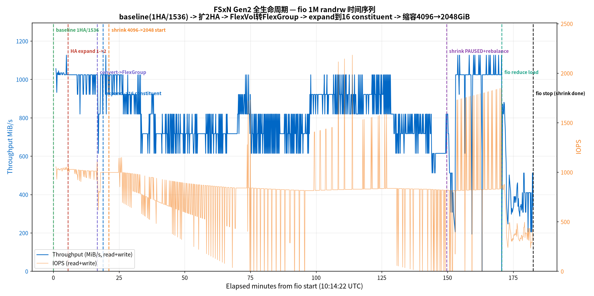
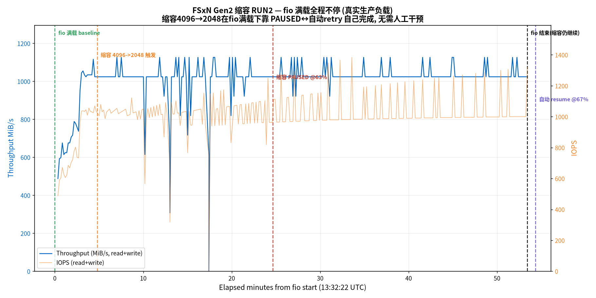

# FSx for NetApp ONTAP — Gen2 全生命周期实测：1HA → 2HA → FlexVol转FlexGroup → expand到16 constituent → 缩容回2TB

**Region**: us-east-2 · **ONTAP**: 9.18.1P6 · **FSxN**: Gen2 (`SINGLE_AZ_2`) · 全程 fio 1M 读写压测

---

## ⭐ 最重要结论：有 I/O 负载时，缩容几乎无法完成

**缩容（4TB→2TB）在 fio 持续压测下会反复 PAUSE、进度卡住推不动；一旦停掉业务负载，几分钟内就完成。**

实测两轮都印证这一点：

| 场景 | 数据分布 | 有快照 | fio 负载 | 结果 |
|---|---|---|---|---|
| RUN1 | 严重偏斜（原始 constituent 占 63%）| 有 | 满载 | 反复 PAUSE，卡在 45%/90%，**~2h49min 才完成（需手动 rebalance + 删快照 + 停 fio）** |
| RUN2 | **已均衡**（各 constituent ~15GB，偏斜仅 2%）| **无** | 满载 | 快速到 63% 后 **PAUSE 卡住约 29min**，直到 fio 停止后 1 分钟才 resume，**总 ~1h02min** |
| RUN1/RUN2 收尾 | — | — | **业务负载停下** | **~1–12 min 内 resume 并完成，缩到 2048 GiB** |

- 缩容需要做"客户端访问重定向"（把要回收的 HA pair 上的数据迁走、切换挂载路径），**这一步需要短暂的低 I/O 窗口**。
- **RUN2 是关键对照**：把数据偏斜、快照这些干扰全排除后（数据均衡、无快照），满载下缩容**照样卡死**。→ 坐实**卡住的根因就是业务 I/O 争用本身，跟数据均不均衡、有没有快照无关**。
- **运维提醒**：FSxN 缩容不适合在业务高峰期做，最好安排在低峰/维护窗口，否则会一直 PAUSE、每小时重试、迟迟不完成。

---

## 1. 实验环境

| 项 | 配置 |
|---|---|
| FSxN | Gen2 Single-AZ (`SINGLE_AZ_2`)，起步 1 HA pair，throughput **1536 MBps/HA**，SSD **2048 GiB** |
| 卷 | FlexVol `lifevol`，junction `/lifevol`，UNIX，无自动 backup（`AutomaticBackupRetentionDays=0`）|
| 数据 | 200 × 1 GiB = **200 GB** 真实随机数据（多文件利于 FlexGroup 哈希分布）|
| fio 客户端 | c6in.4xlarge (16 vCPU)，AL2023，NFSv3 挂载 |
| fio 负载 | `bs=1M rw=randrw rwmixread=50 direct=1 numjobs=4 iodepth=16`，全程持续 |

> ⚠️ **直接建 1536 throughput 的 1HA**，避免 384 档位的 1HA 无法扩 2HA 的死锁。
> ⚠️ **绝不开自动 backup**：FSx 原生 Backup 的 SnapMirror-to-Cloud 关系会阻塞 FlexVol→FlexGroup 转换。

---

## 2. 全流程耗时

| 步骤 | 底层动作 | 耗时 |
|---|---|---|
| 创建 FSxN | 起物理文件服务器 | **~11 min** |
| 建 SVM | 元数据 | ~2 min |
| 建 FlexVol | 元数据 | < 1 min |
| 写 200 GB（200×1GiB）| 数据写入 | ~6 min |
| fio baseline | — | 5 min |
| **扩 HA 1→2** | 真起一对新物理文件服务器 + 新 aggregate，容量自动翻倍到 4096 GiB | **~10.5 min** |
| **FlexVol → FlexGroup** | 改卷类型元数据（不搬数据）| **~16 秒** |
| **expand 到 16 constituent** | 在各 aggregate 挂新空成员卷（元数据）| **~90 秒** |
| **缩容 4096 → 2048 GiB** | 后台 storage optimization 迁移数据 + 重定向客户端访问，物理回收 HA pair | **RUN1 ~2h49min / RUN2 ~1h02min**（含 PAUSE，见 §4）|

**一句话原理**：改元数据（转 FlexGroup / expand constituent）→ 秒级；动物理资源（起服务器 / 缩容搬数据）→ 分钟~小时级。

---

## 3. fio 各阶段性能

**fio 1M randrw 时间序列图**（标注各阶段边界）：



| 阶段 | 吞吐均值 (MiB/s) | 谷底 | 峰值 | IOPS(1M块) |
|---|---|---|---|---|
| baseline（1HA/1536）| **1029.5** | 931.8 | 1126.4 | ~1027 |
| 扩 HA 1→2（进行中）| 1003.2 | 819.2 | 1024.1 | ~1004 |
| 转 FlexGroup + expand（进行中）| 956.9 | 614.3 | 1126.4 | ~953 |
| 缩容 storage optimization（fio 满载）| 811.9 | 193.0 | 1126.5 | ~847 |
| 缩容收尾（fio 降载 numjobs 4→1）| 416.9 | 204.8 | 880.7 | ~416 |

- **baseline ~1030 MiB/s**（1M 大块，读写各半，direct）。
- **扩 HA / 转 FlexGroup / expand 期间在线业务不中断**，吞吐仅小幅下降（~950-1000 MiB/s，偶有卷操作瞬时抖动）。
- **缩容 storage optimization 期间**吞吐降到 ~810 MiB/s（后台数据迁移抢占 I/O），业务仍在线。

---

## 4. 缩容：需要 rebalance + 停 fio 才能完成

缩容 4096→2048 GiB **不是一键完成**，实测经历如下：

1. **发起缩容后进入后台 storage optimization**，进度缓慢爬升（fio 满载时约 0.3–0.6%/min），把要回收的 HA pair 上的数据迁走。
2. **进度到 ~45% 时 PAUSED**，报错：
   > `Redirecting client access for Volume(s) [lifevol__0001] has failed due to insufficient SSD IOPS, throughput capacity, or because the volume is full. Amazon FSx will retry in an hour.`
3. **根因**：这个 FlexGroup 是 FlexVol 就地转换来的——**原始数据全集中在转换来的那个 constituent `lifevol__0001`（443.9 GB / 63%），其余 15 个 constituent 几乎空（各 0.5 GB）**，Imbalance 92%、最大 constituent 偏斜 **1474%**。缩容要重定向这个满载 constituent，加上 fio 持续占满吞吐，重定向失败。
4. **处置**：
   - `volume rebalance start` 把数据从 `__0001` 摊到其余 constituent（443.9 GB → ~297 GB）。⚠️ 首次启动失败：快照计划落在 6h max-runtime 窗口内 → 先 `volume modify -snapshot-policy none` 关快照策略再启。
   - 删掉钉住数据的快照（转换快照 + 两个 hourly 快照，共 ~726 GB）。
   - **降低 fio 负载**（numjobs 4→1, iodepth 16→4），仍反复 PAUSE。
   - **最终停掉 fio**，给重定向完整吞吐余量 → **~5 min 内 100% 完成，cap=2048**。
5. **RUN2 对照验证**：为排除偏斜/快照干扰，第二轮在**数据已均衡（各 constituent ~15GB、偏斜 2%）、无快照**的状态下重跑缩容，全程 fio 满载不降压。

   

   RUN2 时间线：13:37 触发 → 20min 内快速到 63%（比 RUN1 快很多，因为已无偏斜/快照阻塞）→ **13:57 PAUSED @63%**（fio 满载下重定向失败）→ 持续 PAUSED 约 29 min（此间 rebalance state=idle、无需再均衡）→ fio 于 14:25 结束 → **14:26 缩容自动 resume @67%** → **14:39 完成 cap=2048**。RUN2 总耗时 **~1h02min**（含一次 ~29min PAUSE）。fio 满载均值 **~1008 MiB/s**、延迟 clat 中位 ~42ms/p99 ~220ms。
   - ⚠️ **关键观测**：PAUSE 持续到 fio 停止（14:25）后 **1 分钟**（14:26）才 resume——这**不是**等满 1 小时的定时重试（若定时应到 ~14:57），强烈提示**是业务 I/O 停下腾出吞吐才让重定向成功**。
6. **关键结论**：**缩容卡住的根因是业务 I/O 争用本身**（RUN2 排除了偏斜/快照后满载仍卡在 63%）。客户端重定向需要短暂低 I/O 窗口；fio 满压下反复 PAUSE，**业务负载停下后（RUN1 手动停、RUN2 fio 自行结束）随即在几分钟内完成**。→ **FSxN 缩容应安排在业务低峰/维护窗口。**

---

## 5. 最终状态

| 项 | 结果 |
|---|---|
| StorageCapacity | **2048 GiB**（从 4096 缩回）|
| aggregate | 2 个，各 **907 GB**（从 1.77 TB 缩至 ~907 GB）|
| FlexGroup constituent | **16 个，aggr1:8 / aggr2:8**（缩容未破坏 FlexGroup 结构）|
| 卷类型 | `is-flexgroup=true` ✓ |
| 数据 | 258.8 GB / 5%，无丢失 |

**全生命周期成功**：1HA(FlexVol) → 2HA → FlexGroup → 16 constituent → 缩容 2TB，FlexGroup 结构与数据完整保留。

---

## 6. 关键结论汇总

| # | 结论 |
|---|---|
| 1 | **改元数据秒级，动物理资源分钟~小时级**：转 FlexGroup **16 秒**、expand 16 constituent **90 秒**；扩 HA **~10.5 min**（起真硬件）；缩容 **~2h49min**（搬数据）。|
| 2 | **扩 HA / 转 FlexGroup / expand 期间在线业务不中断**，吞吐仅小幅下降（~95% baseline）。|
| 3 | **就地转换的 FlexGroup 数据结构性偏斜**：原始数据全在转换来的那个 constituent，其余 constituent 空。缩容前必须 `volume rebalance` 摊平。|
| 4 | **缩容会 PAUSE，根因是业务 I/O 争用**：客户端重定向需要低 I/O 窗口。RUN2 在数据均衡+无快照下满载仍卡死，坐实与偏斜/快照无关。**停止业务压测后 ~5–12 min 完成。**|
| 5 | **rebalance 启动前提**：6h max-runtime 窗口内不能有快照计划——先关 `snapshot-policy` 或缩短 `-max-runtime`。快照会钉住数据（`Exclude Files Stuck in Snapshot Copies: true`），缩容前建议删快照。|
| 6 | **缩容成功后 FlexGroup 结构完整保留**：16 constituent、8:8 分布、数据无损。|

---

## 7. 命令手册（脱敏）

> 占位符：`<FS_ID>` / `<SVM_ID>` / `<SUBNET_ID>` / `<SG_ID>` / `<MGMT_IP>` / `<NFS_IP>` / `<PWD>`。ONTAP CLI 走 `sshpass -p '<PWD>' ssh fsxadmin@<MGMT_IP>`。

```bash
# 1) 建 FSxN Gen2 1HA/1536/2048GiB，无自动 backup
aws fsx create-file-system --file-system-type ONTAP --storage-capacity 2048 --storage-type SSD \
  --subnet-ids <SUBNET_ID> --security-group-ids <SG_ID> --region us-east-2 \
  --ontap-configuration '{"DeploymentType":"SINGLE_AZ_2","ThroughputCapacityPerHAPair":1536,"HAPairs":1,"AutomaticBackupRetentionDays":0,"FsxAdminPassword":"<PWD>"}'

# 2) 建 SVM + FlexVol（UNIX，SE off，无 tiering）
aws fsx create-storage-virtual-machine --file-system-id <FS_ID> --name lifesvm --region us-east-2
aws fsx create-volume --volume-type ONTAP --name lifevol --region us-east-2 \
  --ontap-configuration '{"StorageVirtualMachineId":"<SVM_ID>","JunctionPath":"/lifevol","SecurityStyle":"UNIX","SizeInBytes":1717986918400,"StorageEfficiencyEnabled":false,"TieringPolicy":{"Name":"NONE"}}'

# 3) 挂载 + 写数据
mount -t nfs -o nfsvers=3,hard,timeo=600 <NFS_IP>:/lifevol /mnt/life
seq 1 200 | xargs -P 8 -I {} dd if=/dev/urandom of=/mnt/life/data/f{}.dat bs=1M count=1024

# 4) 扩 HA 1→2（必须同时给 StorageCapacity=4096 和 ThroughputCapacityPerHAPair）
aws fsx update-file-system --file-system-id <FS_ID> --storage-capacity 4096 --region us-east-2 \
  --ontap-configuration '{"HAPairs":2,"ThroughputCapacityPerHAPair":1536}'

# 5) FlexVol → FlexGroup（diag 权限）
sshpass -p '<PWD>' ssh fsxadmin@<MGMT_IP> \
  "set -privilege diag -confirmations off; volume conversion start -vserver lifesvm -volume lifevol -foreground true"

# 6) expand 到每 aggr 8 个 constituent（原始 1 个在 aggr1）
#    先 resize 让 member 变小(薄置备)，再 expand
volume size -vserver lifesvm -volume lifevol 320GB
volume expand -vserver lifesvm -volume lifevol -aggr-list aggr1,aggr2 -aggr-list-multiplier 7 -foreground true  # aggr1:8, aggr2:7
volume expand -vserver lifesvm -volume lifevol -aggr-list aggr2 -aggr-list-multiplier 1 -foreground true        # aggr2:8

# 7) 缩容 4096 → 2048
aws fsx update-file-system --file-system-id <FS_ID> --storage-capacity 2048 --region us-east-2

# 8) 缩容 PAUSE 时：rebalance 摊平 + 关快照 + 停 fio
volume modify -vserver lifesvm -volume lifevol -snapshot-policy none
volume rebalance start -vserver lifesvm -volume lifevol -max-runtime 4h
volume snapshot delete -vserver lifesvm -volume lifevol -snapshot <snap> -foreground true
pkill fio   # 停业务压测，给重定向低 I/O 窗口
```

---

## 8. 本次资源清单

| 资源 | ID / 值 | 状态 |
|---|---|---|
| FSxN Gen2 | `fs-0806e114696713d2c` | **保留** |
| SVM | `svm-02d9b4728dd51dcbd`（lifesvm）| 保留 |
| FlexGroup 卷 | `fsvol-0f92a7bfb7cd9692d`（lifevol）| 保留 |
| 管理端点 IP | `172.31.44.166`（fsxadmin 登录）| — |
| NFS 端点 IP | `172.31.47.6` | — |
| fio 客户端 EC2 (RUN1) | `i-0f94cb684f2cb38bb`（c6in.4xlarge）| **已终止** |
| fio 客户端 EC2 (RUN2) | `i-0fb1bb68551670ebe`（c6in.4xlarge）| **已终止** |
| Region | us-east-2 | — |
| ONTAP 版本 | 9.18.1P6 | — |

> FSx 资源默认保留供复现；fio 客户端 EC2 本次新建、测完终止；跳板机 `i-0dffb881b2a90daa2` 保留（本实验未用到，全程走独立 fio 客户端）。
