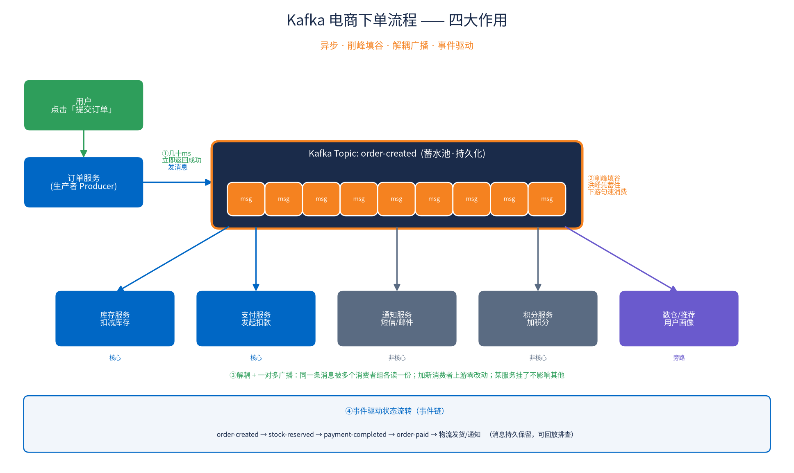

# Kafka 在电商下单流程中的作用

用一个**电商下单**的完整事务流程，讲解 Kafka 发挥的四大作用：**异步、削峰填谷、解耦广播、事件驱动**。



> ⚠️ **案例定性（诚实说明）**：这是一个**基于真实生产模式构造的教科书式典型案例**，不是某个具体公司的真实案例。其中的**架构模式**（异步解耦、削峰、多消费者组、事件驱动、Outbox、幂等）是业界广泛采用的标准做法（阿里、京东、美团、Uber、LinkedIn 等公开分享过类似架构）；但文中的**具体数字**（如每秒 50 万订单）是**示意值**，非真实压测数据。

---

## 前提认知：Kafka 眼里消息只是"字节"

对 Kafka 来说一条消息 = `key(字节) + value(字节) + headers + timestamp`。**Kafka 只可靠地存储/传递字节，不解析内容**。格式由生产者/消费者两端约定：

- **内容**：放"事件/事实"字段（orderId、userId、金额、状态等）。敏感信息（email 等 PII）要脱敏/加密；大文件（视频等）不要塞进去（默认单消息上限约 1MB），应存对象存储只传 URL（claim-check 模式）。
- **格式**：JSON 最通用易上手；**Avro / Protobuf 是大规模生产首选**（二进制、紧凑、带 schema、可演进，配合 Schema Registry）；**XML/YAML 不适合传消息**（YAML 尤其反模式）。

---

## 不用 Kafka 的痛点（同步串行）

```
下单 → 扣库存 → 扣款 → 发短信 → 发邮件 → 加积分 → 更新推荐 → 通知物流 → 返回成功
```
1. **慢**：用户要等所有步骤跑完
2. **脆**：发短信挂了整个下单失败（其实短信不关键）
3. **扛不住峰值**：瞬时高并发把数据库打爆

Kafka 用**异步解耦 + 削峰填谷**解决这三个问题。

---

## 完整流程 + Kafka 四大作用

### ① 异步（低延迟响应）
下单服务只做核心两件事：写订单主表（status=PENDING）、往 `order-created` topic 发一条消息，然后**立即返回用户"下单成功"**（几十 ms）。消息示例：
```json
{"eventType":"OrderCreated","orderId":"20260811-1001","userId":"u123",
 "items":[{"sku":"A100","qty":2,"price":99.5}],"amount":199.0,"ts":1690000000}
```

### ② 削峰填谷（缓冲蓄水池）
瞬时洪峰全进 Kafka topic，Kafka 顺序写磁盘、吞吐极高，把消息**持久化堆住**；下游各服务**按自己能力匀速消费**，消费不完先积压。数据库不会被瞬间打爆。**Kafka = 蓄水池，洪峰先蓄、下游按节奏放水。**

### ③ 解耦 + 一对多广播
同一条 `OrderCreated` 被**多个消费者组各读一份**（Kafka 消费者组机制）：

| 消费者组 | 作用 | 重要性 |
|---|---|---|
| 库存服务 | 扣减库存 | 核心 |
| 支付服务 | 发起扣款 | 核心 |
| 通知服务 | 短信/邮件 | 非核心 |
| 积分服务 | 加积分 | 非核心 |
| 数仓/推荐 | 用户画像 | 旁路 |

- 上游**不知道**下游有谁，加新消费者（如风控）**上游零改动**
- 通知服务挂了**不影响**库存/支付；恢复后从上次 offset **继续消费**积压消息，不丢

### ④ 事件驱动状态流转（事件链）
```
order-created  → 库存服务 → 扣减成功 → stock-reserved
stock-reserved → 支付服务 → 扣款成功 → payment-completed
payment-completed → 订单服务 → status=PAID → order-paid
order-paid → 物流服务(发货单) / 通知服务(支付成功短信)
```
每步完成发新事件驱动下一步，订单生命周期成为**可追溯、可回放**的事件流（消息持久保留）。

---

## 事务一致性（进阶关键点）

**难题**：订单入库 与 发 Kafka 消息 如何原子？（万一入库成功但发消息失败 → 库存永不扣）

- **Outbox 模式（事务发件箱）**：同一 DB 事务里把订单和"待发消息"一起写入（消息写 outbox 表），再由 CDC（如 Debezium）可靠投递到 Kafka → 绝不丢消息。
- **消费端幂等**：Kafka 是"至少一次"投递，消息可能重复，消费者用 orderId 去重，避免重复扣款。

---

## 一句话总结

> **Kafka 四大作用：①异步（快速响应）②削峰填谷（缓冲洪峰）③解耦+广播（一发多收、随意扩展下游）④事件驱动（可追溯可回放）。** 内容放事件字段（敏感脱敏、大文件放对象存储传引用），格式选 JSON（易用）或 Avro/Protobuf（大规模），别用 XML/YAML。

## 文件
- `kafka_ecommerce_flow.png` — 流程图
- `kafka_flow_diagram.py` — 画图脚本（matplotlib，中文 Noto 字体）

_整理日期：2026-08-24_
