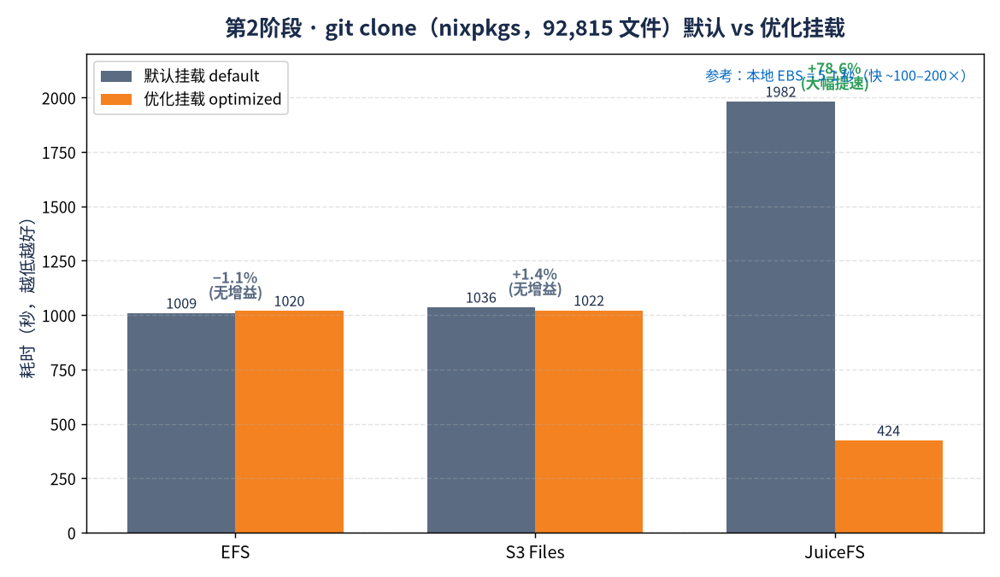

# Phase 2 — git clone 基准测试（挂载参数调优）

**日期:** 2026-09-18  **区域:** us-east-2 (Ohio)  **克隆仓库:** NixOS/nixpkgs (92815 个文件)

从**本地 EBS 源副本**克隆（`git clone --no-hardlinks /data/nixpkgs-src <目标>`），
避免网络下载干扰结果——只测量目标文件系统的写入/元数据路径。
每轮前：`sync && echo 3 > /proc/sys/vm/drop_caches`、`rm -rf` 目标目录、用 `nfsstat -m` 验证挂载参数。
用 `/usr/bin/time -v` 计时。对比 Phase-1 的**默认挂载**基线（此处不重跑默认）。

## 使用的优化挂载参数

| 存储      | 优化挂载参数 |
|-----------|--------------|
| EBS       | 本地 gp3（8000 IOPS / 500 MB/s），noatime 参考 |
| EFS       | `tls,noatime,nodiratime,rsize=1048576,wsize=1048576,actimeo=600` |
| S3 Files  | `tls,iam,accesspoint=…,noatime,nodiratime,rsize=1048576,wsize=1048576,actimeo=600` |
| JuiceFS   | `--writeback --attr-cache 300 --entry-cache 300 --dir-entry-cache 300 --cache-size 10240 --buffer-size 1024`（redis 元数据 + S3） |

（EFS 与 S3 Files 在 `-o tls` / stunnel 单 socket 下 `nconnect` 被忽略——未使用。）

## 测试结果

| 存储      | 优化挂载                    | git clone 耗时 | 文件数 | 相比默认基线的提升 |
|-----------|-----------------------------|---------------:|-------:|-------------------:|
| EBS       | noatime（本地 gp3）         |        5.11 秒 | 92815 |  -2.2 %（基线 5.0 秒）  |
| EFS       | noatime,rsize/wsize=1M,actimeo=600 |  1019.68 秒 | 92815 |  -1.1 %（基线 1009 秒） |
| S3 Files  | noatime,rsize/wsize=1M,actimeo=600 |  1021.92 秒 | 92815 |  +1.4 %（基线 1036 秒） |
| JuiceFS   | writeback + 缓存            |      423.76 秒 | 92815 | **+78.6 %**（基线 1982 秒） |

## 结论

**核心两点：**

> **① NFS 类存储（EFS / S3 Files）：优化挂载参数对 `git clone` 没帮助（±1–2%）。** 瓶颈是约 9.2 万个小文件的**每文件同步元数据往返**（create/write/close/rename）；`rsize/wsize` 只对大块顺序 I/O 有用，`noatime`/`actimeo` 减少的是读重验证，而全新克隆基本是纯写。
>
> **② JuiceFS 的 `--writeback` 是唯一有效的优化（+78.6%，1982 秒→424 秒，约 1/4 耗时）。** 先把写确认到本地缓存、再异步上传 S3，git 的同步小写不再被 S3 延迟阻塞。代价是持久性放宽，仅适合可重建的临时数据。

往这些存储里 `git clone` 的瓶颈是**每个文件的同步元数据往返**（约 9.2 万个小文件的
create/write/close/rename）。更大的 `rsize/wsize` 只对大块顺序 I/O 有用——这里都是小文件；
`noatime`/`actimeo` 减少的是*读*重验证，而全新克隆基本是纯写，几乎用不到。
EFS/S3 Files 的净效果都在误差范围内（±1–2%）。

**JuiceFS 是例外：`--writeback` 让克隆耗时降到约 1/4（1982 秒 → 424 秒，+78.6%）。**
writeback 模式下 JuiceFS 先把写入确认到本地缓存、再异步上传 S3，
git 的大量同步小写入就不再被 S3 延迟阻塞。这是真实的大幅提升——但以牺牲持久性为代价
（数据在刷盘前只在本地缓存里），因此只适合可重新生成的临时数据。

**EBS 仍然比任何网络存储快约 100–200 倍**（本地 NVMe、无网络往返），
挂载 `noatime` 在这里没有明显差别。

**一句话总结:** 对 `git clone` 这种小文件密集型负载，NFS 文件系统的调优杠杆不在 buffer-size 挂载参数，
而在架构本身。只有客户端写回缓存（JuiceFS `--writeback`）能真正改善，且代价是放松持久性。
