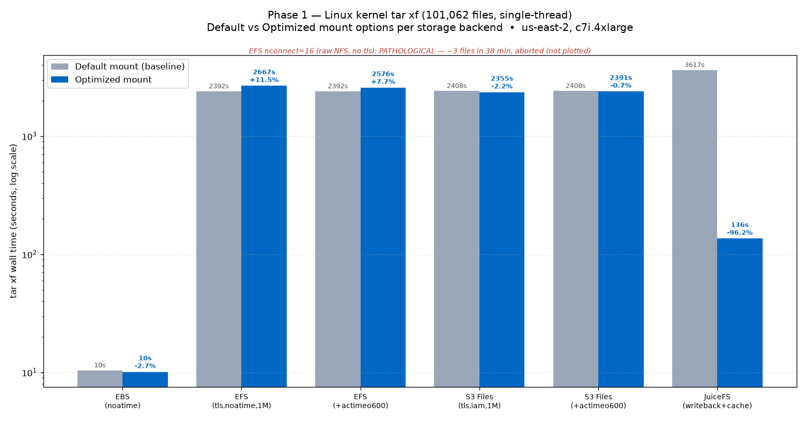

# 内核解压存储基准 — Phase 1：挂载参数调优

调优**挂载参数**能否加速小文件、元数据密集型的网络存储负载？
单线程 `tar xf linux-7.2.5.tar.xz`（**101,062 个文件**），在一台 EC2 客户端上，
对每种存储后端的**默认**挂载 vs **优化**挂载参数做对比。

配套：[`kernel-untar-bench-4way`](../kernel-untar-bench-4way/)（建立了默认基准）
与 [`kernel-untar-bench-phase3-npm`](../kernel-untar-bench-phase3-npm/)（对 `npm install` 的同一问题）。

## 测试环境

| 项 | 值 |
|---|---|
| 区域 | us-east-2（俄亥俄） |
| 客户端 | 1× c7i.4xlarge（16 vCPU / 32 GiB），Amazon Linux 2023 |
| 负载 | `tar xf linux-7.2.5.tar.xz`，单线程 |
| 产生文件数 | 每轮 **101,062**（用 `find | wc -l` 核对） |
| 方法 | 每轮前 `sync && echo 3 > drop_caches`；全新目标目录；`/usr/bin/time -v`；墙钟；用 `nfsstat -m` 核实生效参数 |
| 默认基准 | 取自 `kernel-untar-bench-4way`：EBS 10.4s / EFS 2392s / S3 Files 2408s / JuiceFS 3617s（**本次不重跑**） |

## 结果 — `tar xf`（默认基准 vs 优化挂载）

| 存储 | 挂载变体 | tar 耗时 | 文件数 | vs 默认基准 |
|---|---|---|---|---|
| **EBS gp3** | 优化（`noatime`，本地 xfs） | **10.1s** | 101,062 | −2.7%（噪声） |
| **EFS** | 优化（`tls,noatime,nodiratime,rsize/wsize=1M`） | **2667.1s** | 101,062 | **+11.5%（更慢）** |
| **EFS** | 优化 + `actimeo=600` | **2575.8s** | 101,062 | +7.7%（更慢） |
| **EFS** | `nconnect=16` 裸 NFS，**不带 tls** | **病态 — 已中止** | 38 分钟仅 3 个 | 会话卡死 |
| **S3 Files** | 优化（`tls,iam,noatime,nodiratime,rsize/wsize=1M`）NFSv4.2 | **2354.8s** | 101,062 | −2.2%（噪声） |
| **S3 Files** | 优化 + `actimeo=600` | **2391.4s** | 101,062 | −0.7%（噪声） |
| **JuiceFS** | 优化（`--writeback --attr-cache 300 --entry-cache 300 --dir-entry-cache 300 --cache-size 10240 --buffer-size 1024`） | **135.9s** | 101,062 | **−96.2%（快 26.6 倍）** |

## 到底哪个挂载参数有用？

**① NFS 类存储（EFS / S3 Files）：挂载调优基本没用（±3%，有时甚至略慢）。**
瓶颈是**每个文件的同步元数据往返**：tar 流里每个 `mkdir` / `open(O_CREAT)` / `write` / `rename`
都要等服务端 ACK 才能进行下一个。那些参数针对的是别的东西：
- `noatime` / `nodiratime` —— 省的是访问时间*读*；create 负载几乎不读 atime → 无效。
- `rsize` / `wsize = 1 MiB` —— 加速大块*顺序读写*；内核源码文件很小（平均 ~5 KB）→ 无效。
- `actimeo=600` —— 缓存反复 `stat` 同一文件的*属性*；tar 每个文件只创建一次 → 无效（额外缓存记账甚至让 EFS 略慢一点，这就是那个小 +%）。
- **异步本来就是 NFS 默认** —— 协议允许处客户端已经在流水线/写回，没有"打开异步"的开关可拨。

**② `nconnect` 在 EFS 上没有可用收益 —— 两个独立原因：**
- 在**受支持的 `-o tls` 路径**（efs-utils → 127.0.0.1 上单条 stunnel socket）下，`nconnect` 被**静默忽略**：只有一条 TCP，额外连接根本不存在。
- **裸 NFSv4.1 直连挂载目标 IP、不带 tls** 时*确实*开出了 16 条真 TCP（`nfsstat -m` 里能看到 `nconnect=16`，确认 16 条 ESTAB）—— **但会话会卡死**：RPC 任务卡在 `CREATE_SESSION` / `CLOSE`（`q:xprt_pending`），`tar` 在中止前 **38 分钟只完成约 3 个文件**。EFS 挂载目标期望走 efs-proxy 路径；手搓的裸多连接 NFSv4.1 会话在这里不可行。
- 无论哪种：**更多连接无法并行化"创建"这条串行依赖链** —— 瓶颈是每次创建的延迟，不是连接数/带宽。

**③ JuiceFS `--writeback` 是唯一真正见效的优化（−96%，3617s → 136s）。**
它把 S3 延迟从关键路径上拿掉：数据写入先落本地磁盘缓冲并立即返回，后台再刷到 S3；
entry/attr/dir 缓存 + 大本地缓存吸收元数据抖动。结果全程接近本地盘速度，甚至比两个 NFS 存储快约 17 倍。
代价：弱化持久性（后台上传前客户端崩溃会丢未刷写数据）—— 对可重建的内核树没问题，主数据不行。

## 结论

对 `tar xf` 这类元数据密集型小文件负载，**通用 NFS 挂载参数在 EFS/S3 Files 上毫无用处** ——
瓶颈是每次创建的同步往返延迟，这些旋钮碰不到它；`nconnect` 要么被忽略（tls），要么病态卡死（裸 NFS）。
只有能把写操作**从关键路径上延后/批量化**的文件系统（JuiceFS `--writeback`）才有真提升。
没有任何网络存储接近本地 EBS（10s）—— 它把这一切串行化到本地 NVMe、零网络往返，比最快的网络结果还快约 230 倍。

## 文件

- `phase1_mountopt_compare.png` —— 默认 vs 优化 柱状图（对数刻度）
- `phase1_results.csv` —— 每轮原始结果（墙钟秒、文件数、rc、核实过的挂载参数）
- `README.md` —— 英文版
