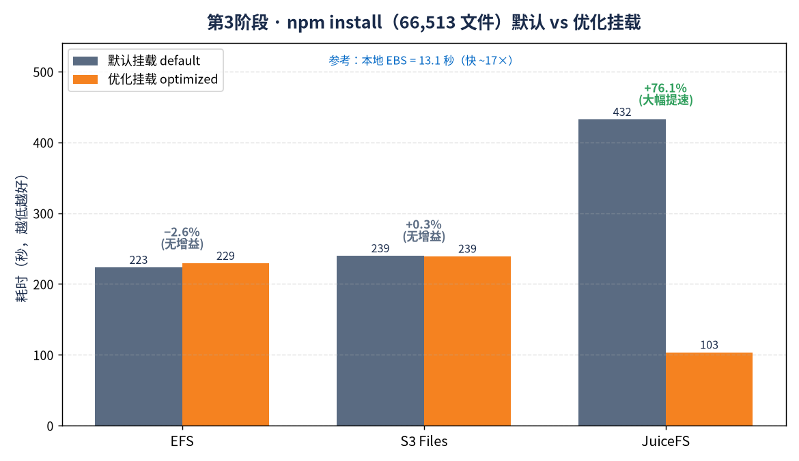

# npm install 存储基准测试 — 第 3 阶段（EFS vs S3 Files vs JuiceFS vs EBS）

在单台 EC2 客户端上，对一套重量级前端依赖树（**66,513 个文件**）执行 `npm install`，对每种网络存储后端比较**默认挂载 vs 优化挂载**。这是 [`kernel-untar-bench-4way`](../kernel-untar-bench-4way/)（`tar xf` / `git clone`）的小文件、元数据密集型配套测试。

## 为什么用 npm install
`npm install` 是现实中元数据操作最密集的工作负载之一：它在很深的目录树里创建数万个极小文件，伴随大量 `mkdir`、`lstat`、`rename`、`open/write/close`、`symlink`。在网络文件系统上，这些操作每一个都变成一次同步网络往返，因此它能非常尖锐地检验挂载调优是否有用。

## 测试环境

| 项目 | 值 |
|---|---|
| 区域 | us-east-2（俄亥俄） |
| 客户端（EC2-A） | 1× c7i.4xlarge，AL2023，gp3 100 GB @ 8000 IOPS / 500 MB/s（root xfs，noatime） |
| Redis（EC2-B，JuiceFS 元数据） | 1× c7i.4xlarge，gp3 30 GB |
| Node.js | v18.20.8（LTS），npm 10.8.2 |
| 工作负载 | 对重量级 `package.json` 执行 `npm install --prefer-offline --no-audit --no-fund` |
| 产生文件数 | **66,513** 个 node_modules 条目（每次运行完全一致） |
| Lock 文件 | 一次性生成一个 `package-lock.json`，**每次运行都复用同一个** |
| npm 缓存 | 在本地 EBS 上一次性预热（`~/.npm` = /root/.npm），因此各次运行测的是文件系统/元数据开销，而非下载 |
| 方法 | 每次运行前 `sync && echo 3 > drop_caches`；在目标挂载点上用全新工作目录；`/usr/bin/time -v`；墙钟时间 |

依赖集合：react、react-dom、vue、next、@mui/material、@emotion、antd、rxjs、lodash + 开发工具（webpack、webpack-cli、webpack-dev-server、@babel/*、babel-loader、typescript、ts-loader、eslint、eslint-plugin-react、prettier、jest、@testing-library/*、@vue/cli-service、sass、sass-loader、css-loader、style-loader、postcss、postcss-loader、autoprefixer、tailwindcss、vite、@vitejs/plugin-react、storybook、@storybook/react）。本目录已存 `package.json` 与 `package-lock.json` 以便复现。

## 结果 — npm install 耗时（EBS = 参考行）

| 存储 | 挂载（默认 / 优化） | npm install 耗时 | 文件数 | 优化 vs 默认 |
|---|---|---|---|---|
| **EBS gp3** | 本地，noatime（仅作参考） | **13.1 秒** | 66,513 | —（单次运行） |
| **EFS（Elastic）** | 默认（`tls`） | **3 分 43 秒**（223.1 秒） | 66,513 | — |
| **EFS（Elastic）** | 优化（`noatime,nodiratime,rsize/wsize=1M,actimeo=600`） | **3 分 49 秒**（228.8 秒） | 66,513 | **−2.6%**（无增益） |
| **S3 Files** | 默认（`tls,iam`）NFSv4.2 | **3 分 59 秒**（239.4 秒） | 66,513 | — |
| **S3 Files** | 优化（`+noatime,nodiratime,rsize/wsize=1M,actimeo=600`） | **3 分 59 秒**（238.8 秒） | 66,513 | **+0.3%**（无增益） |
| **JuiceFS** | 默认（`redis + S3`，FUSE） | **7 分 12 秒**（432.1 秒） | 66,513 | — |
| **JuiceFS** | 优化（`--writeback --*-cache 300 --cache-size 10240 --buffer-size 1024`） | **1 分 43 秒**（103.1 秒） | 66,513 | **快 76.1%** |

## 结论 — 挂载调优对 npm install 有帮助吗？

**完全取决于瓶颈在哪里。核心两点：**

> **① NFS 类存储（EFS / S3 Files）：优化挂载参数几乎无用（±3%）。** 瓶颈是每个文件的**同步元数据往返**（mkdir/create/rename/write 都要等服务端确认），`noatime`/`rsize/wsize=1M`/`actimeo` 这类参数优化的是读/属性缓存，碰不到这堵墙；`nconnect` 在 `-o tls` 下还被静默忽略。
>
> **② JuiceFS 的 `--writeback` 是唯一真正有效的优化（−76%，7分12秒→1分43秒）。** 它把数据写变成异步（先落本地缓冲再后台上传 S3），把 S3 延迟移出关键路径，甚至反超两个 NFS 存储、逼近本地盘速度。代价是持久性放宽，仅适合可重建的 node_modules。

- **EFS / S3 Files：挂载调优基本没用（±3%）。** 两者都是 NFS（v4.1 / v4.2）走 EFS-utils 的 stunnel socket。标准 NFS 参数——`noatime`、`nodiratime`、`rsize/wsize=1M`、`actimeo=600`——针对的是**读取 / 属性缓存**行为。但 npm install 是**以写和创建为主**：`mkdir`、`open(O_CREAT)`、`write`、`rename`、`symlink`。这些每一个都是**同步的 COMMIT / 元数据往返，NFS 客户端无法用缓存消除**——协议要求服务端确认创建完成后 npm 才能继续。更大的 `rsize/wsize` 帮的是大块顺序读，而不是几万个 ~2KB 的小文件创建；属性缓存帮的是对**同一个**文件的重复 `stat`，而 npm 几乎不这么做。所以每文件延迟这堵墙纹丝不动。（注意：`-o tls`/stunnel 下 `nconnect` 会被静默忽略——只有单个 socket——所以它也无法把这些往返并行化。）

- **JuiceFS：挂载调优效果惊人（−76%，7分12秒 → 1分43秒）。** JuiceFS 是 FUSE 文件系统，元数据存在 Redis、数据以 S3 对象存储。在**默认**模式下，每次文件创建都是一次同步 Redis 元数据事务**外加**一次 S3 对象 PUT——正是这条双重同步路径让默认 JuiceFS 成为所有方案里最慢的。开启 **`--writeback`** 后，数据写入变成**异步**：npm 的写落到本地磁盘暂存缓冲区就立即返回，JuiceFS 在后台刷到 S3。再配合条目/属性/目录缓存（300 秒）以及大容量本地缓存（10 GB）+ 写缓冲（1 GB），整个安装过程都以接近本地磁盘的速度运行，甚至**反超两个 NFS 存储**——因为 S3 延迟被移出了关键路径。代价是：`--writeback` 削弱了持久性（若客户端在后台上传前崩溃，未刷出的写会丢失），这对可重建的 node_modules 可以接受，但对主数据不行。

**一句话总结：** 对于 npm-install 这类元数据密集的小文件负载，通用 NFS 挂载参数在 EFS 或 S3 Files 上没有任何帮助——墙在于每次创建的同步往返延迟，而这些参数根本碰不到它。只有能把**写从关键路径上延迟/批处理掉**的文件系统（JuiceFS `--writeback`）才能带来真正的加速，甚至能反超 NFS。而没有任何网络方案能接近本地 EBS（13 秒）——它把所有这些操作对着本地 NVMe 串行执行、完全没有网络往返，比最好的网络结果快约 17 倍、比 JuiceFS 默认快约 33 倍。

## 交叉引用
参见 [`kernel-untar-bench-4way`](../kernel-untar-bench-4way/)，其中有同样四种后端上的 `tar xf`（内核源码，~10.1 万文件）与 `git clone`（nixpkgs，~9.2 万文件）基线，以及月度成本对比。规律是一致的：单线程小文件工作在所有网络存储上都被每文件元数据延迟主导；只有写延迟（JuiceFS writeback）或走本地（EBS）才能改变结局。
