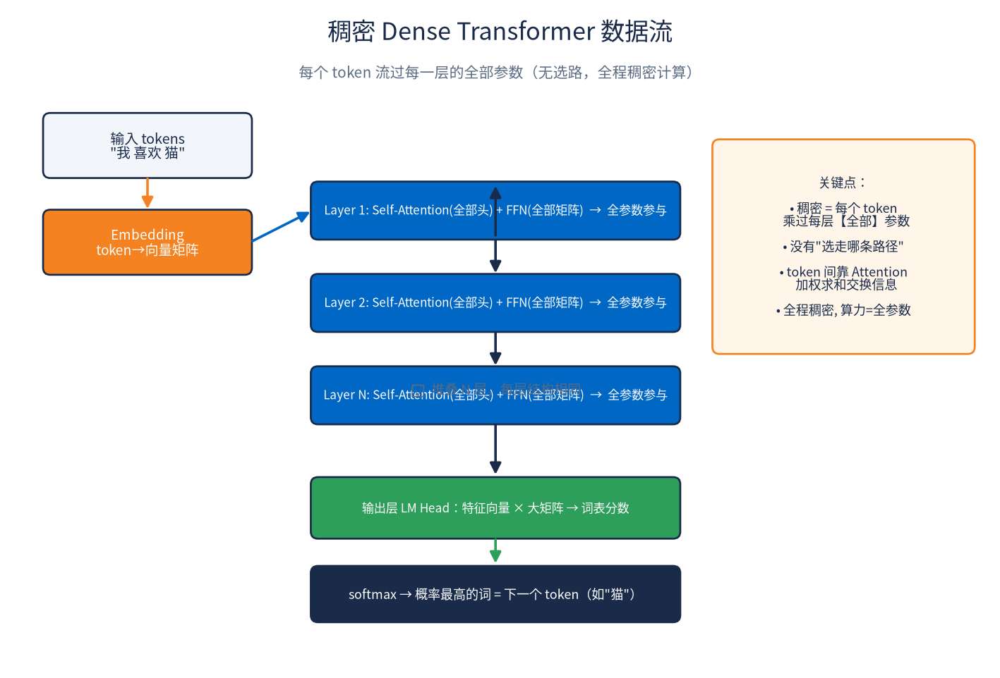
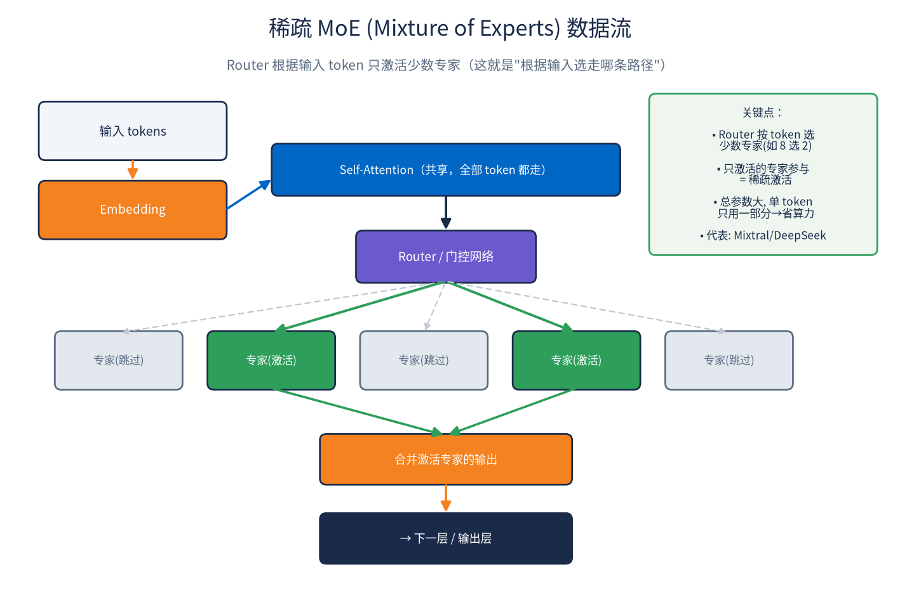

# 大模型数据流：稠密 Dense vs 稀疏 MoE

> 2026-08-25 | 用于理解"大模型是不是根据输入 token 选择走哪条路径"

## 一句话结论

- **标准大模型是稠密（Dense）的**：每个 token 流过**每一层的全部参数**，**没有"选路径"**——是"全部矩阵都乘一遍 + Attention 加权求和"。
- **"根据输入选走哪条路径" = MoE（Mixture of Experts）架构的稀疏激活**：Router 按输入 token 只激活少数专家。这是另一大流派。

## 图 1：稠密 Dense Transformer 数据流

- 输入 tokens → Embedding（token→向量）→ 逐层（每层 = Self-Attention 全部头 + FFN 全部矩阵，**全参数参与**）→ 输出层 LM Head（特征向量×大矩阵→词表分数）→ softmax → 下一个 token。
- 关键：**无选路，全程稠密**；token 间靠 Attention 加权求和交换信息；算力 = 全部参数。

## 图 2：稀疏 MoE 数据流

- 输入 → Embedding → Self-Attention（共享）→ **Router/门控网络按 token 选少数专家（如 8 选 2）** → 只激活的专家参与（绿色实线），其余跳过（灰色虚线）→ 合并激活专家输出 → 下一层/输出层。
- 关键：**稀疏激活**——总参数量大，但单 token 只用一部分 → 省算力。代表：Mixtral、DeepSeek 等。

## 两流派对比

| | 稠密 Dense | 稀疏 MoE |
|---|---|---|
| 每个 token | 走全部参数 | Router 选少数专家 |
| 是否"选路径" | ❌ 无 | ✅ 有（稀疏激活） |
| 算力/token | = 全参数 | = 激活的那部分参数 |
| 总参数 vs 计算量 | 一致 | 总参数大、单次计算量小 |
| 代表 | 标准 GPT 类 | Mixtral / DeepSeek |

## 补充：输出层做什么

经过所有层得到最后的**特征向量** → **输出层（LM Head / unembedding）** 把它乘一个大矩阵，映射成**整个词表的分数** → softmax 变概率 → 概率最高的词 = 预测的下一个 token。
