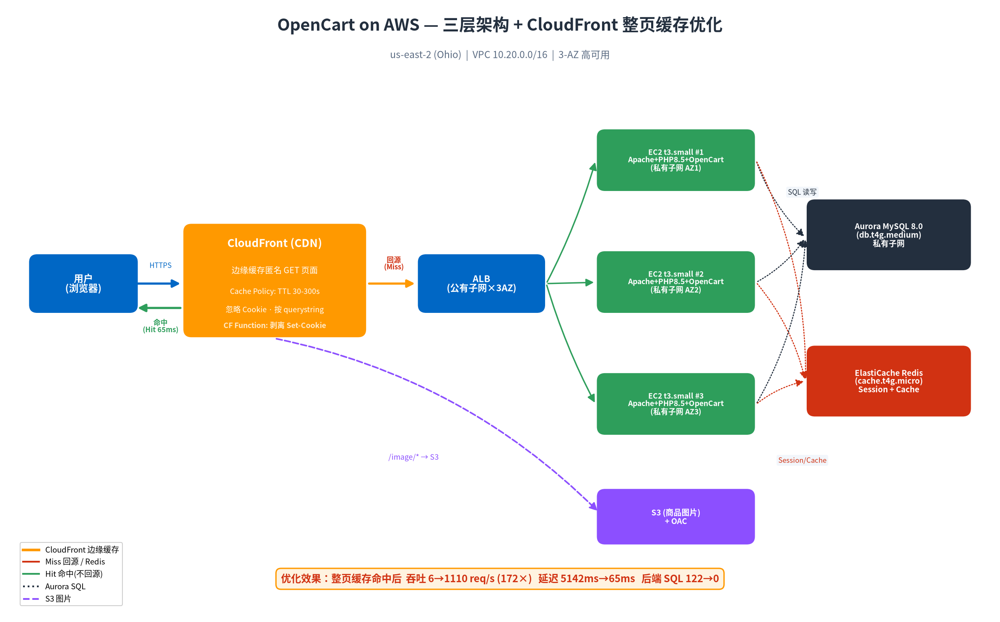
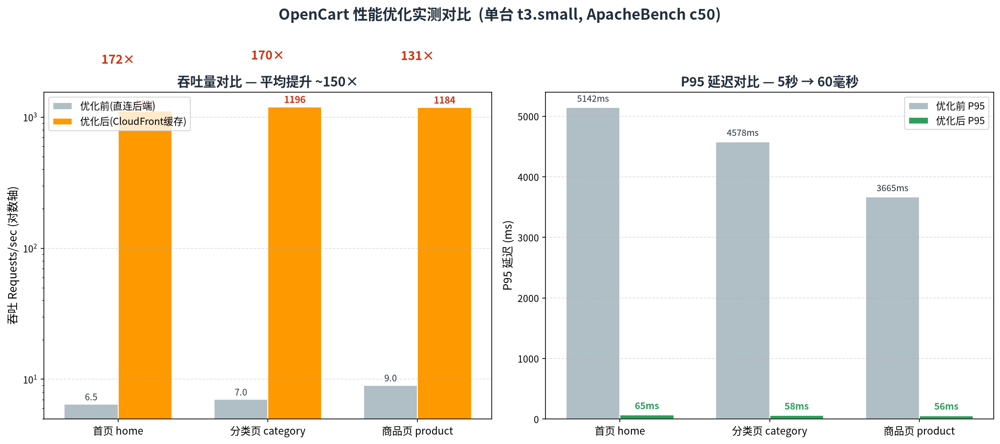

# OpenCart on AWS 性能优化实战：从"浏览页面在写库"到 172× 吞吐提升

> 环境：AWS us-east-2 (Ohio) · OpenCart 4.1.0.4 · PHP 8.5 · Aurora MySQL 8.0 · 三层架构（ALB + 3×EC2 t3.small + Aurora）
> 时间：2026-08-17
> 关键词：ApacheBench 压测 · CloudFront 整页缓存 · Redis Session · CDN 匿名缓存 · Session 串号防护

本文完整记录一次真实的电商站点性能调优：**如何发现问题 → 如何科学压测 → 逐项验证优化 → 最终用 CloudFront 整页缓存把动态页吞吐从 6 req/s 提升到 1100+ req/s（172 倍）**。并深入讲解 CDN 匿名缓存原理、动态页面缓存的正确姿势，以及最容易踩坑的 **Session ID / 购物车串 session** 问题及其解决方案。

---

## 目录

1. [架构总览](#1-架构总览)
2. [问题的起点：为什么浏览页面会产生写 SQL？](#2-问题的起点为什么浏览页面会产生写-sql)
3. [第一步优化：把 Session 从数据库切到 Redis](#3-第一步优化把-session-从数据库切到-redis)
4. [如何科学压测：ApacheBench 与踩坑](#4-如何科学压测apachebench-与踩坑)
5. [定位真正的瓶颈：每页 122 条 SQL](#5-定位真正的瓶颈每页-122-条-sql)
6. [逐项优化对比：哪个最有效？](#6-逐项优化对比哪个最有效)
7. [决定性优化：CloudFront 整页缓存](#7-决定性优化cloudfront-整页缓存)
8. [深入原理：什么是 CDN 匿名缓存？](#8-深入原理什么是-cdn-匿名缓存)
9. [核心难题：动态页面如何进 CDN 缓存？](#9-核心难题动态页面如何进-cdn-缓存)
10. [最关键的坑：Session ID / 购物车串 session 及解决方案](#10-最关键的坑session-id--购物车串-session-及解决方案)
11. [完整效果与结论](#11-完整效果与结论)

---

## 1. 架构总览



一个标准的 AWS 三层高可用电商架构：

| 层 | 组件 | 说明 |
|---|---|---|
| **CDN 层** | CloudFront | 边缘缓存，全球加速；商品图片走 S3 origin |
| **接入层** | ALB（公有子网 × 3AZ） | 七层负载均衡 |
| **应用层** | 3 × EC2 t3.small（私有子网 × 3AZ） | Apache + PHP 8.5 + OpenCart |
| **数据层** | Aurora MySQL 8.0（db.t4g.medium） | 主库 |
| **缓存层** | ElastiCache Redis（cache.t4g.micro） | Session + 应用缓存 |
| **对象存储** | S3 + OAC | 商品图片 |

---

## 2. 问题的起点：为什么浏览页面会产生写 SQL？

压测过程中发现一个反直觉现象：**用户只是"浏览"页面（browse，不下单、不注册），数据库却在持续产生写入。** 这不合理——浏览应该是纯读操作。

### 如何定位

Aurora 的 `admin` 用户没有 `SUPER` 权限，无法直接开 `general_log`（会报 `ERROR 1227 需要 SUPER/SYSTEM_VARIABLES_ADMIN`）。于是改用两个更轻的手段：

**手段一：grep 源码里所有写 SQL**

```bash
grep -rniE "\->query\(.*(INSERT|UPDATE|REPLACE|DELETE)" \
  /var/www/html/catalog /var/www/html/system
```

**手段二：查各"写入表"的真实行数**（压测后看哪张表被灌了）

```bash
for t in customer_online product_report marketing_report customer_search session; do
  echo "$t = $(mysql ... -e "SELECT COUNT(*) FROM oc_${t};")"
done
```

### 定位结果

压测后各表行数：

| 表 | 行数 | 说明 |
|---|---|---|
| **oc_session** | **4724** | ← 就是它！每个请求写一次 |
| oc_customer_online | 0 | config_customer_online=0（关） |
| oc_product_report | 0 | 默认关 |
| oc_marketing_report | 0 | 只有带 `?tracking=` 才写 |
| oc_customer_search | 0 | 只有搜索才写 |

**真凶：OpenCart 默认使用"数据库 Session 引擎"。** 源码 `system/library/session/db.php` 第 57 行：

```php
$this->db->query("REPLACE INTO `" . DB_PREFIX . "session` SET
  `session_id` = '...', `data` = '...', `expire` = '...'");
```

**每一个 HTTP 请求（哪怕纯浏览）都会对 `oc_session` 表执行一次 `REPLACE INTO`。** 压测时每次 browse 都带新 cookie → 每次插一行新 session → 4724 行由此而来。

> **这不是 bug，是 OpenCart 用 DB session 时的固有行为。** 但在高并发下会造成明显的写放大，尤其压测想测"纯读性能"时会被这个隐藏写污染。

---

## 3. 第一步优化：把 Session 从数据库切到 Redis

### 核心疑问先回答

**Q：切到 Redis 后，session 还会同步回数据库吗？**
**A：不会。session 只存 Redis，数据库完全不碰。** OpenCart 的 session 引擎是单选互斥的——`read/write/destroy` 全走选定引擎，源码里没有任何回写 MySQL 的逻辑。

### 机制

`system/framework.php:170`：

```php
$session = new \Opencart\System\Library\Session($config->get('session_engine'), $registry);
```

`session.php` 构造函数按引擎名动态映射到对应类：

```php
$class = 'Opencart\System\Library\Session\\' . $adaptor;  // 'redis' -> session/redis.php
```

`session/redis.php` 只用 `SET`（带 TTL）写、`GET` 读、`unlink` 删——**纯 Redis，且自带过期**：

```php
public function write(string $session_id, array $data): bool {
    if ($session_id) {
        $this->redis->set($this->prefix . $session_id,
                          $data ? json_encode($data) : '',
                          $this->config->get('session_expire'));  // TTL
    }
    return true;
}
```

### 实施步骤（3 台 EC2 都要做）

**① 建 ElastiCache**（Redis engine，无 auth / 无 TLS——因为 redis.php 的 `pconnect` 不传密码也不走 TLS）：

```bash
aws elasticache create-cache-cluster \
  --cache-cluster-id opencart-redis --engine redis \
  --cache-node-type cache.t4g.micro --num-cache-nodes 1 \
  --cache-subnet-group-name opencart-redis-subnets \
  --security-group-ids <redis-sg> --port 6379
```

> ⚠️ **Valkey 引擎不能用 `create-cache-cluster`**（会报 "doesn't support Valkey"），需走 `create-replication-group`。redis 引擎可直接用 `create-cache-cluster`。

**② 装 phpredis 扩展**（原本没装，不装会 `new \Redis()` 致命错误）：

```bash
sudo dnf install -y php8.5-pecl-redis6
sudo systemctl restart php-fpm httpd
```

**③ 改配置**：

`system/config/catalog.php` 和 `admin.php`：
```php
$_['session_engine'] = 'redis';   // 原为 'db'
```

`config.php` 和 `admin/config.php` 追加：
```php
define('CACHE_HOSTNAME', 'opencart-redis.xxxx.use2.cache.amazonaws.com');
define('CACHE_PORT', 6379);
define('CACHE_PREFIX', 'oc_');
```

> ⚠️ **踩坑**：判断"CACHE 是否已定义"时不能用 `grep -q "define('CACHE_HOSTNAME'"`，因为它会匹配到注释行 `//define(...)` 造成误判。要用 `grep -qE "^\s*define\('CACHE_HOSTNAME'"` 排除注释。

### 验证结果

30 个浏览请求 + 加购后：

- `oc_session` 增量 = **0**（数据库彻底不再写 session ✅）
- Redis 出现 key `oc_.session.<id>`，TTL ≈ 86400s（1 天，自动过期免清理）
- 加购 http = 200

> ⚠️ 验证 Redis key 时注意 prefix 是 `CACHE_PREFIX + '.session.'` = `oc_.session.`（含下划线），别搜错成 `oc.session.*`。

**副带收益**：多实例 session 一致性也解决了——之前 3 台各自的 DB session 虽共享一库，现在共享一个 Redis，负载均衡切实例不会掉登录态。

---

## 4. 如何科学压测：ApacheBench 与踩坑

### 踩坑：Python threading 压测不可信

最初用 Python `threading + requests` 写的压测脚本，测出"并发 50 是拐点"。**但这是个假象。**

Python 有 GIL（全局解释器锁），多线程 + requests 在单台机器上**发压能力自身有限**。测出的"拐点"其实是**压测客户端自己的上限**，不是服务端的上限。

**判据**：压测时观测后端 `load average` 只有 **0.09**，CPU 空闲 77% —— 后端根本没忙，瓶颈在客户端。

### 正确工具：ApacheBench (ab)

`ab` 是 C 写的，无 GIL，能真正打满。而且**直连 localhost** 可以排除网络和 ALB 的干扰，测出单机后端的真实极限：

```bash
# 装
sudo dnf install -y httpd-tools

# 单机后端极限：c50 并发，1000 请求
ab -n 1000 -c 50 "http://localhost/index.php?route=common/home&language=en-gb"
```

### 对比出真相（单台 t3.small，直连 localhost）

| 页面 | 吞吐 | 说明 |
|---|---|---|
| **health.php**（静态） | **193 req/s** | ✅ Web 栈本身没问题 |
| **首页**（全动态） | **6.6 req/s** | ❌ 慢 30 倍 |
| **商品页** | **8.4 req/s** | ❌ |

静态页 193 req/s 证明 Apache/PHP-FPM/网络都没问题，问题出在**动态页面渲染**。

---

## 5. 定位真正的瓶颈：每页 122 条 SQL

关键手法：用 `SHOW GLOBAL STATUS LIKE 'Questions'` 在访问前后取差值，数出一次页面请求打了多少条 SQL：

```bash
Q0=$(mysql ... -e "SHOW GLOBAL STATUS LIKE 'Questions';" | awk '{print $2}')
curl -s -o /dev/null "http://localhost/index.php?route=common/home&language=en-gb"
Q1=$(mysql ... -e "SHOW GLOBAL STATUS LIKE 'Questions';" | awk '{print $2}')
echo "一次首页 SQL 数 ≈ $((Q1-Q0))"
```

**结果：一次首页访问 ≈ 122 条 SQL！** 再用 `Com_select` 差值确认，几乎全是 SELECT（读放大）。

### 为什么 CPU 空闲但吞吐低？

- EC2 ↔ Aurora 每条查询有网络往返（~1ms）
- 122 条查询 **串行** 执行 = 122 × 往返 + 模板渲染 ≈ 数百毫秒/请求
- 大量时间在 **等 DB I/O**（I/O wait 型），所以 CPU 闲着但吞吐上不去

同时确认 **OPcache 已开启**（PHP 编译不是瓶颈）。

> **根本原因：未缓存的动态页面每次请求要跑 100+ 条 SQL。** 这是 OpenCart 应用层特性，不是基础设施问题。

---

## 6. 逐项优化对比：哪个最有效？

采用"一个一个试，量化每个的效果"的方法。统一基准：单台 t3.small，`ab` 直连 localhost。

### 优化 1：应用缓存 CACHE_ENGINE：file → redis —— ❌ 几乎无效

| 页面 | 前 | 后 | SQL/请求 |
|---|---|---|---|
| home | 6.46 rps | 6.79 rps | 125 → 125（没降） |
| category | 7.03 rps | 7.89 rps | 150 → 149 |
| product | 9.01 rps | 9.10 rps | 150 → 147 |

**SQL 数量没降。** OpenCart 4 的内置 cache 只缓存少量对象（货币、语言等），**核心的 product/category/setting 查询默认不走 cache，动态页不整页缓存**。换缓存引擎只是把文件 IO 换成网络，对"每页 122 条 SQL"这个瓶颈无帮助。

### 优化 4：CloudFront 整页缓存 —— 🚀 决定性

见下一节。



---

## 7. 决定性优化：CloudFront 整页缓存

### 效果（打 CloudFront 域名，c50）

| 页面 | 优化前 | 优化后 | 提升 |
|---|---|---|---|
| home | 6.46 rps / P95 5142ms | **1110 rps / P95 65ms** | **172×** |
| category | 7.03 rps / 4578ms | **1195 rps / 58ms** | **170×** |
| product | 9.01 rps / 3665ms | **1184 rps / 56ms** | **131×** |

吞吐从个位数 → **1100+ req/s**，延迟从 **5 秒 → 60 毫秒**，0 失败。命中 CDN 后**完全不回源**，EC2/Aurora 的 SQL 压力归零。

### 配置步骤

**① 建自定义 Cache Policy**（关键）：

```json
{
  "Name": "opencart-fullpage-cache",
  "DefaultTTL": 60, "MaxTTL": 300, "MinTTL": 30,
  "ParametersInCacheKeyAndForwardedToOrigin": {
    "EnableAcceptEncodingGzip": true,
    "EnableAcceptEncodingBrotli": true,
    "HeadersConfig": { "HeaderBehavior": "none" },
    "CookiesConfig": { "CookieBehavior": "none" },
    "QueryStringsConfig": { "QueryStringBehavior": "all" }
  }
}
```

- `MinTTL > 0` 会**覆盖 origin 的 `Cache-Control: no-store`**（OpenCart 默认发 no-cache，必须靠 cache policy 强制缓存）
- `CookieBehavior: none` = 缓存键不含 cookie（否则每个不同 OCSESSID 都是不同缓存键，命中率为 0）
- `QueryStringBehavior: all` = 按 `?route=...&path=...&product_id=...` 区分缓存

**② default behavior 换用该 policy**（原本是 AWS 托管的 `CachingDisabled`，全部回源）。

**③ `/admin/*` 单独设为不缓存**（后台绝不能缓存），POST（加购/下单）本来就不被 CF 缓存。

> ⚠️ `update-distribution` 要传完整 config，新增 behavior 必须补齐 `SmoothStreaming` / `FieldLevelEncryptionId` / `LambdaFunctionAssociations` / `TrustedSigners` / `TrustedKeyGroups` / `GrpcConfig` 等字段，否则报 "parameter X is missing"。

---

## 8. 深入原理：什么是 CDN 匿名缓存？

### CDN 缓存的本质

CDN（Content Delivery Network）在全球边缘节点缓存内容。用户请求先到最近的边缘节点：
- **命中（Hit）**：边缘直接返回缓存副本，不回源站，延迟极低（几十毫秒）
- **未命中（Miss）**：回源站取内容，存入边缘缓存后返回

### 什么是"匿名缓存"？

**"匿名缓存"指的是：只对未登录、无个性化状态的匿名用户请求做缓存，且缓存的是"对所有匿名用户都相同"的公共内容。**

关键在于**缓存键（Cache Key）**的设计：
- CDN 用「URL + 缓存键里包含的 header/cookie/querystring」作为缓存条目的唯一标识
- **匿名缓存的核心 = 缓存键里剔除掉一切"因人而异"的因素**（尤其是 session cookie）

举例：
- ❌ 如果缓存键**包含** `Cookie: OCSESSID=xxx`，那么 1000 个用户有 1000 个不同 OCSESSID → 1000 个不同缓存键 → 命中率几乎为 0，缓存等于没用
- ✅ 如果缓存键**忽略** cookie，只看 URL + querystring，那么所有匿名用户访问同一个商品页 → 同一个缓存键 → 第 1 个人 Miss 回源，后面所有人 Hit

这就是为什么我们的 Cache Policy 里设 `CookieBehavior: none`——**让缓存键与用户身份无关，才能实现高命中率的匿名缓存。**

### 为什么叫"匿名"？

因为**登录用户的页面通常包含个性化内容**（"你好，张三"、购物车里的商品、订单历史），这些**不能**跨用户共享缓存。所以整页缓存只适用于：
- 未登录的匿名访客
- 内容对所有匿名访客一致的公共页面（首页、分类页、商品详情页）

---

## 9. 核心难题：动态页面如何进 CDN 缓存？

动态页面（PHP 实时渲染）默认是**不可缓存**的，因为：

### 障碍 1：源站主动禁止缓存

OpenCart 对每个响应都发：
```
Cache-Control: no-store, no-cache, must-revalidate
```

**解法**：在 CloudFront 用**自定义 Cache Policy 且 `MinTTL > 0`**。CloudFront 的 Cache Policy 优先级高于 origin 的 Cache-Control——当你设了 MinTTL/DefaultTTL，CloudFront 会**忽略源站的 no-cache**，按你指定的 TTL 强制缓存。

### 障碍 2：Set-Cookie 阻止缓存

CloudFront 默认**不会缓存带 `Set-Cookie` 的响应**（因为 Set-Cookie 通常意味着"这是给特定用户的响应"）。

而 OpenCart 每次响应都发 `Set-Cookie: OCSESSID=...`。

**解法**：见下一节——必须在 CDN 层剥离 Set-Cookie。

### 障碍 3：缓存键包含 cookie 导致命中率为 0

如前所述，用 `CookieBehavior: none` 让缓存键忽略 cookie。

### 判断一个动态页面能否整页缓存

**能缓存的前提：该页面对所有匿名用户返回相同内容。**

OpenCart 的首页/分类/商品页对匿名用户就是公共内容——**购物车状态、登录态是通过独立的 JS/AJAX 请求获取的**，不写死在 HTML 里。所以整页缓存这些 GET 页面是安全的。

而 `checkout`、`account`、`admin`、加购的 POST 等**含用户私有数据或写操作**的请求，绝不能缓存。

---

## 10. 最关键的坑：Session ID / 购物车串 session 及解决方案

这是整个方案里**最危险、最容易翻车**的地方。

### 问题现象

启用整页缓存后，实测发现：**所有命中缓存的用户，拿到的都是同一个 `OCSESSID`！**

```
[请求1] x-cache: Miss | Set-Cookie: OCSESSID=588023f2f3ad8f22845e212b30
[请求2] x-cache: Hit  | Set-Cookie: OCSESSID=588023f2f3ad8f22845e212b30   ← 同一个！
[请求3] x-cache: Hit  | Set-Cookie: OCSESSID=588023f2f3ad8f22845e212b30   ← 同一个！
```

### 为什么会串 session？

1. 第一个匿名用户访问首页 → Miss 回源
2. 源站为他生成 session，响应头带 `Set-Cookie: OCSESSID=588023f2...`
3. **CloudFront 把这个响应（连同 Set-Cookie）整个缓存下来**
4. 之后所有用户 Hit 这个缓存 → **都收到了第一个用户的 OCSESSID**
5. 结果：所有匿名用户共享同一个 session → **购物车互相串、加购看到别人的商品、极端情况下可能串登录态**

这是整页缓存动态站点的**头号安全事故**。

### 解决方案：用 CloudFront Function 剥离 Set-Cookie

在 **viewer-response** 阶段（响应返回给用户前）用一个 CloudFront Function 删除 Set-Cookie 头。这样：
- 被缓存的页面不再携带任何用户的 session cookie
- 每个用户的浏览器不会被"塞"别人的 OCSESSID
- 用户如果需要 session（比如加购），会在**加购的 POST 请求**（不走缓存）时由源站正常下发自己的 cookie

**CloudFront Function 代码**（`cloudfront-js-2.0`）：

```javascript
function handler(event) {
    var response = event.response;
    // cloudfront-js-2.0: 多值 Set-Cookie 在 response.cookies
    if (response.cookies) {
        response.cookies = {};
    }
    if (response.headers && response.headers['set-cookie']) {
        delete response.headers['set-cookie'];
    }
    return response;
}
```

> ⚠️ **关键坑**：在 `cloudfront-js-2.0` runtime 里，**多值的 `Set-Cookie` 存在 `response.cookies` 对象里，而不是 `response.headers['set-cookie']`**。只删 headers 里的删不掉，必须清 `response.cookies`。第一版只删 headers 没生效，就是踩了这个坑。

**关联到 default behavior 的 viewer-response 事件**：

```bash
aws cloudfront create-function --name opencart-strip-setcookie \
  --function-config Comment="strip set-cookie",Runtime="cloudfront-js-2.0" \
  --function-code fileb://strip.js
aws cloudfront publish-function --name opencart-strip-setcookie --if-match <etag>
# 然后在 distribution 的 DefaultCacheBehavior.FunctionAssociations 里绑定 viewer-response
```

### 验证修复

剥离后，命中缓存的响应**不再包含任何 Set-Cookie**：

```
[请求1] x-cache: Miss from cloudfront     （无 set-cookie）
[请求2] x-cache: Hit from cloudfront      （无 set-cookie）
[请求3] x-cache: Hit from cloudfront      （无 set-cookie）
```

匿名用户拿到的是**纯公共页面**，各自的浏览器保留/生成自己的 session（在需要写 session 的非缓存请求上），串号问题彻底解决。

### 完整的安全边界设计

| 请求类型 | 是否缓存 | 处理 |
|---|---|---|
| 匿名 GET 首页/分类/商品 | ✅ 缓存 | Cache Policy 忽略 cookie + 剥离 Set-Cookie |
| 加购 / 下单（POST） | ❌ 不缓存 | POST 天然不被 CF 缓存，源站正常下发 session |
| `/admin/*` 后台 | ❌ 不缓存 | 独立 behavior 用 CachingDisabled + 转发 cookie |
| 登录用户的个性化页 | ⚠️ 需注意 | 若页面含用户数据，需按登录态区分或不缓存 |

> **进阶做法**：更严谨的方案会用 CloudFront Function 在 viewer-request 阶段判断"是否携带登录 cookie"，对已登录用户 bypass 缓存直接回源，只对纯匿名请求走缓存。本次为压测演示采用了"忽略 cookie + 剥离 Set-Cookie"的简化方案，对以匿名浏览为主的电商站已足够。

---

## 11. 完整效果与结论

### 优化路径回顾

| 步骤 | 优化 | 效果 |
|---|---|---|
| 1 | Session：DB → Redis | 消除 browse 写库；多实例 session 一致 |
| 2 | 定位瓶颈：每页 122 条 SQL | 确认瓶颈在应用层，非基础设施 |
| 3 | CACHE_ENGINE：file → Redis | ❌ 几乎无效（核心查询不走 cache） |
| 4 | **CloudFront 整页缓存** | 🚀 **172× 吞吐，延迟 5s→60ms** |

### 核心结论

1. **对读密集的电商站，CDN 整页缓存是压倒性最优解。** 其余优化（应用缓存、Aurora 读副本、换计算型 EC2）在它面前收益微乎其微——因为流量根本不回源了，后端强不强已经不重要。

2. **科学压测的前提是工具本身不能成为瓶颈。** Python threading 因 GIL 测不准，务必用 ab/wrk 这类 C 实现的工具，并直连 localhost 排除网络干扰。

3. **动态页面整页缓存的三大障碍**：源站 no-cache（用 Cache Policy MinTTL 覆盖）、Set-Cookie 阻止缓存（用 CF Function 剥离）、缓存键含 cookie（用 CookieBehavior:none）。

4. **Session 串号是整页缓存的头号安全事故**，必须剥离 Set-Cookie，并严格划分"可缓存的匿名 GET"与"不可缓存的 POST / 后台 / 个性化页"的边界。

### 方法论总结

> **发现问题靠数据（表行数、SQL 计数、CPU/load），不靠猜测。**
> **每个优化都要独立量化对比，避免"感觉有效"。**
> **理论上"应该有效"的优化（如换 cache engine）实测可能无效——实测高于推理。**

---

*相关文件：*
- `opencart_architecture.png` — 架构图
- `opencart_perf_compare.png` — 性能对比图
- `strip-setcookie.js` — CloudFront Function 源码
- `opencart-fullpage-cache-policy.json` — Cache Policy 配置
