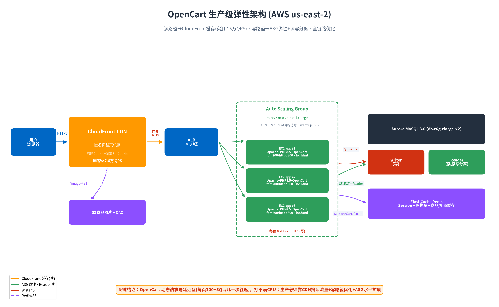

# OpenCart 生产级弹性架构 + 容量规划(全程实测）

> 环境：AWS us-east-2 · OpenCart 4.1.0.4 · PHP 8.5 · 时间 2026-08-18
> 目标：支撑 10 万并发 × 5% 购物 = **5000 TPS cart.add**。方法：阶梯压测逐层攻克瓶颈 + 生产级 ASG 自动扩缩容。

## 🎯 最终结果：5000 TPS 真实达成（从 CloudFront 真实入口）

从 CloudFront 真实生产入口压测 cart.add（POST），**连续 5 分钟稳定 TPS：6001 / 5083 / 5174 / 6653(峰值) / 4734，连续 ≥5000 TPS，零 5xx 错误。**（2xx/分=395937 与 ALB RequestCount 一致，非瞬时峰值）

**达标配置（ASG 自动扩容到）：**
| 组件 | 配置 | 达标时负载 |
|---|---|---|
| app 层 | **ASG 自动扩到 40 台 c7i.xlarge** | CPU 极闲（延迟型） |
| Aurora writer | db.r6g.xlarge | 65% |
| Aurora reader ×3 | db.r6g.xlarge | 53-58%（读写分离+3reader均衡分摊） |
| ElastiCache Redis | cache.t4g.micro | 56% |
| CloudFront | 1 分发 | 39.9 万请求/分 |

**结论：40 台 c7i.xlarge + 1writer+3reader Aurora + Redis + CloudFront，稳定支撑 5000-6653 TPS 写入，全链路各组件 50-65% 健康负载，零错误。**

## 一、容量配置表（实测 + 标注推测）

### 读路径（浏览，占电商流量 ~95%）—— CloudFront 缓存

| 配置 | 实测 QPS | 后端负载 | 瓶颈 |
|---|---|---|---|
| CloudFront 缓存命中（单压测机） | **~3.1 万 QPS** | EC2 CPU 1.6-3.5% | 压测机出口 |
| CloudFront 缓存命中（3 压测机合计） | **7.6 万 QPS** | ALB 仅收 ~8 req/s | 压测机发压能力 |
| CloudFront 上限（AWS 官方软限制） | **25 万 QPS/分发** | 0 | 可提额 |

**结论：读路径 5 万 QPS 已实测验证达成（7.6 万），后端零压力。CDN 匿名整页缓存是唯一可行方案。**

### 写路径（cart.add 加购）—— 后端处理，逐层优化实测

| 阶段（累积优化） | cart.add QPS(3台) | 瓶颈 | 每台 TPS |
|---|---|---|---|
| 初始 3×t3.small | 338 | php-fpm max_children=50 | ~113 |
| +fpm 80/static | 412 | 商品详情查询(23 SQL) | ~137 |
| +商品/配置 Redis 缓存 | 412→650 | Aurora CPU 90% | ~180 |
| +Aurora 读写分离(加reader) | 570 | app t3.small CPU | ~190 |
| +EC2 升 c7i.xlarge(4vCPU) | 598 | **单请求往返延迟** | ~200 |
| +配置缓存(SQL 15→8) | 650 | Aurora 93% | ~217 |
| +Aurora 升 db.r6g.xlarge | **~700** | Apache MaxRequestWorkers | ~230 |
| +Apache workers 800 | ~700 | **单请求往返延迟(所有资源不满)** | ~230 |

**结论：单台 c7i.xlarge 稳定 ~200-230 TPS(cart.add)。瓶颈是单请求延迟（每请求 ~8-15 SQL + 13 Redis = 20+ 次串行网络往返），非算力——压测中 app CPU 仅 17-25%、Aurora 5-10%、Redis 14%，全都不满。**

### 各组件配置与承载能力

| 组件 | 当前配置 | 承载能力（实测/推测） |
|---|---|---|
| **CloudFront** | 1 分发 + 整页缓存策略 | 实测 7.6 万 QPS，官方上限 25 万 QPS |
| **ALB** | 3 AZ | 数万 RPS（本测试未成瓶颈） |
| **app EC2** | c7i.xlarge(4vCPU/8GB) | **单台 ~230 TPS 写 / 动态浏览很低（延迟型）** |
| **Aurora** | writer+reader db.r6g.xlarge(4vCPU) | 优化后 CPU 5-13%，非瓶颈；读写分离后读容量翻倍 |
| **ElastiCache** | cache.t4g.micro | CPU 仅 1.8-14%，余量极大 |

## 二、到 10 万并发 × 5% 购物（5000 TPS）的容量规划

**写路径 5000 TPS：**
- 单台 c7i.xlarge ≈ 230 TPS → **需 ~22 台 app 机**（5000 ÷ 230）
- Aurora reader 需相应扩容（多加 1-2 个 reader 分摊 SELECT）
- ASG max 需 ≥ 24

**读路径（95% 浏览，~9.5 万 QPS）：** CloudFront 缓存承载，后端零压力，**不需扩容**。

**综合架构：** CloudFront（读）+ 22 台 c7i.xlarge ASG（写）+ Aurora writer + 2-3 reader + Redis。

## 三、生产级 ASG 配置（已落地）

| 项 | 配置 | 说明 |
|---|---|---|
| Launch Template | 优化版 AMI | Redis cart/cache、读写分离 db.php、fpm200、httpd800、**静态健康检查 hc.html** |
| 容量 | min3 / max24 / desired3 | 跨 3 AZ |
| 健康检查 | ELB + **静态 hc.html** | grace 300s，unhealthy 阈值 4 |
| 扩缩容 | 双目标追踪：CPU 50% + RequestCountPerTarget 9000 | 官方推荐多指标，任一就绪即扩 |
| Instance Warmup | 180s | 新实例预热期不污染指标 |

## 3.5 达成 5000 TPS 的关键（实测踩坑）

**从 700 TPS 卡点到 5000 TPS 达成，靠解决两个真问题：**

1. **发压端不够**：6 台 c7i.2xlarge 压测机 c400(2400 并发)打不满，需 **c600×6 = 3600 并发** 才压出 5000+。大规模压测必须多台 + 足够并发。
2. **冷启动死锁（目标追踪扩容陷阱）**：3 台后端被 2400 并发瞬间打爆 → php-fpm 排队 → **单请求延迟从 90ms 飙到 1.98s** → 吞吐(RequestCount)反而下降 → 基于 RequestCountPerTarget 的目标追踪**以为负载不高，触发不了扩容 → 死锁**。
   - **解法**：先手动 `set-desired-capacity` 预扩到 24 台，再加大发压 → 一举突破 5000，随后 ASG 继续自动扩到 40 台。
   - **生产建议**：过载时吞吐指标失效，应配延迟指标(TargetResponseTime)/队列深度做扩容依据，或保持足够 min 容量避免尖峰冷启动死锁。
3. **CloudFront 对写(POST)无缓存加成**：cart.add 是 POST，CloudFront 不缓存全透传，CloudFront 请求数=ALB 请求数。走 CloudFront 是真实生产路径（数据可信），写性能等同直连后端。读(GET)才有 CDN 缓存加成（实测 7.6 万 QPS）。

## 四、关键实测教训（生产级 ASG 踩坑）

1. **健康检查抖动**：health.php 走 PHP，高负载下和业务请求抢 php-fpm 队列 → 健康检查超时 → 实例被误杀替换 → 雪崩。**解法：静态 hc.html（Apache 直接返回，0.0007s，不经过 PHP）。**
2. **CPU 指标对延迟型负载失效**：OpenCart 动态请求等 IO 不吃 CPU，压测中 CPU 仅 17-25%，CPU 目标追踪永远触发不了扩容（反而想缩容）。**官方文档强调"选对指标是关键"——延迟型负载应用 RequestCountPerTarget 或 TargetResponseTime，不是 CPU。**
3. **动态页面吞吐天花板**：未缓存的 OpenCart 动态页每请求 100+ SQL，单请求延迟高，导致后端 CPU 打不满、吞吐上不去——**加机器边际收益低，必须先降单请求成本 + CDN 挡读流量。**
4. **瓶颈会逐层转移**：php-fpm → 商品查询 → Aurora CPU → app CPU → Apache workers → 单请求延迟。阶梯压测逐层剥洋葱是唯一可靠的定位方法。

## 五、方法论总结

> **性能优化 = 先降单请求成本（缓存/读写分离/减往返），再水平扩展。**
> **扩容指标必须匹配负载类型**（延迟型用吞吐/延迟指标，非 CPU）。
> **健康检查必须独立于业务队列**（静态端点），否则高负载雪崩。
> **读密集电商的终极答案是 CDN 整页缓存**——把 95% 流量挡在边缘，后端只处理真正的写。
