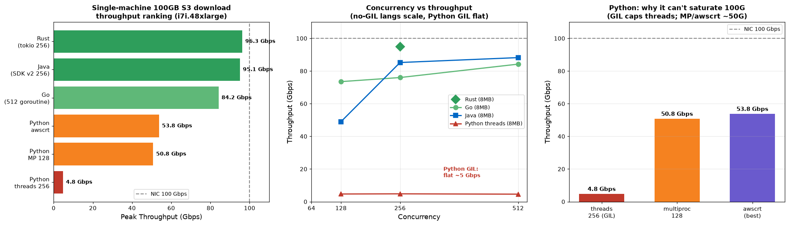

# S3 大文件下载吞吐测试 —— 打满 100Gbps 网卡（Rust / Java / Go / Python 对比）

测试从 Amazon S3 下载单个 **100GB** 大对象的吞吐极限，横向对比 **Rust / Java / Go / Python** 四种语言（Python 含多线程/多进程/awscrt 三种方式），找出打满 100Gbps 网卡的关键因素。

- **区域**: us-east-2 (Ohio)
- **测试对象**: 一个 100GB 对象（随机数据，S3 不压缩）
- **测试日期**: 2026-08-07
- **场景**: 模拟 AI checkpoint 从 S3 加载（数据读进内存，body 丢弃，纯测 S3→内存传输，不落盘）
- **策略**: 所有实现统一用「手动 byte-range 分片 + 高并发」，公平对比

> 🔒 代码中的 bucket / key **不含真实名称**，统一从环境变量读取（`S3_BUCKET` / `S3_KEY` / `AWS_REGION`），默认占位符 `YOUR_BUCKET`。凭证走 EC2 IAM role，代码无任何 AK/SK。

## 机器配置

| 项 | 配置 |
|----|------|
| 实例类型 | **i7i.48xlarge** |
| vCPU / 内存 | 192 vCPU / 1488 GiB RAM |
| 网卡 | **Up to 100 Gigabit** |
| OS | Amazon Linux 2023 (kernel 6.1) |
| Rust | 1.97 / aws-sdk-s3 1.x（默认 hyper HTTP） |
| Java | Corretto 17 / AWS SDK v2 (s3 2.32.6 + apache-client) |
| Go | 1.25 / aws-sdk-go-v2 |
| Python | 3.9 / boto3 1.42 + awscrt 0.31 |

## 核心结果



### 🏁 五方案排名（单机 100GB 下载峰值）

| 方案 | 最佳配置 | 峰值吞吐 | 打满 100G? |
|------|---------|---------|-----------|
| 🥇 **Rust** (aws-sdk-s3 + tokio) | 16MB × 256 | **96.3 Gbps (12.0 GB/s)** | ✅ |
| 🥈 **Java** (SDK v2 + 线程池) | 16MB × 256 | **95.1 Gbps (11.9 GB/s)** | ✅ |
| 🥉 **Go** (aws-sdk-go-v2 + goroutine) | 8MB × 512 | **84.2 Gbps (10.5 GB/s)** | ✅ 接近 |
| Python **awscrt** (单 client) | target 50G | 53.8 Gbps (6.7 GB/s) | ❌ |
| Python **多进程** | 16MB × 128 | 50.8 Gbps (6.4 GB/s) | ❌ |
| Python **多线程** | 8MB × 256 | 4.8 Gbps (0.6 GB/s) | ❌❌ GIL |

### 各语言并发扫描明细

**Rust**（part=8/16MB × concurrency 64~256）：256 并发达 94.8~96.3 Gbps
**Go**：128→73.5 / 256→76.0 / 512→84.2 Gbps
**Java**：128→49.0 / 256→85.2~95.1 / 512→88.2 Gbps
**Python 多线程**：128→4.7 / 256→4.8 / 512→4.6 Gbps（GIL 锁死，加并发无效）
**Python 多进程**：64→33.8 / 128→50.8 / 192→30.0 Gbps

## 核心结论

1. **并发度是打满带宽的决定因素**（不是 chunk 大小、不是某个特定语言）：无 GIL 语言把 in-flight 的 byte-range GET 拉到 256~512，就能逼近/打满 100Gbps。

2. **Rust ≈ Java（95-96 Gbps）并列第一，都能打满 100G 网卡**；Go 84 Gbps 也很接近（连接池/HTTP2 调优后应更高）。**语言本身不是瓶颈。**

3. **只有 Python 打不满**：
   - **多线程**：被 **GIL** 死死锁在 ~5 Gbps，256/512 并发完全无效（响应字节流迭代/拷贝在 GIL 下串行化）。
   - **多进程**：绕开 GIL 到 ~51 Gbps，但进程 fork/序列化/独立连接池开销让它到不了满速。
   - **awscrt**：底层是 C 库并行，但 `throughput_target_gbps` 驱动的调度不够激进 + Python 回调开销，封顶 ~54 Gbps。
   - **Python 单机的天花板约 50-54 Gbps（网卡的一半）。**

4. **共性最优参数：16MB part + 256 并发**；part 太小(8MB)略逊，但并发拉到 512 也能补回。

## 实践建议（AI checkpoint / 大文件从 S3 加载）

- **要吃满 100G 网卡，用 Rust / Java / Go 写加载器，手动开 256+ 路 byte-range 并发**。
- **Java 表现意外地好（和 Rust 打平）**，对已有 JVM 技术栈的团队最友好。
- **别用纯 Python 单进程**——多线程 GIL 死路，多进程/awscrt 顶到 ~50 Gbps。50Gbps 够用的话 Python 也能接受。
- 下载目标设内存/流可省一次磁盘往返；100GB 对象需 < 实例内存才能整份驻留。

## 目录结构

```
rust/       Rust 实现 (aws-sdk-s3 + tokio)
java/       Java 实现 (AWS SDK v2 + 线程池, Maven)
go/         Go 实现 (aws-sdk-go-v2 + goroutine)
python/     Python 实现 (boto3 多线程/多进程) — 见 s3_download.py threads|procs
gen_charts.py                        图表生成脚本
s3_download_throughput_charts.png    结果图表
```

## 复现

```bash
export S3_BUCKET=your-bucket S3_KEY=ckpt-bench/ckpt_100g.bin AWS_REGION=us-east-2
# Rust
cd rust && cargo build --release && ./target/release/s3crt
# Java
cd java && mvn -q package && java -Xmx8g -jar target/s3java.jar
# Go
cd go && go mod init s3go && go get github.com/aws/aws-sdk-go-v2/config github.com/aws/aws-sdk-go-v2/service/s3 && go build -o s3go . && ./s3go
# Python
cd python && python3 s3_download.py threads   # 多线程(GIL)
              python3 s3_download.py procs     # 多进程(绕GIL)
```

> 实例（i7i.48xlarge）+ S3 测试对象测完已清理。凭证走 EC2 IAM role，代码无任何硬编码密钥/真实 bucket 名。
